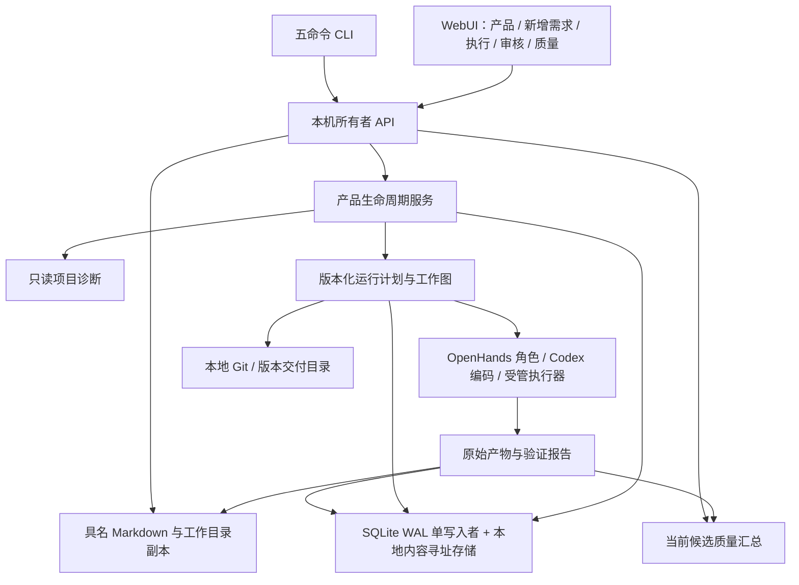

# AgentFlow MVP 产品工作台：架构与实现方案

版本：v0.5 · 2026-09-21 · 对应 [PRD v0.7](AgentFlow-PRD-v0.7.md)

## 1. 调整统一对照

| 方面 | 原有设计 | 本方案 |
| --- | --- | --- |
| 产品标识 | 单次创建、单个 target | 长期 Product + 多平台 targets + 多次 ProductChange/Run |
| 导入 | 高级项目页面 | 产品入口中的只读诊断与导入 |
| 迭代 | 通用阶段选择 | 新需求默认从 PRD 开始，明确输入版本与代码基线 |
| 页面数据 | 直接渲染内部工作项与 JSON | 工作流投影、可读文档投影和质量汇总接口 |
| 交付目录 | 单一 release | 初版 release 与后续按 run 分开的版本交付 |
| 原生入口 | 底层七目标适配契约 | 产品声明七平台；当前本机自动产品仅 Web/API，原生明确暂不支持 |
| 模型请求上限 | 默认 200，有限正数 | 默认 200；严格整数 `0` 表示不限，`1` 至 `2000` 表示有限上限，各层独立检查 |

## 2. 架构



控制器继续在 macOS 本机运行，单用户，所有者 API 仅绑定回环地址；执行节点使用独立认证通道。SQLite 保持单写入者，代码使用 Git，产物使用本地内容寻址存储。配置固定为 `~/.config/agentflow/config.toml`。

专业角色与编码角色按任务隔离，所有角色可按模块并行，统一受并发、写入范围、预算与时间限制。执行完成、质量通过、人工认可和 Git 交付是独立事实。

## 3. 产品、导入与平台诊断

Product 保存长期 `goal`、`name`、`targets`、项目关联、当前运行和交付。`target` 作为现有 Web/API 主执行栈兼容字段；平台声明不代替已通过的 TargetConfig/能力验证。

创建请求支持平台数组。原生目标保留标识和扩展点，但本机产品入口遇到不可执行目标时返回明确错误，不静默缩减矩阵。

诊断仅读取受限目录下的项目文件和清单，忽略依赖缓存及敏感文件，不执行用户脚本。结果包括平台、技术栈线索、证据文件、可执行状态与限制。未知工程和未知平台保留 unknown，不默认推断成受支持 Node 产品。

导入通过实际 Git 仓库与干净提交验证建立 `Project`，保存源路径、提交和产品信息。源代码不能被初始化模板覆盖。对于无法直接适配受管 Web/API recipe 的工程，先登记并明确阻塞，待配置经过验证的执行契约后再启动。

用户目标和静态诊断可以形成 `source_kind=owner_input/static_diagnosis` 的基线资料，`generation=0`、`quality_result=not_applicable`，不伪造已执行的市场调研或测试。

## 4. 新需求和基线

ProductChange 保存需求名称、描述、验收期望、产品原目标快照、基线运行/交付和本轮状态。新需求创建独立 Iteration，不把旧运行预算清零后继续使用。

计划选择 `from_step=prd` 至 `delivery`。通过 `stage_input_versions` 将相关旧目标、调研、PRD、架构资料分别绑定到需要的步骤，避免无选择地重复全量背景。所有引用必须属于同一项目，匹配产物修订、摘要和当前工作版本；运行开始时再次校验。

有历史交付时，`source_commit` 与 `source_ref` 必须对应同项目的已确认交付，而且本地 Git 引用仍指向该提交。导入的首轮使用已确认导入提交。工作区从准确提交克隆，交付仍经过原门禁和 Git compare-and-swap。

每轮保留架构检查与调整阶段。提示与输入明确要求评估需求对模块、API、数据兼容、性能及扩展性的影响，只调整受影响部分。架构文档、图和接口定义构成更新产物，后续编码/审查/测试用同一版本。

创建并发迭代、已有活动执行、预览状态未结束、基线变更等均需明确拒绝或等待处理。请求使用幂等键，确认丢失不能产生重复产品、变更或运行。

## 5. 可读产物与工作目录

`WorkflowService.finish_attempt` 在冻结输出前，将已校验的结构化结果派生为一个具名 Markdown 产物。派生结果缓存到原尝试/原始摘要关联的记录，使旧请求重放不会因后来版本变化而改变命令身份。原始 JSON 保留用于后续机器处理。

Markdown 与原始产物一起进入版本化产物记录，所选人审绑定这批准确输出。工作目录文件是不可变产物的可恢复副本，写入失败不修改质量事实；界面提示存储问题并提供归档版本。已有历史运行通过只读投影生成可读副本，不改变旧审核指纹。

```text
产品输出目录/
  repository/                     产品 Git 项目
  documents/<run-id>/<阶段-工作项-版本>/
    产品目标说明.md
    市场与竞品调研报告.md
    产品需求文档 PRD.md
    系统架构与接口设计.md
    代码审查报告.md
  release/                        初版交付
  releases/<run-id>/               后续迭代的完整交付
    source/                       精确源码（包含项目测试代码）
    product/                      经验证的运行产物
    documents/                    各阶段人读文档
    reports/                      人读测试报告
    evidence/raw_reports/         校验所需的原始证据
  runtime/                        预览运行数据
```

公开文档入口绑定 `readable_artifact`、源工作版本及摘要，陈旧或损坏文件不能继续显示为当前产物。下载使用受认证的本机 API；默认列表不暴露 JSON envelopes。文档内容在浏览器中以安全 Markdown 展示，禁用 HTML 执行。

代码步骤的主要产物指向精确源码快照目录；测试编写步骤指向相应测试目录，同时提供可读变更说明。并行阶段外层仅选择最终汇总产物，内部仍可查看各任务成果。

## 6. 工作流和质量投影

执行台使用可折行的节点全图；连接表示实际依赖，布局变化时更新连线位置。运行、选中、人审、失败和已完成状态分别表达。点击或键盘选择节点后展示对应产物和子任务详情，页面轮询不强制改变用户选中项。

工作流投影以无 `parent_stage_id` 的工作项为外层阶段。内部列出子任务和最后的汇总工作；节点显示真实状态和产物。子任务失败、尚在执行或汇总未完成会反映到外层，原图的语义依赖保留。

质量投影只采用同一运行输入指纹、唯一当前候选、已绑定平台矩阵、验证完成的节点结果和摘要一致的原始报告。按平台/阶段/用例/尝试去重；不能把同一报告被多个矩阵项引用的情况重复累加。

单元与集成统计分别返回通过/失败/错误/跳过/未知、总数、覆盖完整性和通过率。零用例、未执行、缺矩阵项、跳过和损坏报告不能伪装成全通过。用例耗时作为测试执行指标单列。

审查问题来自准确工作版本的审查结果，分类支持 bug、安全、格式、性能、可维护性及未分类；未运行独立检查器时不能报告其已通过。测试失败不能直接推算代码 bug 数。

性能测量以测试源码和原始报告为依据。Web/API 测试可通过 Playwright attachment 输出 `application/vnd.agentflow.performance+json`，包含 `metrics[{name,value,unit,sample_count}]`。解析器限制大小、数量、有限非负数值和单位，并绑定用例及原始报告。无测量时返回 `not_measured`。

## 7. 主要接口

| 方法与路径 | 用途 |
| --- | --- |
| `POST /api/v1/products/diagnose` | 只读诊断已有本机项目 |
| `POST /api/v1/products` | 新建或导入产品，支持 `targets`、`language` 与创建模式 |
| `POST /api/v1/products/{id}/language` | 按 `expected_revision` 更新未来语言默认；支持幂等重放 |
| `GET /api/v1/products` / `/{id}` | 产品和当前状态 |
| `GET/POST /api/v1/products/{id}/changes` | 查看/创建新增需求迭代 |
| `GET /api/v1/runs/{id}/workflow` | 阶段、内部任务、汇总和主要产物 |
| `GET /api/v1/runs/{id}/quality_summary` | 用例统计、问题、性能及人读产物 |
| `POST /api/v1/runs/{id}/request_limit` | 显式提高有限次数或设为不限；仅限暂停且已确认停止，保持用量计数 |
| `GET /api/v1/readable_artifacts/{id}` | 预览具名 Markdown；`download=true` 下载 |
| `POST /api/v1/run_plans` | 支持阶段输入版本映射和确认的源码基线 |

所有读写仍通过所有者鉴权；写请求要求 Origin 和幂等键。模型密钥不进入文档、浏览器公开状态或工作区。

## 8. 实现与验证

后端采用现有 `ProductService` / `WorkflowService` 扩展，增加项目诊断与需求迭代模块；`readable.py` 负责文档渲染，`presentation.py` 负责版本绑定、落盘和聚合视图。原调度、测试、交付门禁继续作为权威数据源。

前端使用统一产品入口和新增需求页，移除旧导航。执行和质量页面消费投影 API，不能通过前端推算或硬编码通过状态。类型、构建、浏览器交互与后端状态反例分别验证。

关键检查包括：重复导入/重放、未提交代码、跨项目资料、旧摘要/旧版本、已确认基线引用变化、并发新需求、预览未结束、原生目标拒绝、阶段汇总、文档符号链接/外部改动、无报告/旧候选/重复引用、跳过和真实性能附件。低层七目标设备执行仍按各原生环境独立验证，不能由平台元数据代替。

## 9. 语言与文档执行策略

`Product.language` 是未来默认，支持 `zh-CN` 与 `en`；固定 TOML 的 `product.language` 默认 `zh-CN`。首轮保存在 `initial_language`，新增需求在接受时冻结 `change.language`，运行使用 `plan.product_contract.language`。旧记录缺省中文；改变默认不修改已有 plan、运行或产物，旧准备请求保持原幂等 payload。

`document_policy.stage_instructions` 按阶段给出受众、范围、语言和简洁要求。目标、调研、PRD、需求拆解不接收 Node 工程执行契约；技术契约进入架构、开发和测试阶段。编码 Agent 的新写注释和说明遵循运行语言，标识符及机器协议不翻译。渲染以正文为主，仅按阶段附必要来源、未知、审查问题或测试信息；标题、摘要和排程数据不重复堆叠。

`StageContext` 从版本绑定的依赖图选择相关资料。已有汇总取代其子产物作为下游输入；汇总任务仍读取各自子产物。去除 `parallel_work`、运行日志及重复 envelope；显式绑定的复用资料仍保留。短资料在提示中提供，长资料完整保存在控制器私有的只读目录，通过摘要命名文件、有限范围的 `read_context` 或编码工具按需读取。提示仅包含文件索引和有限短内容，不递归复制全部祖先报告。

上下文文件不放进项目代码工作区，避免污染源码或越过写入范围；按工作版本与来源摘要定位，写入原子化，读取校验摘要、路径和大小。单个文件不超过 1 MiB，每次角色读取最多 24000 字符；较长内容通过 offset/has_more 分段，不能静默丢弃未读的验收条件。

## 10. 编码回执与失败恢复

编码执行同时要求进程、终结事件、最终 JSON schema 和后续源码验证有效。提示明确最终对象结构、简短总结及分块代码修改。模型输出达到上限、最终格式错误、回执缺失、无终结事件、未知执行和进程失败分别记录闭集错误码，界面展示固定可读说明，不暴露原始异常和凭据。

历史失败通过绑定当前 attempt、generation、fence 和 input fingerprint 后的私有证据读取诊断，不改原回执。重试只重开明确失败的工作及受影响后续阶段，保留有效兄弟任务和旧产物。活跃或执行未知的任务须先完成核对；不能为了让界面通过而放宽 schema、跳过测试或伪造完成状态。

产品入口与固定 TOML 的 `max_model_requests` 使用严格整数校验，允许 `0` 与 `1..2000`，默认 `200`。布尔、浮点、数字字符串、负数或超界值不能强制转换成不限。`0` 是次数不限标记；限额判断只在对应层为正数时比较已用次数。产品、迭代、运行和任务传递时均须保留 `0`，不能用真假值回退默认。单次输出、工具调用、执行时长及费用额度保持原有语义。

调用额度调整使用 `{expected_revision,max_model_requests,reason}`。要求同迭代无在途/未知 Agent、节点作业及未结算模型调用，且运行已暂停。

| 本轮 / 迭代现状 | 新目标 | 事务结果 |
| --- | --- | --- |
| 本轮有限，迭代有限 | 更大的有限整数（至多 2000） | 提高本轮上限，迭代累计上限增加同等次数 |
| 本轮有限，迭代不限 | 更大的有限整数 | 提高本轮上限，迭代保持 `0` |
| 本轮有限，或本轮不限但迭代有限 | `0` | 本轮与迭代均设为 `0` |
| 本轮与迭代均不限 | 新提交标识再请求 `0` | 拒绝无变化请求；原幂等键重放仍返回原结果 |
| 本轮不限 | 有限整数 | 作为降低额度拒绝 |

事务同时更新 run/iteration 的预算配置与账户上限，保留已用次数、金额、旧 plan 和产物，并写入审计。设为不限的审计使用 `added_requests=null`、`unlimited_requests=true`，不把不限伪装成新增零次。重复提交同幂等键不重复调整；该接口不恢复调度、不发起模型请求。调整必须由所有者明确批准，不能因失败自动扩大额度。

界面把 `0` 显示为“不限次数”，费用未知时保持未知，不从次数推断零费用。输入框最小值为 0，轮询只初始化未编辑值；已输入的 0 和未确认 CLI 提交在默认配置改变后仍保持原意图。
