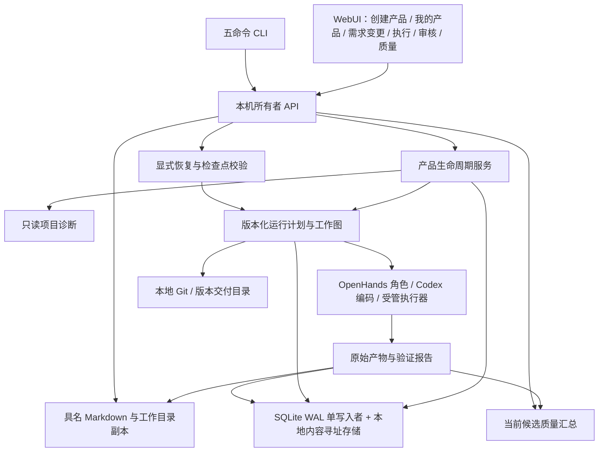

# AgentFlow MVP 产品工作台：架构与实现方案

版本：v0.6 · 更新于 2026-09-29 · 对应 [PRD v0.8](AgentFlow-PRD-v0.8.md)

## 1. 调整统一对照

| 方面 | 原有设计 | 本方案 |
| --- | --- | --- |
| 产品标识 | 单次创建、单个 target | 长期 Product + 多平台 targets + 多次 ProductChange/Run |
| 导入与管理入口 | 创建、导入及列表混合 | 创建/导入后进入独立“我的产品”；管理列表支持 active/deleted/all |
| 配置与删除 | 缺少统一生命周期命令 | 修订与幂等保护的 PATCH、软删除和恢复，保留源码与历史目录归属 |
| 完整重跑 | 容易复用首次准备或旧运行 | kind=restart 的独立操作，新 Run/Iteration，从 goal 全流程执行，冻结配置与代码基线 |
| 原运行恢复 | 通用返工与继续入口 | recovery_options/recover 明确 retry/continue、影响范围、检查点与节点候选复用 |
| 页面会话 | 交互式锁定与手工重新连接 | 移除锁定功能，内存 owner 凭据与限定续接票据分离，刷新自动续接 |
| 迭代 | 通用阶段选择 | 新需求默认从 PRD 开始，明确输入版本与代码基线 |
| 页面数据 | 直接渲染内部工作项与 JSON | 工作流投影、可读文档投影和质量汇总接口 |
| 返工展示与文档 | 每个修复工作项独立节点、文档目录带代次 | 按逻辑阶段聚合当前状态与执行历史；当前 Markdown 原子更新，安全整理旧生成副本 |
| 交付目录 | 单一 release | 直接新建首轮 release，需求变更和完整重跑按 run 分开保存 |
| 原生入口 | 底层七目标适配契约 | 产品声明七平台；当前本机自动产品仅 Web/API，原生明确暂不支持 |
| 模型请求上限 | 默认 200，有限正数 | 默认 200；严格整数 `0` 表示不限，`1` 至 `2000` 表示有限上限，各层独立检查 |
| 项目工作流 | 直接选择各运行 | 项目＋需求变更双选择器，共享完整阶段模板，状态和操作按所选版本隔离 |
| 文档目录与历史 | 按运行 GUID 分目录 | 项目固定阶段路径、不可变内部快照、前部变更历史、接受变更时冻结文档基线 |

## 2. 架构



控制器继续在 macOS 本机运行，单用户，所有者 API 仅绑定回环地址；执行节点使用独立认证通道。SQLite 保持单写入者，代码使用 Git，产物使用本地内容寻址存储。配置固定为 `~/.config/agentflow/config.toml`。

专业角色与编码角色按任务隔离，所有角色可按模块并行，统一受并发、写入范围、预算与时间限制。执行完成、质量通过、人工认可和 Git 交付是独立事实。

## 3. 产品、导入与平台诊断

Product 保存长期 `goal`、`name`、`targets`、项目关联、当前运行和交付。`target` 作为现有 Web/API 主执行栈兼容字段；平台声明不代替已通过的 TargetConfig/能力验证。

创建请求支持平台数组。原生目标保留标识和扩展点，但本机产品入口遇到不可执行目标时返回明确错误，不静默缩减矩阵。

诊断仅读取受限目录下的项目文件和清单，忽略依赖缓存及敏感文件，不执行用户脚本。结果包括平台、技术栈线索、证据文件、可执行状态与限制。未知工程和未知平台保留 unknown，不默认推断成受支持 Node 产品。

导入通过实际 Git 仓库与干净提交验证建立 `Project`，保存源路径、提交和产品信息。源代码不能被初始化模板覆盖。对于无法适配当前受管 Node Web/API 构建、运行与测试契约的工程，先登记并明确阻塞；平台元数据或选择目标不等于完成工具链适配。

用户目标和静态诊断可以形成 `source_kind=owner_input/static_diagnosis` 的基线资料，`generation=0`、`quality_result=not_applicable`，不伪造已执行的市场调研或测试。

### 3.1 产品管理状态与约束

`ProductManagement` 提供修订和幂等保护的编辑、软删除、恢复与从头运行请求。产品 `config_revision` 记录目标/平台的关键配置版本，`run_config_revision` 记录当前运行对应版本；旧记录缺省为版本 1。修改 `goal` 或 `targets` 的实际值时增加配置版本并设置 `needs_restart=true`，保存动作不创建模型调用。

名称、语言、审核策略和未来调用次数可单独编辑，不要求重跑，也不修改已有 Run/Plan 的快照。`default_overrides` 记录管理表单明确提交的未来默认字段，即使保存值与原值相同也保留该意图；例如明确保存 `max_model_requests=0` 后，需求变更不会又被全局 200 覆盖。未明确设置覆盖项的旧产品仍保留原全局默认继承行为。

软删除只写入 `deleted_at` 等管理信息，不删除 Product、Project、原仓库、运行、交付包或文件。默认列表隐藏删除项，`view=deleted` 提供回收站，`view=all` 用于管理视图；相关运行默认列表也隐藏已删除产品的运行，无产品归属的低层运行保留。恢复只撤销删除标记，不自动运行，也不清除待核对状态。

管理操作复用产品生命周期锁，并在写入事务内检查预览、准备、运行、Agent 尝试、受管进程、模型调用、节点作业和未确认预算。使用中的预览、调度中或结果未知的工作会给出具体阻塞码。后台跳过已删除或待从头运行的产品；所有者暂停期间不自动返工。低层恢复/继续通过 `guard_product_run` 检查删除、配置版本及当前运行归属，不能绕过产品管理限制。

`initial_request_snapshot` 和原请求指纹保留首次提交的幂等身份；`initial_product_snapshot`、运行计划内的 `product_snapshot` 及历史 Run 记录用于还原旧名称、目标、平台和语言。原输出目录及导入目录归属不因删除释放。历史导出按冻结版本生成或验证，不能使用后来编辑的配置重写旧包。

## 4. 需求迭代、全流程重跑与代码基线

ProductChange 保存需求名称、描述、验收期望、产品原目标快照、基线运行/交付和本轮状态。新需求创建独立 Iteration，不把旧运行预算清零后继续使用。

普通需求变更计划选择 `from_step=prd` 至 `delivery`。通过 `stage_input_versions` 将相关旧目标、调研、PRD、架构资料分别绑定到需要的步骤，避免无选择地重复全量背景。所有引用必须属于同一项目，匹配产物修订、摘要和当前工作版本；运行开始时再次校验。

接受变更时，`ProjectDocumentService.freeze(product_id, base_run_id)` 冻结项目已有文档，保存在 `ProductChange.document_baseline` 和 `Plan.product_contract.document_baseline`。每个逻辑阶段引用不可变的 `readable_artifact` 身份、摘要、来源运行、工作项和代次。准备重试沿用同一基线；`StageContext` 核验同产品、同阶段与摘要后提供前版完整内容，要求保留未受影响部分并返回完整更新文档。前版审查、测试结论仅是历史资料，不能替代本轮真实验证。

有历史交付时，`source_commit` 与 `source_ref` 必须对应同项目的已确认交付，而且本地 Git 引用仍指向该提交。导入的首轮使用已确认导入提交。工作区从准确提交克隆，交付仍经过原门禁和 Git compare-and-swap。

每轮保留架构检查与调整阶段。提示与输入明确要求评估需求对模块、API、数据兼容、性能及扩展性的影响，只调整受影响部分。架构文档、图和接口定义构成更新产物，后续编码/审查/测试用同一版本。

创建并发迭代、已有活动执行、预览状态未结束、基线变更等均需明确拒绝或等待处理。请求使用幂等键，确认丢失不能产生重复产品、变更或运行。


显式从头运行使用 `product_change.kind=restart` 和独立操作身份，冻结 `product_snapshot`、配置版本、模型绑定及额度。选择 `goal → delivery`，`input_versions` 与阶段复用映射为空，不借用旧目标或旧阶段的完成状态。开始前及挂接时校验配置版本和产品归属；挂接新运行后更新 `run_config_revision` 并清除 `needs_restart`。

完整重跑创建新的 Run 和 Iteration。旧运行关系保存在 `product_contract.base_run_id` 和重跑记录中，不使用会继承旧迭代预算的 `parent_run_id`。`run_ids` 追加而不覆盖，`initial_run_id` 保持首次运行。导入产品保持原 `project_id` 和确认的提交基线，不走模板覆盖；尚无项目的新建登记才在受管新目录建立初始工程。

重跑沿用后续版本的 `change_id` 目录规则，交付进入 `releases/<run-id>/`，避免覆盖初版 `release/` 或旧收据。普通需求变更只选择当前关键配置版本的有效资料；没有新目标所需基线时明确阻塞，不能回退到旧配置产物。

## 5. 可读产物与工作目录

`WorkflowService.finish_attempt` 在冻结输出前，将已校验的结构化结果派生为一个具名 Markdown 产物。派生结果缓存到原尝试/原始摘要关联的记录，使旧请求重放不会因后来版本变化而改变命令身份。原始 JSON 保留用于后续机器处理。

Markdown 与原始产物一起进入版本化产物记录，所选人审绑定这批准确输出。工作目录文件是不可变产物的可恢复副本，写入失败不修改质量事实；界面提示存储问题并提供归档版本。已有历史运行通过只读投影生成可读副本，不改变旧审核指纹。

```text
产品输出目录/
  repository/                     产品 Git 项目与当前开发源码
    src/                          实际产品源码
    tests/                        实际测试代码
    .agentflow/workspaces/        项目内按 attempt 隔离的工作目录
  documents/<逻辑阶段>/            每阶段一份当前文档，不含运行 GUID 层
    产品目标说明.md
    市场与竞品调研报告.md
    产品需求文档 PRD.md
    系统架构与接口设计.md
    代码审查报告.md
  release/                        直接新建的首轮交付
  releases/<run-id>/               新需求或显式完整重跑的交付
    source/                       精确源码（包含项目测试代码）
    product/                      经验证的运行产物
    documents/                    各阶段人读文档
    reports/                      人读测试报告
    evidence/raw_reports/         校验所需的原始证据
  runtime/                        预览运行数据
```

目录示例中的 `repository/` 用于直接新建；导入产品的源码仍在原项目目录。导入后的首次完整运行也使用 `releases/<run-id>/`。公开文档入口绑定 `readable_artifact`、源工作版本及摘要，陈旧或损坏文件不能继续显示为当前产物。下载使用受认证的本机 API；默认列表不暴露 JSON envelopes。文档内容在浏览器中以安全 Markdown 展示，禁用 HTML 执行。

代码步骤的主要产物指向精确源码快照目录；测试编写步骤指向相应测试目录，同时提供可读变更说明。并行阶段外层仅选择最终汇总产物，内部仍可查看各任务成果。

## 6. 工作流和质量投影

执行台使用可折行的节点全图；连接表示实际依赖，布局变化时更新连线位置。运行、选中、人审、失败和已完成状态分别表达。点击或键盘选择节点后展示对应产物和子任务详情，页面轮询不强制改变用户选中项。

`workflow_stages.py` 将执行图投影为逻辑阶段：普通工作按阶段归组，单元和集成测试代码审查分别按对应阶段键归组，动态修复依据既有运行记录关联。节点使用稳定标识，重试操作另带当前真实工作项标识。执行图的后继关系用于识别当前任务与历史任务；主图使用正常阶段的前向依赖，返工回边仅保留在执行记录中。当前子任务的失败、活动和未完成汇总仍影响节点，历史任务状态不覆盖当前结果。

`project_documents.py` 维护 `project_document_head`（产品＋逻辑阶段）与不可变 `readable_artifact` 快照，复用 `documents_projection.py` 的内容投影。当前文件在 `documents/<logical-stage>/<稳定文件名>.md`，前部记录各次变更与更新摘要。同次返工更新本次历史条目，避免复制整个旧文档。写入前核验当前产品/需求变更、工作代次、来源版本、目录归属及原文件摘要，以原子替换更新受管文件；迁移只删除登记且摘要匹配的旧 GUID 副本，保留用户修改及未知文件。历史选择只读取当次快照，不能移动项目当前 head 或覆盖文件。已确认交付包及原始证据不变。

`project_workflow.py` 提供项目与版本索引，返回初始开发、完整重跑、各次需求变更和尚无运行的准备记录。前端先选择项目，再选择需求变更；执行动作始终绑定所选真实 Run。产品工作流补齐完整阶段模板，开始阶段之前的节点显示沿用基线及来源；这些节点没有人工造出的 Attempt、Check 或 Approval。导入基线注明用户输入与本地静态诊断，未执行阶段不得声称已有市场调研或测试结论。异步响应与选择项隔离，旧响应不能覆盖新选择。

质量投影只采用同一运行输入指纹、唯一当前候选、已绑定平台矩阵、验证完成的节点结果和摘要一致的原始报告。按平台/阶段/用例/尝试去重；不能把同一报告被多个矩阵项引用的情况重复累加。

单元与集成统计分别返回通过/失败/错误/跳过/未知、总数、覆盖完整性和通过率。零用例、未执行、缺矩阵项、跳过和损坏报告不能伪装成全通过。用例耗时作为测试执行指标单列。

审查问题来自准确工作版本的审查结果，分类支持 bug、安全、格式、性能、可维护性及未分类；未运行独立检查器时不能报告其已通过。测试失败不能直接推算代码 bug 数。

性能测量以测试源码和原始报告为依据。Web/API 测试可通过 Playwright attachment 输出 `application/vnd.agentflow.performance+json`，包含 `metrics[{name,value,unit,sample_count}]`。解析器限制大小、数量、有限非负数值和单位，并绑定用例及原始报告。无测量时返回 `not_measured`。

## 7. 主要接口

| 方法与路径 | 用途 |
| --- | --- |
| `POST /api/v1/products/diagnose` | 只读诊断已有本机项目 |
| `POST /api/v1/products` | 新建或导入产品，支持 `targets`、`language` 与创建模式 |
| `POST /api/v1/products/{id}/language` | 按 `expected_revision` 更新未来语言默认；支持幂等重放 |
| `GET /api/v1/products?view=active/deleted/all` / `/{id}` | 产品管理列表、详情、配置版本及可操作性 |
| `PATCH /api/v1/products/{id}` | 改名或保存产品设置；关键变更要求从头运行 |
| `DELETE /api/v1/products/{id}` / `POST .../{id}/restore` | 软删除与恢复，不物理删除用户文件 |
| `POST /api/v1/products/{id}/restart` | 显式接受完整新运行请求，保存独立重跑记录 |
| `GET/POST /api/v1/products/{id}/changes` | 查看/创建需求变更迭代 |
| `GET /api/v1/project_workflows` | 项目与初始开发、各次需求变更的只读索引 |
| `GET /api/v1/products/{id}/workflow?change_id=...` | 尚无运行的项目基线或准备中变更的完整流程模板 |
| `POST /api/v1/products/{id}/documents/migrate` | 受认证的旧文档目录维护，报告无法安全处理的文件 |
| `GET /api/v1/runs/{id}/workflow` | 阶段、内部任务、汇总和主要产物 |
| `GET /api/v1/runs/{id}/quality_summary` | 用例统计、问题、性能及人读产物 |
| `GET /api/v1/runs/{id}/recovery_options` | 当前恢复条件、影响范围、保留项及检查点预览 |
| `POST /api/v1/runs/{id}/recover` | 显式 retry/continue，原运行内恢复 |
| `POST /api/v1/session` | 交换一次性本机 bootstrap，可为浏览器签发受限续接票据 |
| `POST /api/v1/session/resume` | 仅凭 session:renew 票据换取当前控制器的新 owner 凭据 |
| `POST /api/v1/runs/{id}/request_limit` | 显式提高有限次数或设为不限；暂停或未交付且有可恢复工作的已结束运行；保持用量计数 |
| `GET /api/v1/readable_artifacts/{id}` | 预览具名 Markdown；`download=true` 下载 |
| `POST /api/v1/run_plans` | 支持阶段输入版本映射和确认的源码基线 |

除首次 bootstrap 和受限会话续接外，管理接口仍要求 owner 鉴权；写请求要求精确 Origin 和幂等键，所有请求校验 Host。管理 PATCH 使用 `expected_revision` 与可选的 `name/goal/targets/language/review_mode/max_model_requests`；删除、恢复、从头运行使用 `expected_revision` 和可选原因。模型密钥不进入文档、浏览器公开状态或工作区。

## 8. 实现与验证

后端采用现有 `ProductService` / `WorkflowService` 扩展，增加项目诊断、产品管理、需求迭代和运行恢复模块；`readable.py` 负责文档渲染，`presentation.py` 负责版本绑定、落盘和聚合视图。原调度、测试、交付门禁继续作为权威数据源。

前端将创建/导入、我的产品和需求变更分为独立页面，创建后选中对应产品；执行台提供恢复选项，连接页代替旧锁定交互。执行和质量页面消费投影 API，不能通过前端推算或硬编码通过状态。类型、构建、浏览器交互与后端状态反例分别验证。

关键检查包括：产品改名及未来默认、软删除/恢复及目录保留、关键配置版本与新迭代、旧运行越权恢复拒绝、retry/continue及节点结果重放、浏览器票据权限/撤销/续期/存储失败、重复导入/重放、未提交代码、跨项目资料、旧摘要/旧版本、已确认基线引用变化、并发新需求、预览未结束、原生目标拒绝、阶段汇总、文档符号链接/外部改动、无报告/旧候选/重复引用、跳过和真实性能附件。低层七目标设备执行仍按各原生环境独立验证，不能由平台元数据代替。

## 9. 语言与文档执行策略

`Product.language` 是未来默认，支持 `zh-CN` 与 `en`；固定 TOML 的 `product.language` 默认 `zh-CN`。首轮保存在 `initial_language`，需求变更在接受时冻结 `change.language`，运行使用 `plan.product_contract.language`。旧记录缺省中文；改变默认不修改已有 plan、运行或产物，旧准备请求保持原幂等 payload。

`document_policy.stage_instructions` 按阶段给出受众、范围、语言和简洁要求。目标、调研、PRD、需求拆解不接收 Node 工程执行契约；技术契约进入架构、开发和测试阶段。编码 Agent 的新写注释和说明遵循运行语言，标识符及机器协议不翻译。渲染以正文为主，仅按阶段附必要来源、未知、审查问题或测试信息；标题、摘要和排程数据不重复堆叠。

`StageContext` 从版本绑定的依赖图选择相关资料。已有汇总取代其子产物作为下游输入；汇总任务仍读取各自子产物。去除 `parallel_work`、运行日志及重复 envelope；显式绑定的复用资料仍保留。短资料在提示中提供，长资料完整保存在控制器私有的只读目录，通过摘要命名文件、有限范围的 `read_context` 或编码工具按需读取。提示仅包含文件索引和有限短内容，不递归复制全部祖先报告。

上下文文件不放进项目代码工作区，避免污染源码或越过写入范围；按工作版本与来源摘要定位，写入原子化，读取校验摘要、路径和大小。单个文件不超过 1 MiB，每次角色读取最多 24000 字符；较长内容通过 offset/has_more 分段，不能静默丢弃未读的验收条件。

上下文归一化使用最多 128 项、16 MiB 的有界缓存，并合并相同输入的并发准备；每次使用仍核验原始内容摘要、大小、版本和已发布文件，缓存不替代完整性校验。角色读取默认单页 24000 字符，可按需指定更小页；已完整内联的资料不重复读取，独立受控读取可在同轮批量完成。主文档由 `finish` 一次保存，重复的 schema 提示副本省略，但工具 schema 和最终校验保留。性能数据区分本机准备耗时、模型往返与实际产品执行，不能把本地 HTTP 测试时延当作模型推理时延。

## 10. 编码回执、显式恢复与调用额度

项目工作目录由私有 `workspace_metadata` 登记，绑定项目、attempt、源提交与精确路径。项目内 `.agentflow` 目录有归属标记，并通过 Git 本地排除规则避免混入产品提交；不可将任意项目子目录视为授权工作区。旧全局工作区继续按原身份读取和恢复。应用备份单独包含登记的项目内工作区，恢复到新的平台隔离目录，不覆盖原用户项目。

编码阶段汇总或独立编码阶段完成后，`ProjectCodeService` 将准确源码提交同步到项目根目录的独立开发分支。原基线引用、不可变代码快照与交付引用保持各自用途。同步前核验项目状态、源提交和原开发分支；本地修改、外部分支变更或路径冲突时保留用户文件并提示，禁止强制覆盖。同步有持久操作身份，允许中断后核对完成，不能据此绕过代码审查、测试或人审。

运行时维护在启动、任务结束和空闲巡检时回收已确认停止的临时会话目录。npm 缓存仅存本平台任务请求的包；`app.package_cache_max_bytes` 默认 256 MiB，超限后在无活跃或未知执行、资源均释放时回收，`0` 表示空闲时不保留缓存。节点端仅在结果与资源清理均得到确认后移除已上传构建包的重复副本；无待执行、待重传或待清理任务时回收下载缓存。原始产物、测试报告、唯一源码和恢复证据不作为临时缓存删除。清理使用固定受管路径、进程身份与账本核验、持久删除意图，避免符号链接越界及重复执行。

### 10.1 编码回执诊断

执行前的隔离探测默认使用 30 秒有界等待，分别记录明确拒绝、非预期错误、信号退出和超时；超时后杀死并回收探针进程。探测包含源码可读与只读角色不可写校验，失败不扩大权限、不进入 Agent 启动。v2 探测证据绑定工作、attempt、fence、输入指纹和策略摘要。

Controller 对已知启动前失败写入 `prelaunch_failure`，明确 `outcome=not_started`，绑定原派发内容的版本与摘要。写入时核验没有 Supervisor 启动记录、目录、模型调用或不确定计量；密封后 Supervisor 拒绝同一 attempt 再次启动。恢复只对身份和零启动证据均有效的情况免除“缺少执行回执”阻塞，使用新 attempt 重试；未知状态仍阻断。旧隔离失败仅在完整、匹配的原策略与探测证据可验证时识别，读取不会改写旧执行记录。

旧 v1 探针的 `-1` 无法区分等待超时与信号退出，仅诊断为隔离检查未通过；明确的超时诊断须有新版探针或控制器记录的超时证据。这不影响对“确认尚未启动”的独立核验。

代码审查和测试的当前已完成编码祖先，必须有与当前 attempt、代次、工作项及运行相符的源码快照。否则以 `source_snapshot_missing` 明确阻断；只有没有编码生产者的合法基线审查，才可使用该运行显式选择的原项目基线。

编码执行同时要求进程、终结事件、最终 JSON schema 和后续源码验证有效。提示明确最终对象结构、简短总结及分块代码修改。模型输出达到上限、最终格式错误、回执缺失、无终结事件、未知执行和进程失败分别记录闭集错误码，界面展示固定可读说明，不暴露原始异常和凭据。

历史失败通过绑定当前 attempt、generation、fence 和 input fingerprint 后的私有证据读取诊断，不改原回执。不能为了让界面通过而放宽 schema、跳过测试或伪造完成状态。

`reasoning_output_limit` 仅在最后一条模型调用的身份、账本、私有 SSE 摘要和终结事件均可核验，且输出额度全部用于推理、没有可见消息或工具调用时成立。它描述该次响应，不代表整个任务此前没有修改代码；证据不足时保留通用截断诊断。推理也占用单次输出额度，调用次数不限不能解决单次响应耗尽。

固定配置 `[models.coding].reasoning_effort` 可显式指定编码推理强度；未配置时省略该字段，保持既有配置指纹和模型身份。配置经模型档案、任务授权、执行契约传入 Codex，再由模型代理按冻结值核对请求；不允许 Agent 擅自改写已选强度。模型是否支持具体取值以实际供应商接口为准，不自动映射、切换模型或提高输出额度。

`max_output_tokens` 不设 AgentFlow 固定最大值，允许按供应商模型能力配置。每次新派发按角色读取固定文件中的输出额度；只有供应商、接口地址、请求模型和已接受模型均匹配时才继承。输出额度变更通过内容寻址的不可变模型档案生效，保留原模型的凭据、推理策略、定价及协议，原 Run/Plan 和已有任务授权不变。手工修改输出额度无需重启；切换模型或推理策略仍使用明确的模型选择流程。

派发将有效档案、额度及配置来源一起冻结到任务与授权，编码小步规划、执行契约和代理使用同一额度。代理校验客户端输出参数格式，但最终值取模型档案与任务授权额度中的较小值，避免 SDK 默认值意外压低用户配置。已经派发或恢复原进程时使用原冻结额度；新小步、重试和后续阶段重新读取配置。供应商拒绝不支持的额度时返回其失败状态，不自动缩减额度或重试。输出额度提高不增加运行的调用次数、工具次数或时长预算。

### 10.2 原运行恢复

自动恢复由 `FailureRemediation` 先持久化 `failure_analysis`，记录失败执行、上游依赖、证据、原因及修复指令，再通过内部 `recover_automatic` 或有审查身份绑定的 `ReviewRemediation` 原子安排恢复。执行失败默认每个工作 100 次、超时 100 次、整轮 100 次，退避 30 秒；功能实现、单元与集成测试编写以及各类审查共用这些执行失败策略。审查质量返工与测试失败源码修复独立计数，`auto_review_repair_limit` 和 `auto_test_repair_limit` 均默认 100，显式 `-1` 持续到通过，`0` 关闭，正整数限制轮数。全部模式沿用原授权、模型和累计账本，并核验实际需要修复的编码工作额度；未知执行、损坏证据、额度/鉴权、无法可靠归因的测试失败保留分析并阻止盲目重试。

Agent 执行结束与质量门禁独立记录。审查执行结束但质量失败时，用户界面显示“审查未通过，待返工”，不计入审查完成数量。同版本并行审查尚未结束时显示等待，并在完成后自动重新核验；只修复问题所属模块，然后重新汇总、审查。审查契约由实际编码生产阶段派生：初次功能审查不要求尚未执行的后续测试计划或测试代码，但仍检查已有测试的删除、禁用和退化；测试代码生成后必须接受对应阶段的完整性审查。

审查汇总通过封存的原始依赖定位代码生产阶段，并核验全部子审查的当前执行身份与源码版本。同阶段并行审查的结果全部接受后，在同一事务中合并当前源码上的阻断意见和责任模块，只执行一次失效化，每个模块只派发一个修复任务。每份失败审查保留独立返工回执和来源别名，共用批次标识；额度预检与事务内执行使用同一组责任模块。历史报告仅作下一轮复核材料，不能直接混入当前批次。多个审查对应单个代码生产任务时同样保留独立来源，正常续跑和故障恢复使用一致的来源校验。

所有子审查通过、汇总审查新增阻断时，所有者可通过 `review_repairs` 对完整源码快照安排具体文件的修复。路径仍须属于原始已接受编码祖先的写入范围。修复回执绑定原展开记录、原生产者、子审查身份和新生产者；原展开记录保持不可变，全部子审查、父汇总及下游重新验证。后续读取和再次修复核验整条绑定链，不能仅改依赖图绕过源码身份检查。

Web/API 产品的后续复审发现既有测试代码缺陷时，`late_test_owner` 返工回执核验原测试作者、封存任务范围、已接受计划、文件内容和 Git 来源。完整源码快照的生产者与具体测试文件作者分别识别；返工继续使用原测试任务 ID 与累计预算，从包含已完成产品修复的完整检查点执行。有效测试设计和未改变的代码贡献保留，相关审查与测试重新验证。调度器检查全部前置依赖，保留的中间产物不能越过仍在返工或尚未通过的上游。

工作流仍按逻辑阶段显示单个节点，通过附加上下文说明首次审查、当前复审及有效计划的沿用关系；并行审查同一 `batch_id` 的多份回执只计一个显示轮次。显示层不改写实际执行状态、质量结果或依赖关系。

失效范围与改正指令范围分别计算：所选任务及显式展开的同阶段子任务接收改正指令；受影响的后续阶段清除旧改正指令与执行建议，从更新后的上游产物重新完成自己的阶段任务。同一任务的恢复只还原实际重试根节点的原改正指令。所有者可在单任务恢复中显式纠正指令，代码检查点、原测试计划、权限、账本及人审校验保持有效。

任务指令与工作区准备完成后才签发有限启动授权。实际模型调用以受保护的子进程回执为依据，将执行窗口绑定到与 launcher 硬超时相同的单调时钟、启动会话与任务身份；启动窗口不增加实际执行额度。终止回执存在时立即拒绝继续调用，即使数据库观察尚未更新。授权到期由控制器保留身份绑定的拒绝证据，诊断不依赖供应商 403 文本；新证据参与恢复状态摘要，防止旧失败分析继续盲目重试。

测试执行失败须区分产品缺陷与测试启动配置缺陷。后者在完整候选快照上生成独立测试修复与审查任务，仅授权失败阶段对应的测试文件；保留原用例名称、断言、测试计划、产品代码与构建约定，只重新验证受影响的执行阶段。原失败报告和被取代的错误修复记录留存，所有旧进程确认停止后才能安排替代任务。隔离环境的主、次服务端口由执行器注入，测试代码使用分配值；不得通过修改业务服务器监听语义或放开任意网络权限规避测试启动错误。

源码选择以当前有效快照为基础。元数据出现多个末端提交时，在本地 Git 中验证实际祖先关系，识别跨多次恢复检查点的线性演进；只有有证据包含旧提交的新提交才可覆盖该候选。真正分离的分支仍须正式汇总，不能任意选取一个。

### 10.2.1 实时执行过程

`ExecutionTrace` 保存任务准备、指令、模型请求、可见输出、工具操作与结果、状态和失败分析。`ModelService` 在原代理通路记录已归一化的实际请求，从 Chat Completions/Responses 中提取可见字段；原始协议响应与计费证据继续独立保存。流式记录必须跨分块保留敏感值上下文，过滤凭据和隐藏推理；日志失败不能改变模型转发、预算或任务结果，尚未发送 HTTP 时发生取消应释放未发送请求。

日志使用 SQLite 主键前缀索引分页，正文压缩，单事件不超过 16 KiB，每页按 JSON 实际编码控制在 512 KiB 内；每个执行最多 64 MiB 未压缩正文，容量截断须明确提示。`GET /api/v1/runs/{run_id}/work_items/{work_id}/attempts` 读取执行历史，`GET /api/v1/attempts/{attempt_id}/trace` 用 `after/before` 读取尾部、增量或历史。仅本机 owner 接口开放，禁止缓存。

Dashboard 仅在任务过程展开且可见时每 2 秒增量刷新，保留有限的日志窗口；当前执行终结后仍能接收随后产生的失败分析或跟随新执行。既有运行没有的正文不得通过猜测补造。

### 10.2.2 有限输出与持久小步

`CodingSteps` 为新编码执行提供短回执 `{summary,status,next_action}`。`continue` 仅在真实且范围合法的代码变化、完整执行计量和当前身份均可验证时保存 `coding_step_checkpoint`；旧 attempt 完成，但 work 保持未完成并以新 generation 从检查点继续。`complete` 还要验证累计预算，最终仍经过原 `finish_attempt`、审批和质量门禁。默认最多 32 步，同一 `coding_work_budget` 累计步骤、实际执行时长和观察到的工具次数，换 attempt 或恢复不清零。

新 launcher 在结束回执写入单调时钟耗时；历史回执使用已核验的 `finished_at` 与进程开始时间，不能把控制器延迟收集或停机时间计入执行。已启动却缺少计量回执时以 `coding_budget_unaccounted` 阻止恢复；只有严格的零启动证据可豁免。准备与恢复共用目标工作计量快照及写入时复核，成功兄弟的预算不会阻塞当前任务。

差异基线属于代码演进链，累计计数属于工作预算。正常小步和响应恢复继承已授权的累计基线；上游重规划导致工作失效时，采用新的有效源提交作为基线，同时保留已消费的预算，避免把上游修改误判为本次越界写入。

Git 父提交与累计差异基线分别传递：恢复提交保留当前执行的源提交为真实父，累计代码差异仍相对原工作基线计算。已有错误恢复快照只有在原恢复回执、执行身份、工作区、授权文件范围和原源提交祖先均核验后，才能通过新双父提交恢复完整父链；旧提交和旧数据库记录不变，修复证据写入新的恢复快照。每个声明的父链引用必须可验证为新提交的真实祖先。

编码最终回执必须符合冻结 schema。执行完成且终止证据齐全时，若可见说明末尾只有一个无歧义、完整合法的 JSON 对象，可保留原回复并生成独立的 `codex_final.normalized.json` 供机器消费。多对象、截断、重复键、无效字段或额外尾文均拒绝；不补造字段，不把未完成的执行提升为成功。短回执长度限制写入同一 schema，完整代码仍通过工作区交付。

`reasoning_output_limit` 须通过原始终端响应、摘要、身份与用量共同确认。恢复生成绑定 analysis/recovery/新代次的 `bounded_coding_recovery`，缩小规划目标但不修改显式推理强度、模型或单次额度；首次无进展只允许一次缩小尝试，再次无进展停止。规划的文件数、动作数和行数不能被描述为 Codex 不具备的执行前硬拦截能力。

非编码角色使用 [result builder 协议](role-output-budget.md) 保存字符串和数组片段，引用必须绑定执行身份、schema、版本和摘要，全部封口后在本地按完整原 schema 校验。跨 attempt 导入由控制器通过 `role_output_checkpoint_id` 授权，新 worker 不获得旧目录的读取权限。新角色派发的迭代上限由现有工具额度推导，工具、模型请求和时长限制继续有效。

代理保留原始 JSON/SSE 和准确用量，将 `length`、`incomplete/max_output_tokens` 明确记录为截断。非流式截断以闭集错误返回；Chat SSE 完整核验后才交给 SDK，避免执行虽然可解析但已标记截断的工具参数，所有者 trace 仍实时更新。Responses 流保留原生 incomplete 信号。推理与可见输出共用供应商的有限上限，不能假定存在固定的可见输出预留。

工作执行额度通过 `GET /api/v1/runs/{run_id}/work_items/{work_id}/execution_budget` 显示工具次数、实际时长及小步次数的已用量、上限、剩余与超额。计量未知与额度耗尽分别表示；未知不能按零处理。`POST` 同路径的 `/extend` 接受三项明确追加量、运行/工作/预算版本与原因，仅提高当前工作的上限，累计用量及原调用账本保持不变。所有执行和计量已核验、产品仍可恢复时，即使 Run 标记为 running 也可调整；活跃、未知、版本冲突及交付约束仍阻止提交。追加使用幂等键和审计记录，保存后由用户单独选择恢复，不因预算增加自动启动 Agent。

下一小步在派发前中断时，恢复服务从当前工作绑定的 `coding_step_checkpoint` 取得已完成上一小步的代码。核验工作、代次、原 attempt、树摘要及预算归属后，生成恢复检查点，保留原源码基线、进展摘要和下一步指令。再次在派发前中断也沿用同一来源；恢复不能跳回初始工程、重做已保存的测试或重置小步计数。

### 10.2.3 恢复操作

超时中断的模型响应若缺少供应商终止事件和完整用量，原调用保持 `uncertain`，不能伪造结算或按零费用释放。`GET /api/v1/runs/{run_id}/model_uncertainties` 提供精确调用的只读预览；`POST /api/v1/runs/{run_id}/model_invocations/{invocation_id}/acknowledge_unknown` 接受调用/工作/执行/预算版本、状态摘要、明确确认和原因。仅请求计数模式、已占请求次数、原执行及消费连接均终止且证据核验通过时可确认。

确认只新增 `model_uncertainty_acknowledgment`，保留原调用、未知费用、用量与计数。后续门禁通过绑定摘要识别这一条确认，不豁免其他调用或未知进程；严格金额模式必须核实实际费用。确认与额度追加都不启动 Agent，自动恢复的事务检查要求该代次另行明确重试。重复请求返回同一回执，停止证据或调用版本变化会使原确认失效。

`GET recovery_options` 为只读预览；`POST recover` 接受 `{expected_revision,mode,work_item_id?,reason?,use_current_model_settings?}`，使用 `Idempotency-Key`。提交前后均校验当前版本、停止回执、进程、预算及产品归属；预览不能代替执行授权。

| mode | 条件与状态变化 | 保留与重新验证 |
| --- | --- | --- |
| `retry` | 对明确失败、受阻、取消或质量不合格的目标重开新代次；可指定工作项，否则按流程选择首个目标 | 失败根及依赖后继失效，成功上游与无依赖兄弟保留；并行阶段只重试失败子项并重做受影响汇总 |
| `continue` | 运行已暂停、无待重试失败目标且仍有待办内容；不接受 work_item_id | 只恢复调度，不改变已有代次、输入指纹或审批；匹配的 waiting_execution 可沿用已有节点任务 |

retry 使受影响产物、代码快照、审批、Review 和测试检查标记为 stale，历史记录仍保留。新代次使用新的 fence，原执行不能提交为当前结果。现有验收标准、审批要求、写入范围和质量门禁不变。

`ReviewRemediation` 在当前审查正常完成且质量失败时，按原计划授权和运行级自动返工次数安排修复。对编码汇总阶段，逐一将阻塞发现的安全相对路径匹配到唯一子任务的既有写入范围；缺失、越界或归属不明确时不自动派发。每个待修复子任务使用控制器记录的检查点别名，绑定本次审查的完整汇总提交、原子任务版本、问题路径及原写入范围，保留所有现有贡献与历史父提交。只失效受影响子任务、汇总及下游证据，未受影响的兄弟任务原样保留；修复后的单模块或多模块分支重新汇总，再进入独立审查和测试。

自动返工与原运行共享预算，不重置调用计数，不更换模型或扩大写入范围。暂停、活跃或结果未知的执行、待处理人审、未对账计量、已经冻结的候选或交付意图均会阻止自动返工。`review_repair` 记录触发审查、修复范围、保留模块和检查点来源，事务内防止同一审查重复安排返工。

`use_current_model_settings` 默认 `false`，仅编码步骤的 retry 可设为 `true`。它将恢复范围内已规划的编码工作绑定到当前已接受的编码模型档案，不改原 Run、Plan 或历史模型。工作绑定及恢复回执记录模型 ID、版本、工作 ID、代次和摘要；派发与代理再次校验。未选择时沿用既有模型与推理策略，同一模型的输出额度仍遵循派发时的配置文件。旧请求省略或显式传入 `false` 使用相同命令身份；已提交请求先重放原回执，再考虑当前配置，避免丢失响应后重试意外切换模型。

普通修订、人工驳回与自动审查返工须验证上一代模型绑定，并在同一事务中生成标注 `actor=system` 的继承回执，不伪装成人工恢复操作。重新规划后新拆出的子任务不复制父阶段专属的模型绑定，沿用原 Run 的模型设置；当前模型选择的范围不隐式扩展到未来新增工作。

编码恢复优先验证原不可变代码快照，必要时从已停止的受管工作区冻结原授权范围内的改动。检查点与 run、工作项、原 attempt、代次、源码摘要和恢复回执绑定；冻结不重置旧工作区 HEAD、暂存区或工作区内容。新执行使用新工作区并再次验证检查点。它是未完成代码的起点，不能作为已通过审查或测试的证据。无法验证或存在越界改动时阻塞，保留原工作区。

仅测试执行或后续交付阶段受影响且源码未改变时，恢复创建新 candidate 身份，为失败 phase 生成新的节点幂等键；版本和摘要匹配的有效构建及未受影响测试证据可复用。证据缺失需重建，与拟保留成功测试矛盾则阻断。continue 对已有 queued/leased/running/已完成节点作业，只在工作、attempt、candidate 身份一致时继续收集，不重新派发；execution_unknown 必须先核对。

恢复回执记录受影响和保留的工作、检查点与执行方式。相同请求和幂等键重放返回同一回执，即使后续状态已推进也不增加代次或创建重复候选。`execution=fresh_attempt` 表示重试新执行，`resume_scheduling` 表示继续调度；`session_resume=unsupported_ephemeral` 明确不恢复 Codex 临时会话。

活跃 Agent 进程、未知执行、不能按原身份继续核对的节点作业、停止/发布未核对、损坏或身份不一致的证据、有限额度耗尽、未核对模型调用、已确认交付、删除产品及过期配置均阻止恢复。恢复沿用原 Run/Iteration，用量和费用累计，不接受在恢复请求中直接修改次数预算或放宽验收契约；单次输出上限来自本次显式绑定的模型档案。

### 10.3 调用次数与显式额度调整

对明确使用 `node_web_api` 内置工具链的项目，缺少 `agentflow.project.json` 时可派生执行配置：先逐一核验 8 个构建与测试支撑文件的 Git blob 和内置版本完全一致，再按已接受的测试计划及目标配置生成并冻结 recipes。配置及来源证据进入候选，不修改已审查源码。已有有效清单优先；已有无效清单、支撑文件变更、原生或未知工具链均不自动替换。并行 API/Web 子任务只负责各自文件，不再收到越过授权目录写根清单的指令。

执行矩阵精确保留已计划的“目标—阶段”组合。每个必选目标至少有一个阶段，整轮要求的单元、集成阶段也都必须有真实用例；不能产生空阶段通过。每个 recipe 的预期 ID 与独立计划一致，单元阶段通过后才执行集成阶段。额外真实测试不会被过滤，任何额外失败仍导致报告失败。

“本地设置 → 执行设置”由固定 TOML 配置驱动，`GET/POST /api/v1/settings/execution` 展示并保存应用级的请求次数、工具额度、累计时长、小步/专业角色循环、并发、自动恢复、节点作业以及启动/隔离/日志限制。模型输出额度使用模型配置，不在此创建第二个值。页面展示字段的文件值、进程已加载值、默认来源、零值语义和生效范围；字段校验元数据来自同一份配置模型。

保存使用文件版本和幂等键，与模型配置共用写锁，通过准备记录、原子文件替换和完成回执恢复中断；不把凭据写入执行设置回执。冲突不覆盖第三方修改，成功历史回执不回滚新文件。应用设置重启后按各字段范围生效，既有工作预算与累计用量由独立额度操作管理。具体字段来源统一见 [操作手册](local-operations.md)。

专业角色循环上限直接传入执行契约和 SDK；Agent 日志上限冻结到任务再传入启动器。启动握手与隔离检查等待时间来自应用设置。执行时长超限的诊断同时显示工作累计用量和该次尝试可用时长，避免把剩余 21 秒误解成新获得完整的 1800 秒。

产品入口与固定 TOML 的 `max_model_requests` 使用严格整数校验，允许 `0` 与 `1..2000`，默认 `200`。布尔、浮点、数字字符串、负数或超界值不能强制转换成不限。`0` 是次数不限标记；限额判断只在对应层为正数时比较已用次数。产品、迭代、运行和任务传递时均须保留 `0`，不能用真假值回退默认。单次输出、工具调用、执行时长及费用额度保持原有语义。

调用额度调整使用 `{expected_revision,max_model_requests,reason}`。要求同迭代无在途/未知 Agent、节点作业及未结算模型调用，且运行已暂停；已取消或已完成的运行，只有未交付且仍有可恢复工作时可调整，原运行状态保持不变。

| 本轮 / 迭代现状 | 新目标 | 事务结果 |
| --- | --- | --- |
| 本轮有限，迭代有限 | 更大的有限整数（至多 2000） | 提高本轮上限，迭代累计上限增加同等次数 |
| 本轮有限，迭代不限 | 更大的有限整数 | 提高本轮上限，迭代保持 `0` |
| 本轮有限，或本轮不限但迭代有限 | `0` | 本轮与迭代均设为 `0` |
| 本轮与迭代均不限 | 新提交标识再请求 `0` | 拒绝无变化请求；原幂等键重放仍返回原结果 |
| 本轮不限 | 有限整数 | 作为降低额度拒绝 |

事务同时更新 run/iteration 的预算配置与账户上限，保留已用次数、金额、旧 plan 和产物，并写入审计。设为不限的审计使用 `added_requests=null`、`unlimited_requests=true`，不把不限伪装成新增零次。重复提交同幂等键不重复调整；该接口不恢复调度、不发起模型请求。调整必须由所有者明确批准，不能因失败自动扩大额度。

界面把 `0` 显示为“不限次数”，费用未知时保持未知，不从次数推断零费用。输入框最小值为 0，轮询只初始化未编辑值；已输入的 0 和未确认 CLI 提交在默认配置改变后仍保持原意图。

## 11. 浏览器会话续接

用户看到的是“打开本机工作台”连接页；工作台没有锁定按钮或锁定功能。首次连接通过 `agentflow start` 的一次性 bootstrap，前端在任何认证请求前移除 URL fragment。页面刷新或内存 owner 凭据过期后，在已有有效票据时自动续接。

| 凭据 | 浏览器保存位置 | 服务端权限与有效性 |
| --- | --- | --- |
| owner bearer | 仅当前页面内存 | 当前控制器的所有者管理权限，遵守 owner 期限 |
| browser session ticket | 仅 `sessionStorage`，键包含精确 origin 和端口 | `agentflow_browser_session` / `session:renew`，只能调用 `POST /api/v1/session/resume`，不能直接管理产品或运行 |
| 模型凭据 | 不进入上述会话存储 | 保留原私有配置/凭据存储规则，不随浏览器票据传给产品 |

不使用 Cookie 或 localStorage 保存会话。浏览器票据七天未使用即过期，成功使用后滚动续期七天；它仍要求初始本机授权。票据与 owner 凭据的服务端状态仅存在于当前进程，控制器重启即失效，需通过 `agentflow start` 建立新连接。会话撤销同时撤销其续接链，清理过期凭据；受限主体不能通过续接扩大为所有者权限。

续接请求使用票据作为 bearer、空 JSON 请求体，并受精确 Host/Origin 校验；其它管理请求不能使用票据代替 owner bearer。前端只认证固定同源 API，使用按 origin+port 隔离的标签页存储。标签页存储不可用时当前页面仍可使用内存连接，刷新可能需要重新打开本机启动链接，没有 Cookie 降级路径。

只在管理请求明确返回 `401 unauthorized`、且确认认证在业务执行前被拒绝时，才续接并用原幂等键重发一次。运输中断、未知业务结果、其它错误或业务失败不自动重试。前端合并正在进行的续接请求；续接不是重新提交产品目标、扩大调用额度或重新开始研发。
