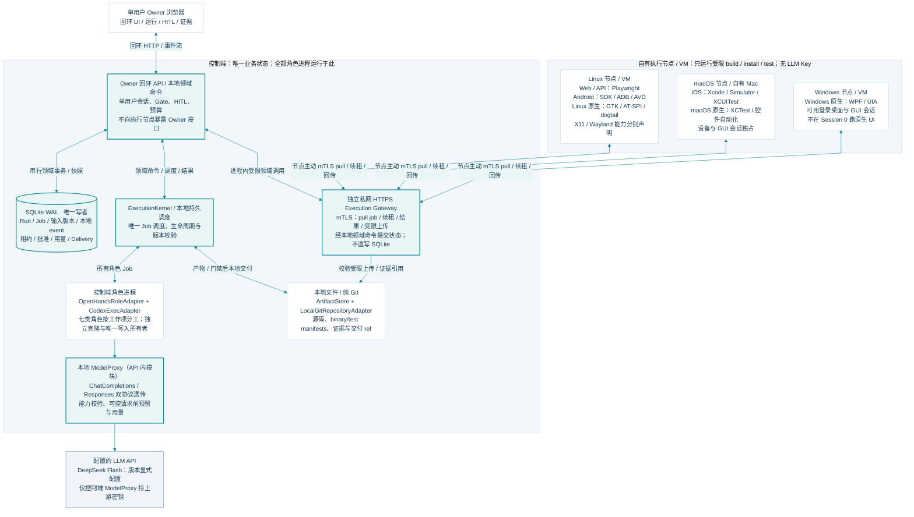
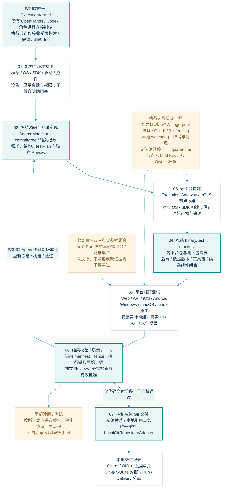

# AgentFlow 本地多平台 MVP：系统架构与技术实现方案

方案评审稿 v0.3｜2026-09-18

**推荐方案：一个本地控制端，连接自有的 Linux、macOS、Windows 执行环境，完成 Web、API、iOS、Android、Windows、macOS、Linux 原生应用的研发与真实测试闭环。** 控制端采用 FastAPI、SQLite WAL、本地文件和纯 Git；OpenHands SDK 承载专业角色会话，Codex 承载编码任务；平台统一管理并行、版本、人审、执行证据和交付。

本地优先指状态、代码、执行和产物保存在用户控制的设备上。不同系统使用合适的自有主机或虚拟机，不能要求一台任意操作系统的电脑原生执行全部平台工具。MVP 的完成标准包含七类目标的实际参考验收，不以预留接口、生成脚本或模拟报告代替。

本文件交付架构设计与实施约束；配套接口、工作包和验收项用于评审及开发。平台功能、模型兼容和各操作系统的实际测试尚未实施验证。

## 1. 版本调整统一对照

本表集中记录文档版本差异；其余正文只定义当前架构。

| 主题 | 既有版本安排 | 当前 v0.3 方案 |
|---|---|---|
| 产品目标 | PRD v0.5 描述完整产品；技术 v0.1 覆盖六类目标，未单列 Linux 原生 | 以完整产品目标为依据，MVP 明确七类目标及每类真实参考验收 |
| 原生范围 | 技术 v0.2 只要求 Web/API，原生适配延期 | iOS、Android、Windows、macOS、Linux 原生构建、执行、测试、证据和门禁全部纳入 MVP |
| 执行拓扑 | 技术 v0.2 使用当前主机执行 | 本地控制端＋自有本机/LAN 主机或 VM；节点按能力领取作业 |
| 网络入口 | 技术 v0.2 所有服务按回环入口设计 | 所有者管理入口只回环；另设有配对、mTLS 和严格接口范围的私网执行入口 |
| 状态与存储 | 技术 v0.1 提出 PostgreSQL/Temporal/对象存储方向；v0.2 使用 SQLite/本地文件 | SQLite 单写者、本地持久 DAG、内容寻址文件库；节点不访问数据库文件 |
| 仓库与交付 | 技术 v0.1 提出 GitHub/PR；v0.2 使用本地 Git | 纯本地 Git、候选对象导入、引用事务与交付对账 |
| 用户与 Agent | 技术 v0.2 使用单用户、OpenHands＋Codex | 单所有者；七角色按需多实例并行；角色/编码进程由控制端统一管理 |
| 候选身份 | 技术 v0.2 主要绑定本地 Web/API 源码和测试 | 源码候选＋分平台构建物＋后端＋测试包＋环境矩阵共同构成不可变候选清单 |
| 模型配置 | 用户最初指定 DeepSeek V4 Flash；现有官方资料显示兼容别名由当前 Flash 服务承接 | 使用可替换 ModelProvider；当前服务是否接受保持待确认，不静默改模型或调用 |
| 文档组织 | 既有技术稿在多个章节穿插范围变化与延期说明 | 版本比较仅集中于本表；正文、接口和清单描述当前方案 |

## 2. MVP 范围与完成定义

### 2.1 产品闭环

1. 接受产品目标和资料，形成有来源的市场/竞品调研、PRD、需求项和验收标准。
2. 形成或调整架构包：系统/模块/部署图、技术方案、主要 API、数据与依赖约束、变更影响分析。
3. 将需求和架构拆为带输入版本、写范围、依赖、资源与验收条件的开发任务。
4. 调研、产品、架构、开发、Review、单元测试、集成测试七类专业角色均可多实例并行。
5. 由独立角色审查功能和测试代码，在适当操作系统上实际构建、运行单测与集成测试。
6. 每个产物步骤可选人工审核；驳回产生修订，重新执行受影响的工作和检查。
7. 同一候选满足所有必需检查及适用人审后，交付到本地 Git，并保留可追溯证据。
8. 已有项目可从所选步骤开始、在所选步骤结束，进行功能新增、修改和删除。

单个所有者可以管理多个本地项目。默认 Agent 并发建议为 3，可配置；各角色、模型请求、构建作业、设备和桌面另有配额。Agent 并发与测试节点并发独立计算。

### 2.2 七目标验收口径

产品项目按其声明的必需目标执行，不要求每个项目同时包含七种客户端。平台 MVP 的总验收必须覆盖全部七类，每类至少有一个锁定版本的真实参考组合，并验证正常与故障两种结果。

每类支持包含：技术识别、方案生成、测试代码实现、环境预检、真实构建/安装/执行、原始报告与证据归档、质量门禁、人工审核接入及失败回传。Simulator/AVD 可以构成所声明组合的真实原生执行；其结果不代表真机硬件能力。

首批参考产品采用“工单”领域，共享一个真实 API 后端，分别提供 Web 和五种原生客户端。各客户端使用相应平台的原生控件和构建物。开发前冻结“登录、建单、修改、重开后持久存在、权限拒绝”等验收旅程，再生成实现和测试。

### 2.3 范围边界

MVP 不包含多用户/组织/RBAC、托管数据库或工作流、S3、GitHub 云计算、设备云、自动生产部署、跨仓库事务及插件市场。不安装 GitLab Server；本地 Git 提供版本和交付能力。

不承诺所有 OS 版本、CPU 架构、GUI 框架、设备型号和系统权限组合均兼容。支持以“目标配置＋工具链＋环境探针＋实际验收”登记。某项目要求的能力不可用时，保留该必需项并阻塞，不能删除分母或将跳过算成通过。

调研使用本地文件及受控 DirectWebReader；联网允许时读取实际可访问的公开 URL，保存来源和时间。安装依赖及公开资料读取按独立网络策略控制。模型 API 是唯一必需的外部运行服务；不依赖云端研发或存储平台。

## 3. 系统架构与部署



### 3.1 三种职责

| 部分 | 部署及职责 | 权限与边界 |
|---|---|---|
| 本地控制端 | 所有者 UI/API、持久调度、OpenHands/Codex、模型代理、文件库、SQLite、Git 交付 | 唯一业务状态写入方；审批和交付只由控制端判定 |
| 执行入口 | 控制端同一应用中的独立 HTTPS listener；服务已配对的自有节点 | 只提供作业领取、心跳、资源/结果与受限文件传输；不暴露所有者管理接口 |
| 执行节点 | 受管 node agent、构建器、测试适配器、隔离目录、设备/桌面会话、本地日志 | 执行冻结源码/测试包；无上游 LLM 密钥，不写控制数据库，不批准或发布 |

OpenHands 和 Codex 的受管进程运行在控制端。平台将原生构建错误、测试报告和诊断回传给相关角色；Codex 根据这些证据生成新修订，再交给适配节点验证。这样可完成 Swift、Kotlin、C#、GTK 等项目的编码闭环，而无需在控制端安装所有原生 SDK。

控制端建议使用经过 OpenHands/Codex 探针验证的 Linux 开发环境；macOS 控制端作为另一可登记组合。控制面可放在自有 VM 中。Windows 原生节点支持不依赖 Windows 能否运行控制端 SDK。

### 3.2 实现栈

| 模块 | 技术选择 | 关键实现 |
|---|---|---|
| Dashboard | React、TypeScript、Vite | 静态构建由管理 API 提供；fetch 流式读取 SSE |
| 控制服务 | Python 3.12、FastAPI、Pydantic 2、asyncio | 单进程领域服务、SQLite 写入 actor、受管子进程 |
| 持久状态 | SQLite WAL | 本地磁盘、外键、显式迁移、单实例锁、事务内事件 |
| 文件 | LocalArtifactStore | SHA-256 内容寻址、原子落盘、索引与引用校验 |
| 专业角色/编码 | OpenHandsRoleAdapter、CodexExecAdapter | 统一 TaskEnvelope、生命周期、产物与能力契约 |
| 模型 | 本地 ModelProxy、ModelProvider | Chat Completions/Responses 原生协议路径与可验证准入 |
| 执行节点 | Python node agent＋按 OS 实现的进程监督器 | pull 作业、本地 journal、租约、受限凭据、构建/测试适配 |
| 原生进程管理 | POSIX 进程组；Windows Job Object 等平台能力 | 身份校验、超时、中断、子进程清理与结果收集 |
| 仓库 | 本地 Git、独立克隆 | 源码冻结、对象导入、候选校验与引用事务 |
| 节点传输 | 私网 HTTPS、单次配对、mTLS | 证书指纹固定、权限绑定、文件摘要校验 |

控制进程只运行一个业务实例。双 listener 共用领域层与写入 actor，使用不同路由、认证和中间件，不运行两个可各自修改状态的服务。节点可以位于同一物理机，也可以是自有 LAN 主机或 VM。

### 3.3 最小环境组成

| 环境 | 可承担目标 | 必备条件 |
|---|---|---|
| Linux 主机或 VM | 控制端、Web/API、Android、Linux 原生 | 工具链与可写隔离目录；Android 需硬件加速/合适虚拟化；Linux GUI 需声明的桌面与辅助功能会话 |
| Apple 硬件上的 macOS | iOS Simulator、macOS 原生 | 合适的 macOS/Xcode/SDK、Simulator runtime、测试 runner、GUI/辅助功能权限 |
| Windows 主机或 VM | Windows 原生 | 合适的 .NET SDK、交互式桌面、UI Automation、应用与测试权限 |

可将控制端与测试节点放在同机的不同受控环境中；设备、桌面和资源许可由探针决定可并发程度。iOS/macOS 可以共用一台 Mac，Android 可以共用合适的 Linux 主机。不能假设任意 VM 都支持嵌套虚拟化或 Android 加速。

Windows 无人值守服务的 Session 0 不能直接代替用户交互桌面；锁屏、RDP 断开、分辨率改变须被探测。Mac 节点需处理测试驱动、屏幕录制和辅助功能许可。签名凭据仅在确有需要的节点上受控引用，普通 Agent 不读取私钥；模拟器测试不等于商店签名或真机分发验收。

## 4. 七类执行与测试适配

### 4.1 首批参考组合

以下是需要实现并验证的参考组合。精确 OS、SDK、运行时、框架和驱动版本在首次验收前由能力探针锁定，并保存到支持清单；此表不表示已完成兼容测试。

| 目标 | 参考技术及工具 | 必须实际验证与归档 |
|---|---|---|
| Web | React/TypeScript，Chromium，Playwright Test | UI 登录/建单/修改、刷新持久性、权限拒绝；trace、截图、报告和后端断言 |
| API | Node.js REST、本地数据库，Playwright APIRequestContext＋契约断言 | 鉴权、请求响应、幂等、数据持久性和业务错误；请求摘要、契约/断言结果 |
| iOS 原生 | SwiftUI，XCTest/XCUITest，指定 iPhone Simulator | 原生安装、控件输入/导航、重进与前后台旅程；xcresult、设备日志、截图、实际 app 身份 |
| Android 原生 | Kotlin View，Espresso/UI Automator，指定 AVD/API level | 应用/测试包安装、原生控件与约定系统交互、重启查询；instrumentation、logcat、截图 |
| Windows 原生 | WPF/.NET，NUnit、FlaUI UIA3，交互桌面 | 窗口/控件登录与保存、原生文件导出、重开及后端一致性；测试报告、UIA 证据、日志 |
| macOS 原生 | SwiftUI/AppKit，XCTest/XCUITest | 原生窗口/菜单/控件、保存后重开、受控目录导出；xcresult、日志、截图与实际 app 身份 |
| Linux 原生 | 锁定 Ubuntu LTS、GNOME/X11、GTK3、AT-SPI2，dogtail＋pytest | 真实辅助功能树、输入/选择/保存、文件对话框、重开；JUnit 报告、控件树、截图、文件/API 断言 |

Web/API 和原生应用都使用真实业务断言。HTTP 200、窗口出现、截图看似正确、Agent 宣称通过或进程退出 0 都不能单独决定成功。每类必须包含至少一个已知业务缺陷的负向验证，证明测试能够发现问题。

### 4.2 工具选择算法

IntegrationTest Agent 读取 ProductProfile、架构包、模块/API 契约和目标配置，生成 TestPlan。识别依据包含应用形态、UI 框架、平台 API、可访问性、构建工具和实际功能，不只依据语言或文件扩展名。

工具选择按以下步骤执行：匹配产品必需能力 → 过滤节点与工具链能力 → 选择已验证组合 → 生成环境、数据、用例、断言及证据方案 → 检查需求覆盖 → 执行适用人审 → 创建测试编码和执行工作项。没有合适组合时产生明确能力缺口，不静默降级为截图检查或 Web 测试。

TestAdapter 统一提供 `probe / prepare / build / install / discover / execute / collect / cleanup`。各方法是平台契约，内部调用实际框架；不假定所有框架有同名 API。API/Web 等无安装动作的组合显式声明“不适用”，不返回伪造安装成功。

UnitTest Agent 使用项目原生单测框架：JS/TS 项目的既有框架、Swift XCTest、Android JUnit、本机 .NET 测试及 Linux 项目框架等。单元和集成测试都有独立方案、实现、Review 和执行结果。必须依赖平台 SDK 的编译与单测同样派发到匹配节点。

### 4.3 Linux GUI 的明确边界

Linux 原生的首个验收组合是 GTK3＋AT-SPI2＋GNOME/X11。节点报告桌面/合成器、X11/Wayland、D-Bus/辅助功能总线、会话、字体、语言、缩放和截图/输入能力；必须能发现真实控件树并操作目标应用。

Wayland 是独立能力组合，需要验证控件动作、输入注入、窗口识别及截图权限。不得静默退到 XWayland 后仍标为原生 Wayland。Xvfb 只有经独立验证后才能登记为虚拟 X11，不能代表完整实体桌面。Qt、自绘 UI 等按其可访问性和驱动另建组合，GTK 验收不自动覆盖它们。

### 4.4 设备、后端与测试数据

原生测试可访问本地/LAN 的受控参考后端。TestPlan 声明服务启动节点、地址、健康检查、测试数据命名空间和清理规则；API 端口不与管理入口共用。项目应用拿到的是短期业务测试账号/令牌，无 owner 或 node 凭据。

跨端验收至少包含“API 建单 → Android 原生客户端修改 → Linux 原生客户端读取/更新 → Web 查询”，所有组件绑定同一候选集合与独立数据空间。摄像头、蓝牙、通知等需真实设备才能证明的必需能力，必须使用匹配真机和专用用例；Simulator/AVD 结果仅覆盖已声明范围。

## 5. 领域模型、状态和文件

### 5.1 核心实体

| 实体 | 必需信息与关系 |
|---|---|
| Project / Iteration / Run | 仓库、目标、迭代、起止步骤、运行范围和累计预算 |
| PlanVersion / WorkItem / Attempt | 不可变 DAG、角色、输入指纹、依赖、写范围、作业身份、fence 与状态 |
| ArtifactVersion / Approval | 产物类型、摘要、父版本；审核对象、策略指纹、决定、理由及有效性 |
| AppTarget / TargetConfig | 七种目标类型；模块、OS/CPU、UI 框架、SDK/设备/显示、所需能力及必需性 |
| ExecutionNode / CapabilityReport | 节点身份、证书、状态、受控环境、版本、探针时间及证据 |
| ExecutionJob / ResourceLease | 构建或测试作业、输入包、节点、租约/独占资源、heartbeat、有效 fence |
| SourceCandidate / BuildArtifact | commit/tree、源码与测试包；平台构建物摘要、bundle/package ID、构建/签名配置引用 |
| CandidateManifest / TestMatrix | 不可变组件集合、后端及数据版本；必需执行键、用例发现、结果和缺口 |
| CheckRun / DeliveryIntent / Delivery | 确定性检查、证据与候选关系；Git 交付意图、引用和对账 |
| BudgetReservation / ExternalInvocation / Event | 额度预留、调用/用量/未知责任、事务内事实事件 |

AppTarget 的规范值为 `web / api / ios_native / android_native / windows_native / macos_native / linux_native`。GUI 与 API 的差别来自目标和能力，不能把“运行在 Linux”直接当成“Linux 原生应用”。

### 5.2 SQLite 与事件

控制端持有 OS 单实例锁，SQLite 使用 WAL、外键、busy_timeout 和耐久提交。单个写入 actor 将领域状态、幂等回执、审计事件和待协调标记放在同一事务中；提交后才回应 UI 或节点。

调度器从已提交事实扫描就绪项、重试和等待条件；内存队列仅唤醒。读接口使用快照；event 表的已提交序列用于 SSE 重放。SQLite 文件不放在网络盘/自动同步目录，节点永远不直接打开数据库或 WAL。

部分清单使用带 schema_version 的 JSON 字段，关系与唯一性由领域校验/数据库约束保证。Gate、领取、结果接收、人审与交付均即时核对输入版本，不只依赖异步过期通知。

### 5.3 数据目录与产物

```text
agentflow-data/
  state/agentflow.sqlite3       唯一业务状态、事件、审核和预算
  artifacts/sha256/             文档、源码包、二进制、测试证据
  repos/                       受控仓库及交付对象
  workspaces/                  Agent attempt 独立克隆
  jobs/                        受保护启动意图、进程身份、日志
  nodes/                       节点元数据、证书引用、传输暂存
  exports/                     交付与评审导出
  backups/                     一致性备份清单

node-data/
  journal/                     本节点作业/传输恢复记录
  cache/sha256/                校验后的输入包与产物
  jobs/                       每次执行的隔离目录
  evidence/                    待回传报告及日志
```

节点 journal 只记录本机执行事实，不能成为第二个业务数据库。先暂存文件、校验大小与摘要、刷新并原子改名，再登记引用。文件与 SQLite 不是同一事务：孤立文件可回收；引用缺失或损坏文件则禁止门禁放行。

备份使用 SQLite 一致性备份与文件清单，恢复时核对哈希；不直接复制活动主库而遗漏 WAL。保留期间内的报告、二进制和必要测试包不得被缓存清理误删。导出不包含模型密钥或节点私钥。

## 6. 完整的 Agent 执行底座



### 6.1 角色与后端分离

OpenHandsRoleAdapter 承担调研、产品、架构、Review、测试分析与规划；CodexExecAdapter 承担功能代码、测试代码及明确范围的修复。开发、单测和集成角色可以共用 CodingAgentAdapter 机制，但使用不同任务、上下文和写范围；功能作者不能自动批准自己的产物。

ExecutionKernel 是唯一调度者。OpenHands 提出结构化 CodingWorkRequest，由内核校验、落库、配额准入后启动 Codex；不授予 SDK 任意派生未受管 Codex 的终端能力。后端内部未纳入平台的子委派默认不启用。同一工作区只有一个有效写入者。

所有七类角色都可按模块拆分并行。跨模块契约由架构协调工作项汇总，计划对依赖和共享文件建立明确关系。等待人工审核、节点资源或上游产物时不占用活跃 Agent 槽位。并行 Review/测试输出需汇总全部必需项，不能由最快完成的一个替代整个阶段。

### 6.2 Runtime 模块与接口

| 模块 | 实现要求 |
|---|---|
| CapabilityProbe | CLI/SDK、模型协议、事件、认证、工具、隔离、取消、恢复和用量；区分已验证、未知、不支持 |
| TaskEnvelope | 目标、角色、输入指纹、源码基线、写范围、网络/工具策略、预算、截止时间和产物要求 |
| BackendRegistry | OpenHandsRole、CodexExec 注册；组合探针通过才可派发 |
| Supervisor | 先存启动意图，再启动握手；进程组、PID/启动时间/boot ID/随机 job ID、日志、超时与清理 |
| WorkspaceManager | attempt 独立克隆、独占写入；不共享可修改的交付 Git 元数据 |
| EventNormalizer | 保存原始 JSONL/stdout/stderr，映射统一事件；未知事件保留，不误判成功 |
| ModelProxy / ToolPolicy | 固定上游、受限任务令牌、请求前预留；工具前置控制须有可验证入口 |
| NodeDispatcher | 目标/能力匹配、资源租约、输入包、作业领取、结果核验和回传诊断 |
| ArtifactCollector | 独立核对 diff、文件、源码/构建/测试身份和原始证据 |
| GateEvaluator | 检查完整性、质量、人审和候选一致性；后端无直接放行接口 |
| ConformanceTests | 正常、失败、重复、旧进程、取消、错误模型、坏事件、无产物和未知费用合同测试 |

CodingAgentAdapter 统一为 `probe/start/inspect/cancel/recover/collect_artifacts/collect_usage`；BackendHandle 绑定 operation、attempt、输入、工作区、版本和身份。平台接口不暗示第三方 SDK 有同名原生方法。

能力的执行保障分为 `hard / observed / unsupported / unverified`。JSONL 事件可以提供事后观测，不能冒充执行前拦截；设置工作目录也不构成沙箱。取消和恢复不能用空实现标为支持。

### 6.3 Codex 实现路径

使用受管 `exec`、JSONL、最终输出 schema、明确工作目录及已验证的沙箱配置。当前本机只读帮助记录为 codex-cli 0.135.0；参数存在不等于整条接入已通过。

每个编码工作项对应受管尝试，默认 ephemeral；平台保存日志、快照和结果。进程死亡后的恢复采用平台检查点加新尝试，不承诺原 Codex 会话无损续跑。生命周期、产物和用量都由适配器归一化。

`--ignore-user-config` 不能单独保证认证隔离。启动前显式验证模型 profile、代理地址、认证与实际请求去向；生成受控配置，不改写用户全局配置，不退回个人默认供应商。最终输出 schema 只约束回答形状，Collector 仍检查 tracked/untracked、删除/重命名、二进制、文件模式和符号链接。

## 7. 节点协议、资源与恢复

### 7.1 配对与通道

所有者在回环 UI 创建限时单次配对；节点连接指定私网执行入口并核对证书指纹，以单次凭据提交公钥/CSR 和节点信息。控制端验证后签发范围受限的节点证书。私钥只存节点受保护目录，支持吊销、轮换和重新配对。

执行入口使用 mTLS 验证 node identity；attempt 凭据绑定节点、作业、fence、输入和期限。配对凭据仅用于配对；owner token、node identity、attempt token 的 audience 与操作权限分离。私网来源本身不构成信任。

节点定向 pull 作业，管理入口不需要对 LAN 开放。执行通道没有任意 shell RPC：作业引用已冻结的执行清单、工具链、允许的动作和输入包。实际项目构建/测试仍会执行代码，必须由匹配的隔离配置承接。

### 7.2 领取与资源排他

1. 控制端检查节点证书、能力时效、队列、预算、输入版本和目标配置，事务内创建作业分配及递增 fence。
2. 节点领取后先将 job/attempt/fence 写入本地 journal，确认输入包摘要和资源状态，再启动受管进程。
3. 重复领取响应或重放请求返回同一作业事实；节点按 job 身份检查已存在进程，不能再次启动。
4. 节点按协议 heartbeat，并回传进程身份、设备/桌面、阶段、日志游标和资源清理状态。
5. 控制端在结果接收时核对当前 fence、输入、候选、矩阵和证据；陈旧结果只归档，不解除当前依赖。

资源标识可包含物理设备、模拟器、桌面会话、display、后端端口和数据空间。GUI 设备/会话默认排他；只有探针证明独立会话、数据与驱动不干扰，才允许并行。构建并发另受 CPU、内存和磁盘约束。

### 7.3 失联与取消

租约过期不证明旧进程已经停止。节点失联后作业进入 execution_unknown，相关设备/桌面隔离；控制端不能仅凭时间到期将同一资源交给新任务。节点 watchdog 尝试中断和清理，重新连线后验证进程消失、应用/模拟器/数据已复位，再解除 quarantine。

控制端重启时先恢复数据库事实并与节点 journal 对账，再开放调度。存活且身份可验证的作业继续观察；无法辨认进程或结果时保留未知。取消分为请求中、已确认停止、清理完成，不能将“已发送取消”显示为全部资源释放。

Windows 使用能够追踪子进程的监督机制，POSIX 使用受管进程组与身份校验；PID 单独不作为身份。无法确认旧进程/GUI 驱动停止时，需执行环境重置或由所有者确认清理证据后解除隔离。

### 7.4 文件传输与节点隔离

输入和输出经认证执行通道传输，带 artifact ID、长度、摘要和 attempt 授权，支持中断后续传/幂等完成。先暂存再校验落库，不接受节点提供任意控制端文件路径；归档解包拒绝路径穿越、越界链接、超限大小与不允许的文件类型。

node agent、身份密钥、journal 和证据收集器与生成代码进程分离权限；后者不能改 node credential 或平台结果。使用受控 OS 用户、容器或 VM 形成经探针验证的边界；原生 GUI 采用合适的独立桌面用户/会话。未证明隔离的环境只可登记为受信任项目模式，不能声称防止恶意仓库篡改测试证据。

## 8. 多平台候选、测试矩阵和门禁

### 8.1 两步冻结

先冻结 SourceCandidate：业务代码与已 Review 的测试代码 commit/tree、依赖锁、架构/API/需求版本及源包摘要。构建作业只消费此快照，输出带平台、工具链、SDK、构建配置、签名配置引用和真实二进制摘要的 BuildArtifact。

构建完成后冻结 CandidateManifest，包含适用平台组件、后端、数据 schema/fixture、测试包、环境矩阵和策略版本。不同平台的二进制摘要本来不同，不能把它们当成同一个包；它们通过同一不可变候选清单建立关系。

矩阵计划指纹只计算冻结的用例、目标配置、必需性、组件角色和策略，不包含运行结果、清单回指或构建后解析的组件 ID。组件绑定和结果有独立修订记录，避免清单与矩阵互相包含摘要形成循环；绑定变化仍须校验候选一致性。

对于构建与测试一体化框架，适配器必须能记录实际运行的产品和测试 bundle，并证明与预构建清单一致。若最终测试触发重编译导致构建物变化，则创建新清单并重新验证，不能将其结果直接归到原构建摘要。

### 8.2 执行键与证据

必需执行键由 `case_id＋target_config_id＋candidate_manifest_digest` 构成。每个结果还绑定 job、attempt、fence、输入指纹、测试包、实际安装/运行构建、后端实例、SDK/OS/驱动和设备/显示会话。

保留用例发现集合、预期集合、实际执行集合、失败/缺失集合及原始框架报告。环境就绪、方案完成、实现就绪、执行完成、质量通过分别记录。缺 SDK、权限、设备、报告或用例时明确 blocked/invalid/unknown，不转换为通过。

关键业务断言使用控件状态、API、数据库或文件内容；截图、trace、视频和视觉 Agent 提供补充。必需视觉断言不确定时保持未验证，不能通过自动修改视觉基线制造成功。跨端测试使用同一候选组件集合与专属数据空间。

### 8.3 门禁计算

GateEvaluator 仅在以下条件同时成立时判定可交付：输入和候选有效；功能及测试代码 Review 满足策略；所有必需构建和单测通过；集成矩阵完整且全部必需键有效通过；架构/API 一致性检查通过；适用人工批准有效；没有阻塞失败、未知执行或证据损坏。

通过数的分母来自冻结矩阵，不来自“已成功回传的报告数”。失败/失联节点不能从分母移除。可选项可显示警告；必需性修改必须形成新计划/策略并重新审核，不能借重试绕过失败项。

测试重跑保留每次结果；重试次数有限，不以反复运行掩盖不稳定。源码、构建、测试、后端/API、环境或审核策略变化使受影响检查失效，依赖图据此重新调度。人类可以认可诊断报告完整，但不能用“报告已批准”替代质量通过。

## 9. 架构治理、Human in the Loop 与已有项目

### 9.1 架构包

新项目建立架构包；已有项目先读取实际代码、构建/依赖、数据和 API，再形成现状与目标设计。包内必须有系统/模块/部署图源、技术方案、主要接口契约、数据关系、跨端依赖、非功能约束、决策记录和变更影响。

新增功能检查扩展边界和接口；修改功能检查兼容性、性能约束和数据迁移；删除功能检查调用方、路由/控件、API、数据、配置和测试残留。任务 DAG 和测试计划引用架构版本，实际实现变化需要回写架构并检查一致性。

多个架构 Agent 可分模块工作，汇总项负责契约冲突、循环依赖、共享数据和跨端一致性。正确、高效、可扩展通过可审查约束和实际检查体现，例如依赖规则、契约测试、迁移验证及适用性能预算；不以生成一张图宣称架构永远正确。

### 9.2 任意产物步骤的人审

注册产物步骤包括调研报告、PRD、需求拆解、架构包、开发任务、功能代码、代码 Review、单测方案/实现/结果、集成方案/实现/结果及交付候选。每一步可配置自动检查后放行或等待人类审核。

批准绑定对象版本、内容摘要、输入与策略指纹。驳回必须保存理由，路由回该产物的生产工作项；如果根因在更早步骤，产生带依据的回退请求。新修订重新检查、重新送审，旧批准不继承。循环持续到通过、预算/截止时间触发停止或所有者取消。

已启动且依赖被修改的任务不能继续放行结果；无关模块可继续。等待不占 Agent 槽位。人工审核不能被 Agent 自己调用，自动放行是所有者预先配置的策略，不是伪造人的批准记录。

### 9.3 已有项目与局部运行

导入明确的已提交基线，检测目标平台、工具链、现有文档、测试和架构。所有者选择起点、终点及变更目标；系统校验必需输入是否存在并仍有效，缺失时创建补充工作，而非编造输入。

例如从 PRD 增加一个功能：更新 PRD → 影响分析和架构/API调整 → 需求/任务 → 各端编码与 Review → 原生单测和集成 → 人审 → Git交付。删除功能也走适用回归和清理检查。可复用内容必须通过输入指纹和适用范围校验。

仅 Review、仅测试或仅方案运行按所选终点停止；仅测试不擅自修改业务代码。始终分别记录“工作执行完成、质量通过、人工批准、Git 已交付”四种事实。部分阶段运行完成不等于整个产品迭代已交付。

## 10. 模型接入、预算与管理安全

### 10.1 模型 profile

ModelProvider 与 CodingAgentAdapter 分开注册。模型 profile 包含供应商、协议、请求 ID、供应方所述版本、实际响应模型、工具/结构化/视觉/流式能力、价格来源、能力报告和接受状态。

当前拟用 DeepSeek Flash：OpenHands 通过本地代理走 Chat Completions，Codex 走 Responses。`deepseek-flash` 为当前官方建议请求 ID；配置的 acceptance_status 保持 `pending_user_confirmation`，accepted_api_model 为空。未确认选择时不发起 live 探针或模型任务。用户不需为本次文档修订重新确认。

DeepSeek 官方兼容说明要求本地保存上下文，不依赖 previous_response_id、conversation、store 或 background。max_tool_calls 被忽略、parallel_tool_calls 始终启用等行为不能承担本地硬限制。provider 参数和角色语义差异必须进入实际组合探针。[D1–D4]

两条协议均原生转发，不自造 Chat 到 Responses 转换桥。支持替换 LLM 表示可注册协议适配和能力矩阵；不是只改 base_url 就保证全部工具、结构化、视觉和用量语义兼容。

### 10.2 限额与恢复

长期模型密钥仅由控制端代理读取，不进入项目、节点、提示词、参数或普通日志。Agent 获得绑定 attempt/profile 的代理令牌，请求不能自选任意上游 URL 或未授权模型。节点不调用 LLM；节点诊断回控制端处理。

并发、attempt 次数、时限与可控工具准入由内核执行。每次可见模型请求在事务内预留 Run/Iteration 累计额度；只有全部流量经过代理且价格、输入及输出上界可证明时，才承诺严格金额上限。否则显示估算或未知责任，严格策略阻止不可控调用。

模型 wire API 不能假定 Codex 总带调用幂等键；无键请求视为新的 invocation，不承诺透明重试只收费一次。响应丢失但可能已收费时保留责任，不自动退款后重试。流式截断、失败和 usage 缺失分别处理，不将网络结束当成功。

### 10.3 所有者入口

所有者 UI/API 只绑定 loopback，采用限时单次 bootstrap code 换 owner Bearer；令牌只保存在 UI 内存，并仅附加到固定控制来源。校验 Host/Origin，不使用随同域其他端口自动发送的管理 Cookie。bootstrap 消费后从地址片段清除，不把长期令牌放在 URL。

项目预览、资料抓取、模型代理和节点传输分别构造请求，禁止转发 owner token。预览使用独立来源，Playwright 使用独立浏览器上下文。执行入口只有节点路由，node/attempt token 无审批、预算调整或直接 Git 发布权限。

保护控制库、文件索引、交付仓库、长期密钥和其他工作区；cwd 不是沙箱，同 OS 用户的无约束进程也不能作为隔离证明。控制端与各节点都运行越界能力探针，支持状态中明确运行模式和可信边界。

## 11. 本地 Git 交付

默认交付为本地候选提交、独立交付 ref/分支和证据清单。不覆盖用户当前工作区、索引或未提交修改；导入从明确的已提交基线开始，不自动 stash 或将未知改动混入候选。

编码 attempt 使用独立克隆，不以硬链接共享对象或交付 Git 元数据。合并并行产物产生新源码候选，最终验证针对组装后的候选，而非用各模块单独通过推导集成成功。

发布前在 SQLite 保存 DeliveryIntent。RepositoryAdapter 通过受控 bundle/fetch 将候选 commit/tree/blob 导入实际目标对象库，核对 OID、tree 和对象完整性；不运行来源 hooks 或不受控过滤器。准备完成不算交付。

对象就绪后，在同一目标仓库的 Git 引用事务中验证 base ref 的期望 OID，并创建交付 ref。相同 ref/OID 重试可对账为已生效；不同则冲突。目标基线变化时重新组装并执行受影响验证。

Git 和 SQLite 不属于同一事务。若 ref 成功但数据库未记账，恢复按 intent/ref/OID 对账确认，不重复发布。交付记录绑定候选清单和有效证据；用户工作区及主分支不自动切换。

## 12. Dashboard 与接口契约

### 12.1 五个界面区域

| 区域 | 必备内容 |
|---|---|
| 项目与运行 | 本地仓库、目标端、资料、起止步骤、DAG、迭代与历史 |
| 执行台 | 阶段、Agent 角色/后端/模型、节点/OS、构建/测试作业、排队原因、并发、取消/失联 |
| 人工审核 | 精确版本、差异、自动检查、驳回理由、受影响依赖与回退范围 |
| 产物与质量 | 调研/PRD/架构/API、diff、七目标矩阵、有效通过数/必需总数、构建和报告、交付 ref |
| 本地设置 | 模型/后端 profile、节点配对/吊销、SDK/设备/GUI 探针、目录、配额和网络策略 |

进展按已接受的工作项和有效必需执行键计算，展示分母、更新时间、失败/未知/缺环境，不以 Agent token 数或一段总结推算完成百分比。费用分为确认、估算和未知；节点能力显示有效期与最近证据。

### 12.2 接口分区

配套 `AgentFlow-MVP-本地多平台接口契约-v0.3.openapi.json` 给出机器可读结构。管理 API 包括项目/Run/产物/审核、目标配置、节点管理、能力探针、候选/矩阵/交付；内部接口承接受限 Agent 结果和模型协议；执行接口承接节点配对、领取、heartbeat、结果及传输。

接口中 SourceManifestView 表达冻结源码候选，PlatformArtifactManifestView 表达候选的平台构建组件集合，TargetMatrixView 表达计划及绑定/结果视图。目标配置通过运行计划及版本化测试计划管理；节点环境探针描述实际能力，两者匹配后才能派发。

所有业务写命令携带 Idempotency-Key，并校验对应 revision/fingerprint。列表与事件提供游标。错误类型区分状态冲突、陈旧输入、缺能力、资源隔离、哈希不符、证据缺失和权限不足。结果接口只提交执行事实及声明，不接受客户端直接覆盖 Gate。

节点路线在 OpenAPI 中绑定独立 execution server 和认证；管理路由不因共享应用代码而暴露给 LAN。离线探针检查环境和结构；live 模型探针必须有已接受 profile 和明确预算。接口/schema 校验不代替运行层身份与业务不变量检查。

## 13. 模块拆分与细粒度实现

### 13.1 推荐代码组织

```text
apps/dashboard/                 页面、事件状态、矩阵与审核组件
agentflow/domain/               版本、DAG、审核、候选、门禁、交付规则
agentflow/control/              管理API、写入actor、调度器、读模型
agentflow/runtime/              supervisor、workspace、event、budget
agentflow/adapters/openhands/    角色会话与受控工具
agentflow/adapters/codex/        进程/JSONL/产物/恢复
agentflow/models/               双协议代理、provider、probe
agentflow/execution/            node协议、配对、租约、传输、dispatcher
agentflow/testing/              TestPlan、matrix、结果归一化、collector
agentflow/testing/adapters/     web/api/ios/android/windows/macos/linux
agentflow/storage/              SQLite、文件、迁移、备份
agentflow/repository/           本地Git、candidate、delivery对账
node_agent/                    journal、supervisor、OS环境与驱动
contracts/                     OpenAPI、schema、事件及adapter合同
reference_apps/                共享API、Web与五种原生参考客户端
```

### 13.2 开发顺序与退出条件

| 实施阶段 | 具体产出 | 退出条件 |
|---|---|---|
| A：组合与环境探针 | OpenHands/Codex/模型契约，七目标环境盘点，至少一个原生纵向样例 | 身份/请求去向正确；原生真实构建、控件操作和证据可回传；缺口显式记录 |
| B：状态和 Runtime | SQLite/事件、版本、文件、工作区、supervisor、模型代理、并发/预算、恢复 | 重复启动、陈旧结果、崩溃、未知费用和损坏产物不能误放行 |
| C：节点与候选协议 | 配对/TLS、capability、租约/fence、传输、manifest、统一 TestAdapter | 多 OS 共享契约可表达且执行；失联/取消/坏包反例通过 |
| D：并行实现七目标 | Web/API 及五原生适配、原生单测、参考客户端与跨端场景 | 每目标正常与已知缺陷验证有效；候选/设备/报告可追溯 |
| E：研发与迭代闭环 | 七角色、架构包、DAG、HITL、已有项目增改删、Git交付 | 从目标到交付及局部运行闭环可证明；新候选不复用失效批准 |
| F：单用户交付 | 五区界面、导出/备份、故障恢复和全量验收 | 全部必需 LAC 有证据，七目标覆盖完整，限制如实呈现 |

阶段 A 先验证一个原生纵向链路及七目标环境，确保节点/候选协议能够容纳真实差异。阶段 D 的适配器可以由不同 Agent 并行开发；公共契约冻结后再集成，变更契约须重新检查全部适配器。

配套实施 CSV 包含 LWP-01～38 共 38 项工作包，给出依赖、交付物、验证方式和验收关联；配套验收 Markdown 包含 LAC-01～34 共 34 项实际运行判定标准。LWP-28 为统一验收工作包，依赖其余工作完成，不按编号推断执行次序。排期取决于设备/SDK、模型组合和原生驱动探针结果，不能只依据服务数量估计工期。

### 13.3 扩展接口的当前约束

StateRepository、WorkflowBackend、ArtifactStore、RepositoryAdapter、ModelProvider、CodingAgentAdapter、TestAdapter、ExecutionHost 和 IdentityProvider 均有明确接口。MVP 实现本文选定后端和合同测试，不预写未使用的实现。

替换后端必须验证状态迁移、幂等/取消、权限、事件、输入身份和证据语义。TestAdapter 可注册新框架/设备；ExecutionHost 可注册新环境；模型和 Coding Agent 分别验证组合。纯 Git 引用、外部合并请求和自动部署不是同一种交付动作。

## 14. 验收重点与可行性判断

### 14.1 必须覆盖的反例

- 五类原生应用不能用网页壳、截图样例或模拟报告代替；每类执行对应真实工具。
- 测试退出 0 但零用例、缺报告、实际包不匹配或业务断言失败：门禁失败。
- 环境不可用、显示协议不符、Windows 桌面锁定或 GUI 权限缺失：阻塞并说明缺口。
- 节点断网但旧 GUI 进程存活：资源隔离，不能直接分给新任务。
- 重复领取、控制端重启或结果重传：不重复启动、不重复结算、不重复交付。
- PRD/API/源码/构建/测试/环境变化：旧结果与批准不能放行新候选。
- Agent 或节点尝试批准、增加预算、读取其他作业或发布：拒绝。
- API 返回 200 但数据未保存，或原生界面显示成功但后端失败：准确检出。
- Git 引用成功而 SQLite 未确认：通过意图/OID 对账恢复。
- Linux X11 成功但产品要求 Wayland，或 Simulator 成功但产品要求真机能力：保留必需缺口。

### 14.2 可行性与实施前提

技术上可按上述分层实现：单控制端避免分布式数据库和工作流基础设施，节点协议承担跨 OS 执行，平台适配器保留原生工具差异，统一候选/矩阵/门禁建立闭环。主要工程投入在 Runtime、节点生命周期、各平台驱动与证据一致性。

实际开工首先需要可用的 Mac/Xcode、Windows 交互桌面、Linux GUI/Android 环境，以及已接受并通过探针的模型/Agent 组合。任一参考组合验证失败时调整工具或补环境，并保留失败证据；不能通过降低必需范围宣布 MVP 完成。

本次完成的检查限于文档、接口结构、工作包依赖、验收追踪、图文一致性与导出。未运行平台实现、付费模型调用或七平台原生测试；真实支持状态由实施阶段产生的证据决定。

## 15. 依据与待验证事项

模型与 CLI 部分依据本地保存的 2026-09-18 资料：DeepSeek 官方 API/模型/Responses/Codex 指南，以及 codex-cli 0.135.0 的只读帮助。OpenHands 的具体模型工具循环和全部原生参考工具组合需在指定环境探针验证；本次未新增联网调研。

工具名称在本文表示实现选择，不代表所有版本组合已获验证。评审包附上模型/CLI 依据说明；节点支持清单将记录最终锁定的版本、命令、权限、环境与实际报告。

- [D1：DeepSeek API](https://api-docs.deepseek.com/)
- [D2：DeepSeek Models & Pricing](https://api-docs.deepseek.com/quick_start/pricing/)
- [D3：DeepSeek Responses API](https://api-docs.deepseek.com/guides/responses_api/)
- [D4：DeepSeek Integrate with Codex](https://api-docs.deepseek.com/quick_start/agent_integrations/codex/)
