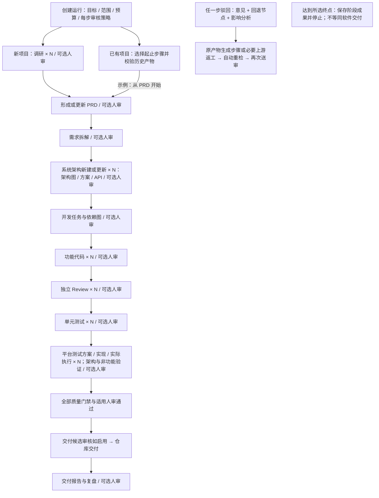

# AgentFlow：Agent 全流程软件研发框架与平台

产品需求文档（PRD）｜v0.5 评审稿｜2026-09-16

**文档定位**：将“人类提出产品目标，Agent 自主完成产品研发迭代”的构想，转化为可评审、可拆解、可验收的产品方案。AgentFlow 为暂定名称。

**假设说明**：本稿为产品方案，配套行业调研另见《AI 驱动的软件研发系统行业调研报告（2026-09-16）》。目标用户、首期技术范围、指标阈值和里程碑仍为设计建议，不代表已经完成用户需求验证或交付承诺。流程中的“调研报告”指平台为目标项目生成的产物。

**本版修订**：将集成测试扩展为基于产品功能与技术特征的方案生成、工具选型、测试实现、环境预检、实际执行及证据汇总。测试模块明确覆盖 Web、API、iOS、Android、Windows、macOS，并补充混合应用、视觉验证、平台矩阵和跨平台执行环境要求。保留架构演进、全角色并行、逐步人审和局部运行。

## 1. 产品定义与目标

### 1.1 一句话定义

AgentFlow 是一个以产品目标为输入、以经过验证的代码仓库交付为输出的自主研发平台。平台组织多个专业 Agent 完成市场与竞品调研、产品分析、需求拆解、技术设计、开发、独立代码 Review、单元测试、集成测试及仓库交付。调研、产品、架构与规划、开发、Review、单元测试和集成测试均支持按模块、专题或验证范围启用多个 Agent 并行工作，并通过 Dashboard 持续展示全过程。

系统架构是随项目版本持续维护的核心资产：技术方案阶段形成或调整架构图、技术方案描述、主要 API 和验证计划，并在后续开发与测试中核对实现是否符合设计。架构的正确性、效率和扩展性以明确场景、约束和证据评估。

集成测试 Agent 根据产品功能、架构、应用形态、协议和目标运行平台生成测试技术方案与可执行实现，选择合适的浏览器、API 或原生自动化工具组合；多端产品按平台矩阵和关键业务链路汇总验证。测试方案、实现生成和执行通过分别记录。

平台支持全自动、关键步骤人工审核和逐步骤人工审核三种运行方式。已有项目既可走完整流程，也可从 PRD 更新、需求拆解、开发、Review 或测试等指定步骤进入，复用仍然适用的历史产物，按选定范围推进。

平台由两部分组成：**研发编排框架**负责工作流、任务依赖、Agent 执行、质量门禁和产物追溯；**可视化平台**负责项目管理、目标输入、运行监控、成本管理和异常干预。两者使用同一套运行与证据数据。

### 1.2 产品原则

1. **自动化程度由用户配置**：未开启人工审核的步骤自动推进；开启的步骤必须等待有权限的人审核。任何步骤都可驳回返工并重新送审，直到当前版本获批，或运行明确暂停、阻塞或终止。
2. **所有完成状态有证据**：阶段通过由平台根据版本化产物与真实检查结果判定，不能只依赖 Agent 的文字结论。
3. **所有专业角色均可按需并行**：角色代表专业职责，一个角色可有多个执行实例。按模块、专题、审查维度或测试集合拆分工作，依赖就绪后并发执行，必需产物经汇总与一致性校验后才能进入下一门禁；不要求每个阶段始终开启多个 Agent。
4. **验证独立于实现**：开发、Review 和测试由职责分离的 Agent 实例承担，测试以需求和接口为依据。
5. **失败形成闭环**：发现问题后自动定位、返工、重新验证；超出预算或授权边界时明确阻塞并保留现场。
6. **过程可追溯、可恢复**：目标、需求、任务、代码、缺陷、测试、人工决定与交付记录关联到具体版本。
7. **按所需步骤迭代**：阶段依赖有效输入产物；已有项目无须每次从调研重新开始，局部运行也不得绕过代码交付所需的质量检查。
8. **架构随功能演进**：功能增删改均分析模块、接口、数据与非功能影响；图、方案、API 和实现共同版本化。设计就绪与实现验证通过分别记录，不以更新文档代替修复代码。
9. **测试方式适配产品**：按功能与技术特点选择工具、环境和断言。浏览器、API、原生 UI 及跨端链路分别覆盖，不能以一种工具的局部成功代替全部必需范围。

### 1.3 用户价值与完成定义

用户不需要手动协调多个 AI 工具，也不需要靠阅读聊天记录判断研发进度。用户能够看到当前阶段、工作中的 Agent、交付范围、关键阻塞、预计剩余工作和实际消耗，并在需要时暂停或调整目标。

代码交付型迭代的“已交付”必须同时满足：冻结范围内的必交需求全部通过验收映射；对应代码通过 Review、单测、集成及必需架构一致性和非功能验证；交付绑定适用架构版本；所有交付前适用的人工审核批准有效；交付内容与已验证版本一致；预设仓库操作成功；仓库交付记录可访问。交付后的复盘审核不构成仓库写入的前置条件。

仅更新 PRD、拆解任务、审查代码或运行测试的局部执行，结束时标为“所选步骤已完成”，不能显示软件已交付。执行完成、质量结论和人工决定分开记录：例如“审查已完成，报告已获人类认可，代码质量未通过”是有效状态，仍不得放行代码交付。

“已交付”表示完成约定的软件研发交付，不代表已经上线，也不代表产品已经获得真实市场验证。

## 2. 目标用户与使用场景

| 用户 | 核心诉求 | 主要使用方式 |
|---|---|---|
| 创业者、产品负责人 | 将想法转化为可运行的软件，掌握范围、成本和结果 | 输入目标，查看产品分析、交付预测与验收结果 |
| 研发负责人、技术负责人 | 将明确的研发目标交给 Agent 团队，确保代码可维护且可验证 | 配置仓库、技术规范和质量策略，查看任务依赖与缺陷 |
| 小型研发团队 | 自动处理边界清楚的功能迭代，减少任务分配和协调成本 | 在已有项目中启动迭代，检查 PR 和回归影响 |
| 平台管理员 | 管理模型、工具、执行环境、权限和费用 | 配置连接器、资源配额、组织策略和审计保留 |

首期优先服务拥有明确目标、可用测试环境和代码仓库权限的小型软件团队；同时支持从模板创建新项目。面向完全缺乏技术配置能力的用户，需要平台提供已验证的项目模板和默认运行策略。

### 2.1 典型场景

**从零构建产品**：用户输入“为 20 人客服团队创建工单系统，支持提交、分配、状态流转、筛选和角色权限”，设置预算并启动。平台输出竞品与需求分析、PRD、任务计划和通过测试的代码交付。

**现有产品新增功能**：用户选择已有项目和代码基线，输入“增加工单 SLA 提醒”，选择“从 PRD 更新开始，至仓库交付结束”，仅为 PRD 与集成结果开启人工审核。平台复用适用的既有调研、更新 PRD，审核通过后拆解需求与任务、开发、验证并交付新版本；未发生变化的产物保留来源，不强制重新调研。

**逐步人工把关**：用户为调研报告、PRD、需求清单、任务计划、功能代码、Review 报告、单测与集成结果分别开启人工审核。发现 PRD 缺少通知失败场景时，直接驳回产品步骤，Agent 按意见修订并重新送审，获批前不启动依赖该 PRD 的工作。

**局部执行与后续继续**：用户对已有提交仅运行代码 Review，获得报告后结束；之后可基于报告启动关联的修复与验证运行。另一种情况是仅更新 PRD 和形成任务计划，审核通过后保存阶段成果，待需要时继续至代码交付。

**架构持续演进**：新增 SLA 提醒时识别提醒调度、数据索引、通知接口与容量需求，更新目标架构和验证计划；修改通知方式时核对 API 消费者与兼容性；删除旧提醒能力时检查残留调用、定时任务和数据保留。设计、人审、实现与验证均形成版本记录。

**按模块组织多个专业团队**：工单、知识库和通知模块分别由多个产品与架构 Agent 分工；调研按竞品或用户问题并行；Review 按模块及安全维度并行；单测与集成测试按套件分片执行。各阶段汇总模块产物与跨模块检查结果，形成统一 PRD、技术方案和最终交付结论。

**按项目生成测试方案与实现**：Web＋API 工单系统采用浏览器交互测试和 API/数据断言组合；接入原生移动或桌面客户端时，分别选择适配其控件、平台和环境的工具，生成测试代码、配置与执行入口，并验证客户端到后端的关键链路。用户可仅审核测试方案，也可运行完整验证。

**自动修复与恢复**：集成测试发现权限校验缺陷，平台生成缺陷任务、安排修复、重新 Review 和测试。若外部测试服务不可用，Dashboard 显示环境阻塞，并在恢复后继续。

## 3. 范围与首期假设

### 3.1 MVP 建议范围

| 维度 | 首期建议 | 后续扩展 |
|---|---|---|
| 产品形态 | 新建产品开发闭环首期为 Web/API；独立测试模块支持已有 Web、API、iOS、Android、Windows、macOS 项目接入 | 移动/桌面原生产品的完整自主开发闭环、复杂分布式系统 |
| 项目入口 | 模板新建；已有项目导入；完整流程、指定起止步骤、仅所选步骤；兼容性按本次所需能力预检 | 大型遗留系统迁移、多仓库协同 |
| 仓库 | 先支持 GitHub 单仓库 | GitLab、其他 Git 服务及多仓库 |
| 技术栈 | 开发模板优先 TypeScript / React / Node.js；测试方案及实现按目标项目语言、平台与既有框架适配 | 更多应用框架、OS 版本、设备及协议组合 |
| 集成测试范围 | P0 包含技术特征识别、方案/实现、环境预检，以及 Web/API 和四类原生平台的基础执行适配与真实验收 | 扩大设备覆盖、设备云、更多 OS/专用控件与协议适配 |
| 部署方式 | 团队级单租户部署，集中管理执行资源 | SaaS 多租户、企业私有网络运行节点 |
| 并发策略 | 七类专业角色均支持多实例；建议单次迭代总并发上限 8、各角色上限 4，按就绪工作项按需分配，可配置且受资源和预算约束 | 按关键路径与历史数据优化各角色配额 |
| 架构设计与演进 | 新建/增量架构设计包、主要 API、变更影响与一致性门禁；包含适用的性能和扩展性验证 | 多仓库全局架构、生产运行反馈驱动的持续优化 |
| 自动化边界 | 选定范围内自动执行；启用人审时审核后继续；完整代码交付至交付分支及 PR | 经启动策略授权的自动合并、部署与线上反馈闭环 |
| 人类参与 | 每一步均可配置人工审核，支持通过、驳回、返工重审；P0 每检查点一名指定审核人，可授权转交 | 多人会签、复杂审批委托与组织审批系统集成 |

以上是便于收敛交付的范围定义，不作为平台长期限制。v0.5 将测试模块的原生平台接入纳入 P0：每个平台至少验证一个声明支持的参考应用、工具/驱动和环境组合，完成从方案到证据与门禁的真实闭环。可分批实现，但未验证的平台组合只能标记为未接入或未验证，不能提前宣称全部平台已支持。原生应用测试可通过已有项目和局部 Run 接入，不要求先完成原生产品全流程开发能力。

### 3.2 首期不包含

- 自动投放广告、收费、采购、招募访谈对象或对外发送消息。
- 默认合并受保护主分支、默认生产部署或直接修改生产数据。
- 自主决定商业方向并无限追加需求；任何新需求必须进入版本化范围与预算。
- 在未接入真实用户研究渠道时，声称已完成用户访谈、需求验证或商业验证。
- 保证任意规模、任意技术栈项目都能无人介入完成。

## 4. 端到端研发流程

### 4.1 正常流程



图中各专业角色节点均可展开为并行工作组；产品和规划角色分别产出 PRD、需求清单与开发任务清单，具有独立审核检查点。“可选人审”表示：关闭时经自动校验继续，开启时进入待审；人类驳回后回到该产物的生成步骤或明确的更早节点，重做、重检、重新送审。此规则覆盖全部步骤与适用子产物，不只图中的主干节点。

所有运行在所选终点结束；无代码交付目标时不会继续执行仓库写入。跨阶段工作须等待其输入产物、自动校验及适用人审全部就绪；七类角色不必同时工作。

Review 和单测适用于每个开发任务；每个任务通过后才可进入候选版本。集成阶段先生成适配项目的测试技术方案和实现，再由多个 Agent 按平台、模块、协议或业务链路并行验证同一最终交付候选。方案、测试代码和执行报告分别可选人审，编排器按必需平台矩阵汇总判定；各平台构建物与后端的版本关系记录于候选清单。任何实质修复均重新进入必要的 Review 与测试。

### 4.2 阶段输入、输出与通过条件

| 步骤 | 核心输入 | 必须产出 | 代码交付路径的自动校验条件 |
|---|---|---|---|
| 目标建立 | 用户目标、约束、仓库与运行策略 | 目标简报、范围边界、成功指标、假设清单 | 必填运行条件齐备；关键缺失项已经解决或明确阻塞 |
| 调研分析 | 目标简报、调研分工与资料 | 多份调研子报告、统一证据索引、综合分析 | 必需专题完整；结论可追溯；重复来源合并；冲突结论有依据或保留分歧 |
| PRD 形成或更新 | 目标、适用调研或既有 PRD、变更说明 | PRD 新版本、业务规则、范围及差异 | 目标、用户场景、边界和关键取舍明确；变更可追溯 |
| 需求拆解 | 有效 PRD、模块分工、项目上下文 | 需求项、优先级、验收标准和全局规则 | 无遗漏或重复；必交需求可验证；关键矛盾解决；形成需求基线 |
| 系统架构设计与技术方案 | 需求基线、现状架构与代码、变更影响、模块分工 | 版本化架构图、技术方案、主要 API、数据模型及适用迁移/验证计划 | 图文契约一致；需求覆盖；独立设计复核通过；必需非功能目标及验证条件明确 |
| 开发任务形成 | 有效需求、就绪目标架构与 API 契约、项目基线 | 功能、兼容性、迁移、架构约束和验证任务及依赖 | 架构决策能落实到任务；无依赖环；输入输出与验证方法完备 |
| 并行实现 | 就绪任务、冻结输入版本 | 代码变更、实现说明、必要文档、运行记录 | 编译与基础检查成功，变更进入独立 Review |
| Review | 需求、契约、指定版本差异、必需审查范围 | 各模块或维度 Review 报告、合并问题清单 | 全部必需审查范围覆盖；无未解决阻断或重大问题；适用静态检查通过 |
| 单元测试 | 需求、接口、用例及分片计划、已 Review 的代码 | 测试代码、各分片报告、合并覆盖与缺陷记录 | 同一被检版本的必需分片全部执行通过，无缺失用例，满足覆盖与行为要求 |
| 集成测试方案 | 产品功能、目标架构、代码/构建特征、目标平台与已有测试 | 特征清单、工具选型、测试范围/矩阵、环境/数据/断言及证据计划 | 每项必需能力有适配方式；理由与缺口明确；通过方案复核及适用人审 |
| 集成测试实现 | 有效测试方案、契约、适用工具/SDK | 测试代码、配置、依赖版本、运行入口、初始化/清理和报告适配 | 实现与方案对应，独立代码 Review 及适用静态检查/人审完成；不等同执行成功 |
| 多平台执行与汇总 | 候选清单、测试实现、工具、浏览器/设备/OS与环境 | 原始结果、适用截图/录像/trace/API及应用日志、缺陷与汇总报告 | 所有必需平台、场景和矩阵项真实执行通过；架构/非功能要求满足；证据版本一致 |
| 仓库交付 | 已验证候选版本、仓库策略 | 交付分支、PR、版本标识、交付说明 | 交付内容一致，远端操作确认成功，仓库规则满足 |
| 迭代复盘 | 全链路事件、成本与质量数据 | 交付清单、遗留风险、耗时成本、下一轮建议 | 记录完整；建议默认进入候选需求池 |

以上每一步、其模块产物及汇总产物均可单独启用人工审核。表内质量条件用于向研发或代码交付链放行；开启人审时还须当前版本获批。仅 Review／测试的报告模式，自动完成条件是约定范围执行完整且证据、报告可信，质量结论允许为不通过；不自动修复，不据此释放交付依赖。复用产物需按第 4.4 节验证，不要求重新执行其全部来源步骤。

### 4.3 状态模型

一个项目包含多个业务迭代；一次迭代可以包含多次关联运行 Run。迭代保存目标与需求范围，Run 保存本次选择的步骤、输入基线、预算和执行记录。每次局部执行、终止后的重试或后续继续均有独立 Run ID；同范围继续不必重新创建业务迭代。平台分开保存步骤位置、执行结果、质量结论和人工决定。

| 对象 | 状态 |
|---|---|
| 迭代业务状态 | 草稿、进行中、阶段成果就绪、已交付、已终止；依据当前目标的有效运行与产物汇总 |
| 运行 Run 执行状态 | 草稿、排队、运行中、等待人工审核、暂停中、已暂停、阻塞、已完成、失败、已取消；交付状态独立显示 |
| 通用工作项 | 待依赖、可调度、执行中、待校验、待人工审核、返工中、已完成、阻塞、失败、已取消 |
| 并行工作组 | 待展开、并行执行中、待汇总、校验中、待人工审核、返工中、已通过、阻塞、结果过期 |
| 人工审核请求 | 待审核、已通过、已驳回、已过期、已撤销；已决定的记录不可覆盖 |
| 架构版本 | 设计状态：草稿、复核中、待人审、设计就绪、需修订；实现状态：未验证、验证中、验证通过、验证失败；另记对应交付版本 |
| 测试方案/实现 | 方案：待识别、编写中、待复核/人审、已完成；实现：未生成、已生成待校验、已就绪；执行结果独立 |
| 平台执行条件 | 未识别、适配器未接入、目标/工具不兼容、缺少环境、缺少权限、就绪；执行中错误与测试断言失败另记 |
| 开发任务细分流程 | 待依赖、可调度、实现中、待 Review、Review 中、待单测、单测中、待集成、集成通过、已交付；附加阻塞、已取消状态 |
| 检查记录 | 待执行、执行中、通过、失败、执行错误、结果过期 |
| Agent 实例 | 空闲、执行中、等待工具、等待资源、停止中、失联、已结束 |

“失败”表示当前 Run 已终止；“阻塞”表示缺少继续条件但可恢复；“暂停”来自用户或运行策略。部分工作待人审时显示“运行中／部分待审核”，其他独立工作继续；只有全部可推进路径均等待人审时，才将 Run 标为“等待人工审核”。人工等待不是失败，测试失败也不等于审核人驳回报告。

工作项完成须满足其运行目标、产物完整性及适用人审；并行组仍需汇总。用于后续开发或交付的依赖，只有自动质量条件及适用人审均通过才释放；开发任务因此达到“任务验证完成”，进入待集成。仅审查或测试时，报告可完成但质量结论仍为不通过，不释放代码交付依赖。

Run 内的返工属于新的工作项尝试；Run 终止为失败或取消后，再次执行创建关联新 Run，保留原终态、费用与决策。同一业务迭代可继续使用有效产物；新的产品版本或独立目标可创建关联新迭代，均不能覆盖历史交付。

仓库写入成功后立即更新独立 Delivery 记录及对应迭代的交付状态；若本次还选了复盘或复盘人审，Run 可继续显示“运行中／等待人工审核，代码已交付”。全部所选步骤完成后 Run 才结束为“已完成”。后续复盘驳回或取消不会把历史 Delivery 改回未交付；局部 Run 则显示“所选步骤已完成，未执行代码交付”。

### 4.4 已有项目与指定步骤入口

启动页支持“完整流程”“指定起止步骤”“仅运行所选步骤”。起点与终点均包含在范围内；选择不连续步骤时，必须有有效产物补齐中间依赖。页面明确列出本次执行步骤、复用产物、不执行步骤、尚缺输入，以及各步的人审策略。

| 入口 | 最小必要输入 | 可复用及处理方式 |
|---|---|---|
| PRD 更新 | 新功能或变更目标、既有 PRD 或经核实的需求现状、项目基线 | 复用适用调研；形成 PRD 新版与变更差异，不默认重跑市场调研 |
| 需求拆解 | 有效 PRD 与本轮范围 | 复用既有业务规则，形成新增、修改和废弃需求及验收条件 |
| 系统架构新建/更新 | 需求与验收标准、代码基线、适用现状架构或重建证据 | 形成架构图、方案及 API；对功能增删改分析影响并更新目标架构 |
| 开发任务形成 | 就绪目标架构、需求、API、迁移与验证计划 | 复用不受影响的模块，拆解实现及验证任务，记录架构版本 |
| 功能开发 | 任务契约、完成标准、需求和接口约束、代码基线 | 前置文档可引用已有版本；如终点为交付，后续 Review、测试和人审仍必需 |
| 仅代码 Review | 确定代码及对比基线、审查范围与规则 | 不强制先重做开发或完整 PRD；需求缺失时说明业务验收判断的边界 |
| 仅测试执行 | 确定代码、可执行套件、测试范围和环境 | 可独立执行现有测试，不要求先完成代码 Review；其报告不证明 Review 或产品验收已通过 |
| 集成测试方案/实现 | 产品与技术资料、目标平台、验收条件；生成实现还需有效测试方案 | 可单独形成方案或实现，缺少设备时不声称已执行；方案与实现各有可选人审 |
| 集成测试执行 | 候选构建与后端版本、所选平台/用例、就绪环境和测试套件 | 可只执行已有测试并输出结果；新增实现或修复需在已选/预授权范围；要交付须覆盖全部必需矩阵 |
| 仓库交付 | 最终候选版本、范围、全部有效必需检查及适用人审 | 校验证据后执行交付；缺失或过期时不得因选择较晚入口而跳过 |

产物可来自平台历史、仓库文件或外部导入。平台保存来源及不可变快照，检查结构、必要字段、适用需求和接口版本、代码基线及权限；既有文档未必与代码一致，不直接视为已核实。历史人审仅在对象和上下文仍一致且策略明确允许继承时复用，否则重新送审。人工上传的“测试通过”文件默认是参考资料；门禁只能复用可核验的平台或受信任 CI 记录，并核对代码、套件、环境、矩阵及策略。

已有项目没有 PRD 时，可将“从代码与已有资料重建需求现状”纳入准备计划，标明推断和未知，再更新 PRD；不得伪造历史验收。仓库读取、环境准备等必要操作可在预算内自动完成；新增市场调研、开发修复或补写业务规则应纳入用户选择或预授权的实际步骤。仅 Review／仅测试默认不改业务代码、不交付仓库；发现缺陷时输出报告，需另选修复范围或启用预授权返工。集成测试可细分为仅方案、仅实现、仅执行已有用例或完整闭环；需要新写测试时应纳入所选步骤，不能把“仅执行”静默扩大为测试开发。

任何入口均进行与本次范围匹配的架构影响检查，结果区分“无需更新，有依据”“需要更新”“证据不足”。读取与比对可作为准备工作；需要重新设计或重建资料时，纳入已选或预授权步骤。仅 Review／测试可输出包含架构偏差的限定报告，不自行重设计；面向代码交付则须消除必需架构输入缺失、过期或冲突，不能从较晚步骤直接绕过。

### 4.5 增量版本示例与停止条件

“工单系统 v1.0 增加 SLA 提醒”的运行可以是：引用 v1.0 代码和需求基线 → PRD v1.1 草稿 → 人工驳回“缺少夜间通知规则” → 产品 Agent 修订 → 再次送审通过 → 需求拆解 → 现状架构 A1 与代码核对 → SLA 功能的架构影响分析 → 目标架构 A2（图、方案、API、非功能目标）及适用人审 → 开发任务 → 多 Agent 开发 → Review → 单测 → 集成及适用人审 → 交付 v1.1 候选分支和 PR。若影响分析未发现调研结论失效，不重新执行完整市场调研。

新增或修改需求保留稳定 ID 和版本差异；现有行为列为回归约束。最终候选仍须通过完整必需验证，包括适用的架构约束、API 契约、迁移和性能目标；“只改一个模块”不表示可以省略受影响的跨模块检查。删除功能同样更新架构和接口生命周期，不直接抹去历史资产。

若所选终点是“开发任务形成”，任务计划完成且适用人审通过后立即停止，不启动代码开发。用户以后可用这些产物发起同一迭代中的“从开发到交付”新 Run，重新确认输入有效性；前一 Run 的完成状态和成本保持不变。

## 5. Agent 角色与协作规则

| 角色 | 主要职责 | 关键输出 | 边界 |
|---|---|---|---|
| 调研 Agent × N | 搜集公开资料、对比竞品、分析用户问题与机会 | 调研报告和证据索引 | 不将推断写成事实，不假装完成真实用户访谈 |
| 产品 Agent × N | 提炼需求、业务规则、范围和验收标准 | PRD、需求清单、验收条件 | 不在实现失败时擅自降低原验收要求 |
| 架构与规划 Agent × N | 新建/更新系统架构，分析功能增删改影响，复核方案并拆解任务 | 架构图、方案、主要 API、数据/迁移、非功能与验证计划、任务图 | 设计者不独自完成最终设计复核；公共契约统一；变更触发影响及版本失效 |
| 开发 Agent × N | 在任务工作区实现代码和必要文档 | 变更集、实现摘要、基础检查记录 | 不能批准自己的代码或修改门禁策略 |
| Review Agent × N | 按需求、正确性、安全性、可维护性检查差异 | 问题、严重程度、位置、修复建议 | 与开发实例隔离；直接修改代码后由其他实例复核 |
| 单元测试 Agent × N | 依据验收标准和接口准备、维护并执行单测 | 测试变更、测试报告、缺陷 | 不通过删除失败用例或降低阈值制造通过 |
| 集成测试 Agent × N | 识别产品/技术特点，设计工具组合，编写测试实现，按平台与链路执行并归因 | 测试技术方案、可执行测试包、平台矩阵、真实报告与证据 | 工具须适配对象且预检通过；方案/实现不抵扣执行；必需平台缺口不放行 |
| 交付 Agent × N | 按迭代分工整理交付说明并发起仓库操作 | 分支、PR、交付报告 | 准备工作可并行；同一候选版本的仓库写入采用唯一租约并保持幂等 |

**编排器是平台组件**：负责状态迁移、任务分配、租约、预算、重试、证据校验和权限执行。它可以调用 Agent 辅助决策，但不能把门禁控制仅交给一个自由对话的“主管 Agent”。

同一模型可以担任不同角色；角色独立指实例、上下文、权限和责任独立，并不自动消除模型之间共有的判断偏差。

七类研发专业角色均来自可按需创建和回收实例的角色池；交付准备也可复用此能力，但同一候选版本的仓库写入仍受唯一租约约束。编排器根据就绪工作项、角色配额和资源创建实例；无工作时可为 0 个，简单工作可为 1 个，有可并行分工时可为多个。汇总工作由指定的专业 Agent 或规则检查器完成，最终门禁仍由编排器执行。

### 5.1 协作协议

- 每个工作项携带其适用的固定版本输入与规范。独立审查或测试缺少业务背景时明确标为未知；代码交付所必需的需求、验收与接口约束仍不可省略。
- 产出通过结构化任务结果、文档、代码和检查记录交换，聊天内容不作为唯一共享状态。
- 上游接口变化时，编排器识别下游受影响任务，暂停陈旧输入的继续执行，并创建新的规划版本。
- 同一子工作项只允许一个有效执行租约；同角色可领取多个互相独立的工作项。多个 Review 维度或测试分片分别建项，不能让多个实例竞争覆盖同一结果。旧执行者恢复后不能覆盖新执行者的产出或重复提交。
- 公共配置、数据库迁移和共享核心文件采用资源锁或明确所有者，冲突解决后重新验证。

### 5.2 按需并行与汇总规则

| 角色 | 典型并行拆分 | 汇总与一致性要求 |
|---|---|---|
| 调研 | 不同竞品、市场、用户问题、资料渠道或业务模块 | 来源与结论去重，保留归属；矛盾结论依据证据解释，不以多数意见代替事实 |
| 产品 | 业务模块、用户角色、用户旅程或需求主题 | 统一术语、需求 ID、业务规则、优先级和验收标准；补齐跨模块场景 |
| 架构与规划 | 模块、服务、数据、安全、性能或容量专题 | 统一架构版本清单；图、方案和 API 使用共同模块/接口 ID；公共契约及部署约束有明确所有者 |
| 开发 | 按依赖就绪的功能模块或变更范围 | 变更独立，公共资源受协调；组装后验证兼容性 |
| Review | 模块、变更集，或业务正确性、安全性等审查维度 | 预设必需审查清单全部完成；问题去重可追溯，任何有效阻断问题均阻止通过 |
| 单元测试 | 模块、组件、测试套件或用例分片 | 测试编写与执行分别建项；按同一被检版本核对完整用例集合并合并原始覆盖数据 |
| 集成测试 | 按平台、协议、模块、业务链路拆分方案/实现/执行工作项 | 统一测试方案与候选版本清单；数据、设备和桌面会话隔离；必需平台及跨端链路完整覆盖 |

每个并行组在启动前记录必需与可选子项、负责范围、输入版本和汇总规则。只有所有必需子项完成、范围覆盖完整、版本一致、冲突解决且适用人工审核通过后，才能发布统一产物。可选结果缺失必须展示，不能删除必需子项以制造完成。

汇总以子项结果的版本清单为输入并保存清单。任何必需子项被修改、重新执行或变为过期时，对应汇总结论同步失效；只重开受影响工作项及其下游，不要求无关模块全部返工。语义分歧可创建独立复核工作项；超出既有目标和约束时请求人类补充。已配置的人工审核始终按检查点触发。模块 A 待审或被驳回只阻止依赖 A 的路径，模块 B 可继续；子项批准不能替代已启用的整组汇总审核。等待人审时释放执行租约及并发配额，保留产物与恢复点。

## 6. 功能需求

优先级定义：**P0** 为 MVP 必需；**P1** 为完成核心闭环后优先增强；**P2** 为后续能力。

### FR-01 项目建立与目标输入｜P0

支持创建项目、导入已有仓库或选择模板，并创建业务迭代和运行。输入包含目标、变更说明、目标用户、必交能力、非目标与技术约束；运行配置包含起止或所选步骤、来源产物与代码基线、各步审核策略、预算、时限、允许的补齐/返工范围及交付方式。分支或标签在启动时解析成确定版本。

系统自动将自然语言整理为目标简报，并展示默认假设。非关键缺失项采用有记录的合理假设继续；涉及本次步骤必需但无法推断的业务规则、仓库权限或服务凭据时，进入有明确原因的阻塞状态。未选步骤的配置缺失不阻止当前局部执行。用户提供一次性组织默认值后，后续迭代可继承。

验收：从目标生成简报并识别应用形态及目标测试平台；必需配置缺失准确定位；已启动迭代保留输入与平台范围快照。

### FR-02 市场、竞品与产品调研｜P0

多个调研 Agent 可根据统一调研计划，按竞品、用户问题、市场或业务模块并行检索可访问的公开资料和用户提供的内部资料。各自产出子报告，由汇总工作项完成证据去重、主题覆盖检查及分歧整理。报告应覆盖目标用户及问题、替代方案、竞品功能和价格维度、差异化机会、实施约束及尚未验证的假设；没有可靠信息的维度明确标为未知。

每个事实性结论关联来源 URL 或文件、标题、访问时间、相关摘录和适用时间；区分事实、分析推断和待验证假设。支持来源数量、调研时限与资料新鲜度策略。MVP 建议至少查看 3 个相关替代方案；不足时说明检索过程和缺口，不生成虚构竞品凑数。

验收：用户可从综合报告跳转到子报告及证据；至少两个调研实例可同时处理不同专题；必需专题缺失或关键分歧未处理时不能完成汇总；调研结论能关联后续需求。

### FR-03 PRD 更新、需求拆解与版本｜P0

支持多个产品 Agent 按模块、角色或旅程先形成或更新统一 PRD，经自动校验及适用人审后，再拆解为结构化需求项。PRD 和需求清单是两个独立可审核、可作为运行起止点的产物；已有项目保留原需求 ID，明确新增、修改、废弃项和回归范围。每个需求项包含稳定 ID、用户问题、场景、业务规则、优先级、验收标准、异常路径、非功能要求及来源。两种产物分别版本化，需求拆解引用有效 PRD；发现产品规则需要修改时，显式创建 PRD 修订并按影响重审，不自动反向覆盖已批准的 PRD。

由产品汇总工作项合并模块需求，统一术语、用户角色、共享业务规则、需求 ID 和优先级，识别重复、遗漏及冲突，并安排相关子项修订。全部必需模块通过一致性校验及已配置的人工审核后，冻结本次迭代的必交范围与验收标准。新增需求进入候选池或显式的新范围版本。范围调整由产品 Agent 进行影响分析，说明新增成本、受影响任务与失效检查；不得静默移除未完成的必交需求以宣告交付。

验收：每个必交需求均有可执行或可判定的验收条件；版本之间可以比较；当前任务明确关联适用需求版本。

### FR-04 系统架构设计与技术方案｜P0

技术方案阶段必须形成可供开发、Review、测试及人类审核共同使用的系统架构设计包。新项目建立首版；已有项目先核对当前代码与架构，再根据需求新增、修改、删除调整目标架构。选择模块化单体、服务拆分等形态必须有规模和维护依据，不以增加服务数量代表可扩展性。

**设计包的必需产物**：架构图及可编辑源文件、技术方案描述、主要 API 契约；同时记录需求与代码基线、模块/接口清单、技术决策、非功能目标和验证计划。适用时附数据模型、关键交互时序、部署视图和迁移方案。不适用的产物须给出理由，不以空文件充数。

| 产物 | 内容要求 | 可核验的完成标准 |
|---|---|---|
| 系统架构图 | 客户端、模块/服务、数据存储、外部系统、依赖方向、数据流和系统边界；涉及部署/扩容时展示运行单元与部署边界 | 提供可编辑图源和可浏览渲染图；节点/连线与模块、API、数据清单对应；当前与目标版本可比较 |
| 技术方案描述 | 模块职责、关键流程、技术选型与理由、备选方案、权限、安全、异常处理、日志观测、数据一致性、资源与扩容策略、风险和限制 | 每个关键需求能定位负责模块及方案；决策、约束与验收依据明确，不只罗列技术名称 |
| 主要 API 契约 | 对外及跨模块 API 的稳定 ID、所有者/消费者、调用方式、请求/响应字段与示例、错误语义、鉴权权限、版本；适用的分页、幂等、超时与限流 | 先确定本轮主要 API 清单并检查覆盖；HTTP 优先提供可校验 OpenAPI，事件接口提供消息结构和交付语义；无适用 API 时记录依据 |
| 数据与迁移设计 | 实体关系、约束、读写责任、索引和存储变化；适用的迁移、校验、切换和失败恢复步骤 | 与代码基线及目标版本对应；注明不可逆操作和生产执行边界；形成实现及测试任务 |
| 非功能与验证计划 | 正确性、效率、容量和功能扩展的适用场景，指标、资源/数据条件、阈值、验证方式及必需/可选属性 | 必需目标可判定；基线来源明确；生成契约、依赖规则、性能和迁移等验证项 |

图源可采用 Mermaid、PlantUML 或受支持的等效格式；平台保存源文件与渲染结果并允许导出。图、文档、API 和数据模型引用同一模块/接口 ID 和架构版本清单。无法直接从代码核实的信息须区分推断与未知。

多个架构 Agent 可按模块或专题并行设计；公共 API、共享数据和部署约束指定所有者。汇总检查图文契约一致、消费者兼容和全局约束；再由不同实例完成独立架构复核。开启 HITL 时，对整份固定设计包及差异审核，驳回按第 8.5 节返工。设计门禁通过只表示目标方案就绪，实现验证在后续阶段完成。

验收：新建与增量项目均能得到完整设计包；主要 API 无遗漏或相互矛盾；必需非功能目标及验证方法明确；适用人审通过后才发布为开发输入。项目原有验证命令可以识别或配置。

### FR-05 全流程工作项拆解与依赖图｜P0

编排器调用规划能力，按本次所选范围及有效输入，逐步拆分调研、PRD、需求拆解、架构、开发任务形成、开发、Review、单测、集成及汇总工作项，建立可版本化的有向无环依赖图。早期按调研问题或业务域分工，不把初始分区当作已冻结需求；需求形成后补齐需求关联并拆解开发与验证任务。

每项工作包含类型、角色、模块或主题、父工作组、负责范围、必需或可选属性、关联目标及适用需求、依赖、输入产物版本、输出契约、完成标准、验证方式、资源需求以及时间与成本估计。拆分时生成汇总和适用人工审核节点，定义必需子项、一致性检查与依赖释放条件；引用历史产物的边记录其来源和有效性。运行计划展示新增补齐步骤与原因，仅执行选择或预授权范围，变更保留版本。

系统检查循环依赖、缺失输入、未声明的重复负责范围和未覆盖需求。同一变更的不同 Review 维度、测试矩阵或独立复核可有明确声明的范围重叠，不能因此被误判为重复任务。依赖区分“契约产物就绪”和“实现验证完成”：下游开发可在契约冻结且测试替身可用时开始；需要实际代码的任务等待上游任务验证完成；候选版本组装必须等待全部必需实现通过门禁。MVP 通过独立契约任务和集成汇合节点表达这些依赖，不忽略依赖强行并行。

验收：代码交付计划进入开发前，必交需求均应关联实现任务和验证项，并映射到适用架构模块/API；迁移、兼容过渡、依赖清理及必需非功能验证应形成任务；局部运行只校验所选步骤的输入、输出及依赖，后续开发/验证映射可显示尚未建立，不因此阻止局部完成。七类专业工作可生成并行子项与汇总节点；循环依赖和本次必需输入遗漏阻止相关计划执行。

### FR-06 并行执行、调度与隔离｜P0

调研、产品、架构与规划、开发、Review、单元测试和集成测试统一使用多实例调度。根据工作项就绪状态按需分配实例，同时遵守组织、项目、迭代总并发上限与角色并发上限，并考虑模块资源锁、关键路径、模型和工具限流及预算。角色配额是上限，不预留空闲实例，也不要求每个角色同时达到上限。等待人工审核不占 Agent 执行配额；审核通过后重新检查依赖并调度。驳回导致下游输入失效时，停止受影响执行并使旧租约失效，其他模块继续。

文档类工作使用独立产物版本与编辑范围；编写代码或测试的工作项使用独立分支和工作区；只读 Review 使用不可变代码快照；测试执行分片使用适配 OS/浏览器/设备的环境与隔离数据。主机、设备、原生桌面会话、端口及共享数据的能力与资源租约共同参与调度，不能将任意原生 UI 任务派给只具浏览器能力的执行器。无法隔离的共享资源通过租约排他使用，局部串行不影响其他独立工作。

执行器报告任务租约、心跳、工具调用和检查点。Agent 失联时回收任务并从最近有效检查点恢复。独立分支负责代码隔离；进程、凭据、网络和文件访问由执行环境负责隔离。

验收：七类专业角色分别具备至少两个独立实例同时执行的能力，并保留至少 3 个开发任务并行的原有验收要求；总并发及角色配额同时生效；无任务时不强制创建实例；恢复不会重复生效产物或交付。

### FR-07 开发产物与基础自检｜P0

开发 Agent 依据任务契约和目标架构实现代码，提交实现摘要、差异及必要文档，并运行构建、类型和适用依赖/契约自检。发现必须改变模块边界、API、数据或部署假设时，提出架构修订并使受影响输入重新就绪，不只修改代码或直接改文档消除偏差。任务可以保存内部提交或代码快照，以便恢复和复核。

开发 Agent 可使用测试辅助开发，但其自测不能替代后续独立单元测试阶段。非任务范围的修改需要记录原因并触发影响分析。

验收：每个实现结果包含确定的代码标识和关联任务；基础检查失败时不能进入“实现完成”。

### FR-08 独立代码 Review｜P0

支持多个独立 Review Agent 按模块、变更集或审查维度并行检查。开始前冻结必需审查范围与维度清单，各实例基于指定代码差异、需求、目标架构与 API 检查功能正确性、依赖方向、模块边界、数据责任、接口兼容性、权限、边界行为和项目规范；架构偏差单独记录并关联设计决策。报告中的问题包含严重程度、位置、依据和可操作建议。

代码交付路径中的阻断和重大问题必须修复；仅报告模式保留这些问题及质量不通过结论，不自动修复。一般建议允许按项目策略记为技术债，并在交付报告中展示。已授权修复后由 Review Agent 复核，开发 Agent 不能自行把发现标记为已解决。新增或修改的测试代码同样需要独立 Review。

汇总节点核对全部必需审查范围、报告版本和未关闭问题，合并重复问题时保留来源。结论冲突交由独立复核工作项根据证据处理；不能用多数通过覆盖一个有效阻断问题。

验收：两个以上 Review 实例可同时检查不同范围；必需审查遗漏、未解决阻断问题或报告版本不一致时不可通过；代码修改使对应审查与汇总失效。

### FR-09 独立单元测试｜P0

多个单元测试 Agent 可按模块、组件或测试套件并行准备测试计划与用例；测试代码经独立 Review 后冻结执行版本，再由多个实例按用例分片执行。测试计划可在开发期间准备；代码交付链的正式单测门禁在对应代码 Review 通过后执行，仅运行现有套件的局部测试可独立开始。代码交付的测试需覆盖正常路径、边界、错误处理和关键权限，并为新缺陷补充回归；仅执行模式按已选套件报告结果和覆盖边界。

在受控环境中实际运行测试，保存命令、环境版本、发现和执行的用例数、结果、日志与覆盖报告。禁止将“零测试”“未发现测试”“执行器异常”或未经策略允许的跳过标为通过。

每个被检变更集使用版本化用例清单和稳定用例 ID 分片，核对预期、发现和实际执行集合；结果按同一被检代码与套件版本汇总。存在浏览器、数据库等测试矩阵时，以“用例 ID + 矩阵项”作为必需执行键，每个适用组合均须完成，不能将不同矩阵项误当作重复用例。不同开发任务可验证各自变更集，但不能混合不同版本的报告宣告某一版本通过。覆盖率从合并后的原始覆盖数据计算，不平均各分片百分比；同一执行键的重复报告不重复计数。

验收：多实例编写与执行可并行；退出码和报告可核验；缺失分片、用例或错误版本均阻止门禁；失败用例关联缺陷；不能单方面删断言或降低标准。

### FR-10 自适应集成测试方案、实现与执行｜P0

集成测试必须完成“识别项目 → 生成测试技术方案 → 生成可执行实现 → 环境预检 → 实际执行 → 证据汇总”的闭环。方案可在架构就绪后提前准备；完整研发交付的最终执行针对组装后的候选版本。仅方案、仅实现或仅执行现有测试也可作为独立 Run，按选定终点结束。

**项目识别与选型**：读取 PRD、需求/验收标准、架构/API、代码和构建配置、已有套件及目标环境，识别 Web 页面、API/协议、原生应用、混合外壳、存储与外部依赖。按验证目标、控件/协议能力、语言和既有工具、可重现性、隔离、维护性及环境成本选择工具组合。用户指定适用工具时优先遵循；不适用时说明具体缺口和可等效替代方案。不能仅按文件后缀或操作系统名称盲选，也不无故重写已有有效测试。

以下为方案可选的典型技术组合，不表示这些工具的所有版本都兼容所有项目；实际选型须记录工具/驱动版本、应用框架、适用边界及预检结果。

| 测试对象 | 候选工具或实现方式 | 重点与环境边界 |
|---|---|---|
| Web 界面与用户流程 | Playwright；Agent Browser 类浏览器自动化；可复用适用的 Selenium 等既有套件 | 验证交互、路由、表单、权限、响应式布局及视觉呈现；记录浏览器引擎/版本、视口；移动视口不等于原生移动应用 |
| HTTP / REST / GraphQL API | Playwright APIRequestContext、pytest＋httpx/requests、项目语言原生 HTTP 测试库等 | 验证契约、鉴权、请求/响应、业务状态、数据、幂等和错误路径；HTTP 200 不代表业务成功，GraphQL 还须验证数据与错误语义 |
| gRPC、WebSocket 等协议 | 对应协议客户端、SDK 与测试框架 | 验证消息结构、流、顺序、超时、重连及适用协议行为；不把全部协议当 HTTP 页面处理 |
| iOS 原生 | XCTest / XCUITest；在驱动适配时使用 Appium 等 | 原生 UI、权限、生命周期和系统交互；相关构建/测试使用具备 Xcode/SDK 的 macOS 节点，声明模拟器或真机及安装/签名条件 |
| Android 原生 | Espresso、Jetpack Compose UI Test、UI Automator；适配时使用 Appium 等 | 按传统 View、Compose、跨应用/系统操作选择；声明 Android SDK、模拟器或真机、应用包及系统版本 |
| Windows 原生 | Windows UI Automation，配套 FlaUI、pywinauto 或适配的其他驱动 | 验证原生窗口、控件、键盘、文件及系统集成；需 Windows 节点、可用交互会话和目标控件支持 |
| macOS 原生 | XCTest / XCUITest 或适配的 Accessibility 自动化、原生驱动 | 验证 AppKit/SwiftUI 等应用的窗口、控件和系统交互；需 macOS 节点、应用构建和相应测试/辅助功能权限 |
| Electron、WebView 或跨平台 UI | 浏览器/网页层测试＋原生外壳及平台适配工具组合 | 识别真实渲染和控件体系；网页通过不能代替安装、原生窗口、权限、系统菜单等所选能力的验证 |

**必须交付的测试产物包**：

| 产物 | 必需内容 | 完成含义 |
|---|---|---|
| 技术特征与测试技术方案 | 需求/架构关联、层次与范围、主要风险、工具组合与理由、必需平台矩阵、数据/环境、断言、隔离/清理、证据与失败归因规则 | 方案完整并经过独立方案复核及适用人审；不代表工具已在该环境执行成功 |
| 可执行测试实现 | 测试代码/步骤定义、配置、依赖及工具版本、运行入口、初始化/清理、测试数据、报告解析器与 CI 接入说明 | 生成实际文件而非只有伪代码；通过独立代码 Review 及适用检查，能交由执行器运行；未运行时明确未验证 |
| 平台执行矩阵 | 平台/版本、浏览器或设备、模拟器/真机、应用框架、所测构建与后端、必需属性、用例/矩阵 ID、执行节点 | 每个必需组合可定位；不适用与未支持分开，不能在失败后静默缩小范围 |
| 执行与缺陷证据 | 真实用例结果、日志，适用的截图、录像、trace、请求响应、设备/应用日志，失败步骤与复现信息 | 可回溯到候选组件、测试实现和环境；人工/Agent 总结不能替代原始执行记录 |

每个用例明确前置条件、动作、预期行为和断言，并关联需求及测试矩阵项。测试方案、代码和最终报告分别可配置 HITL；测试代码作者不能独自批准自己的改动。因可测试性需要新增应用接口、插桩或改变架构时，发起受控开发/架构变更，不让测试 Agent 静默修改业务逻辑。敏感测试账号与签名资料采用受控引用，不嵌入测试包。

**混合项目与真实链路**：Web＋API 应验证关键 UI 操作经真实 API 后形成正确数据，并通过刷新、重新查询或重新进入确认结果；客户端＋后端按产品要求验证鉴权、网络异常、重试、同步和生命周期。模拟外部依赖可以用于已声明范围，但全模拟结果不能冒充要求真实服务的端到端链路。测试覆盖模块契约、共享数据、迁移、关键流程及架构规定的必需性能/容量等指标，分别记录各层结果。

多个集成测试 Agent 按平台、协议、模块或业务链路分工；方案统一后并行生成实现与执行分片，数据、设备和桌面会话使用隔离或排他租约。失败按产品缺陷、测试实现问题、工具/驱动故障、环境/权限缺失归因。代码交付或授权修复路径返工并重验；仅报告路径不自动修复业务代码。测试代码或方案改变后，对受影响版本重新 Review、人审及执行。

验收：所有声明支持的平台都能完成方案、实现和真实执行闭环；工具适配和选型理由可查；混合项目覆盖各层及必要跨端链路；缺失必需平台、原生能力或有效证据时不能交付。详细环境机制与视觉/证据标准见 FR-20 和第 8.7 节。

### FR-11 代码仓库交付｜P0 / P1

仅当本次范围包含仓库交付，且全部适用自动质量门禁与交付前人工审核通过时，P0 默认将已验证候选版本推送到交付分支，并创建包含需求清单、架构设计包版本、实现摘要、测试证据和已知限制的 PR。P1 增加创建迭代时选择经授权的自动合并模式；执行仍必须符合仓库保护规则。

内部任务提交用于开发和恢复，不等于对外仓库交付。“提交到代码仓库”在 MVP 的完成口径是远端交付分支及 PR 创建成功；如选择自动合并模式，还必须确认合并成功。生产部署单独定义。启用交付候选人审时，审批发生在远端写入前；交付后复盘报告的人审可独立进行，不撤销已发生的仓库写入。发现已交付版本的问题，创建后续修订或补救运行，不把历史写入伪装成未发生。

验收：写入失败不会显示已交付；重试不会重复创建分支或 PR；远端结果与候选版本可核对；不存在绕过门禁的写入入口。

### FR-12 Dashboard 与运行详情｜P0

提供项目总览、迭代总览、全流程工作项依赖图、Agent 列表、质量报告、产物与交付页面。用户可按角色、阶段、模块或主题展开并行组，查看各子项、执行实例、待汇总产物、覆盖缺口与冲突，并从业务需求追溯代码差异、缺陷、测试证据及 PR。

进度来自产物与任务状态，而非对话数量或 Agent 的主观百分比。展示真实更新时间；失联时标记数据陈旧。

验收：用户能在一个迭代总览中找到当前阶段、谁在执行、已验收范围、阻塞原因、剩余预算和最近事件。详细指标见第 9 节。

### FR-13 运行控制、人工干预与范围变更｜P0

用户可暂停、恢复、取消当前 Run，或明确终止整个迭代；可调整尚未消耗的预算，补充目标，重试失败阶段，并在能力和权限允许时调整并发或模型策略。暂停立即阻止新增任务，正在运行的操作在安全点停止；界面显示仍在结束的操作与费用。

运行中补充目标会创建变更请求。系统先分析影响，再更新范围、任务与成本计划；已通过但受影响的结果变为过期。取消 Run 保留记录和内部产物并释放资源；同范围继续创建关联新 Run，原 Run 保持已取消。更改已启用人审需有策略管理权限，保留前后版本与原因；撤销请求记为已撤销，不伪造人工批准，组织强制规则不能被低权限覆盖。

验收：暂停后的任务不会继续被分配；变更前后的范围、检查和成本均可追溯。

### FR-14 异常处理与自动返工｜P0

为模型错误、工具失败、代码缺陷、测试缺陷、依赖变化、授权不足与人工驳回分别配置处理策略。仅执行所选步骤时，修复必须在本次或预授权范围内；否则输出缺陷和建议，不擅自扩大工作。临时故障可以重试；产品缺陷进入返工；同类失败达到限制时更换策略、重新拆分或阻塞。

建议默认值：执行失败、超时续跑、整轮恢复及审查和测试质量修复分别最多 100 次；审查与测试质量修复允许显式 -1 持续到通过，0 关闭对应策略。总预算、时间或证据门禁不满足时停止新增消耗并保留现场，连续无进展时缩小步骤并调整方法，仍按已配置次数限制。所有阈值均可配置。人工驳回产生新的修订与送审轮次，与同轮工具重试次数分开；直到人工通过才可放行。总预算、恢复次数或时限限制仍生效，达到限制只暂停/阻塞并保留现场，绝不因驳回次数多或超时而默认通过。

验收：系统不会无限重试；阻塞事件包含原因、已尝试动作、可恢复条件和用户可执行的下一步。

### FR-15 运行策略、模型与工具适配｜P0 / P1

P0 支持七类专业角色的多实例配置、总并发与角色配额、并行组拆分和汇总协议、至少一种模型适配、仓库工具、检索工具、隔离执行器和测试结果适配器。平台能够按角色选择模型、限制工具和资源，任务可由替代 Agent 继续处理。

P1 支持多模型路由、复用模板和历史表现驱动的策略建议。更换模型或策略保留版本与原因，不改变已冻结验收标准。

验收：工作流不绑定某个 Agent 的自然语言格式；结构化结果不合格时重试或失败，而非误推进状态。

### FR-16 交付复盘与下一轮迭代｜P0 / P1

P0 运行报告汇总实际步骤、复用产物、人工审核与驳回记录、质量结论、成本及遗留问题；代码交付型运行另包含需求验收、代码和 PR。局部运行提供“基于这些成果继续”入口，保留同一迭代的来源关系。平台给出下一轮建议，默认进入候选需求池。

P1 支持启动时设定“在总预算内连续执行最多 N 轮已授权需求”的策略。每轮重新冻结范围、独立验证和交付，不自动无限扩大产品目标。

验收：本轮是否交付与下一轮是否启动分别记录；复盘建议不会在未纳入授权范围时自动产生新任务。

### FR-17 每一步可选人工审核与驳回闭环｜P0

项目模板可设置全自动、关键检查点人审或全部检查点人审；本次 Run 可在权限范围内覆盖，并对单功能、模块产物、子报告、测试分片或整组汇总单独配置。PRD、需求拆解和开发任务形成分别设检查点，不用一个“产品阶段”开关代替。默认关闭人审以保留自主模式；一键全部开启覆盖本次实际执行的所有注册产物检查点，不包括每次工具调用。复用输入是否重新审核必须显式配置。

每个检查点指定审核人、审核对象和范围、通过标准、提醒时限及默认返工节点。P0 每请求一名有权限的人做决定，支持授权转交并留记录；多人会签留待后续。审核页展示固定快照、自动检查结果、历史版本差异、上轮意见和影响范围，提供“通过”“驳回并返工”。驳回必须填写问题和修改期望，可指定更早节点；提交决定时再次核对版本。

返工完成并重新校验后自动创建下一轮待审请求，通知审核人。原已驳回决定不可覆盖，Agent 不得代签。人审时限届满只提醒、转交或继续等待；预算不足进入可恢复阻塞，不能放行。详细的逐步映射和门禁关系见第 8.5 节。

验收：所有注册步骤和适用子产物可独立配置；连续驳回后均重新送审，只有当前版本获批才释放相应依赖；陈旧批准、无权限决定、超时自动通过均被阻止。

### FR-18 已有项目的阶段化增量迭代｜P0

导入已有项目时读取仓库基线、项目规范、现有文档、测试与交付记录，按本次目标生成兼容性预检；仅审查文档不要求具备完整应用运行环境。用户选择本次起止或所选步骤，并指定已有产物。系统输出实际执行计划、复用及缺失输入、预计成本和人工检查点，经启动确认后执行。

新增、修改或删除功能均支持从既有 PRD 更新开始，并执行适用架构影响分析；纯缺陷修复可以从有效任务或开发开始；仅 Review、仅测试可独立产出报告。缺少现状文档时，可把重建基线纳入计划；依赖不能满足时仅阻塞相关步骤并说明补齐建议，不自动从调研重走全部流程。必要环境准备自动执行，新增业务工作依既定授权范围决定。

局部步骤完成后保存版本化产物及 Run 谱系，可创建关联 Run 继续后续阶段。变更影响上游或共享接口时，重开受影响步骤，使对应检查和批准过期；无关历史成果继续复用。选择仓库交付终点时，必须校验完整必需门禁，起点较晚不构成豁免。

验收：已有项目可从 PRD 更新至交付；也可只完成 PRD 与任务计划或单独审查/测试；历史输入有效性可核验；停止范围准确；局部完成不误报代码已交付。

### FR-19 架构持续演进、API 生命周期与实现一致性｜P0

每次功能增删改执行“现状基线核对 → 变更影响 → 目标架构修订或有依据复用 → 设计复核及适用人审 → 任务落实 → 实现一致性验证 → 绑定交付”。架构影响覆盖模块、调用方、共享数据、权限、部署、后台任务、依赖和非功能目标；结果及引用的代码基线留档。

已有架构与代码不一致时，区分文档陈旧、实现偏离和证据不足。需要重建的内容标明代码证据、推断和未知；无法核实的关键关系不能被自动标为已验证。无架构影响的修改可复用未变化的图和接口，但要记录判定依据及回归范围，不要求每次重画全系统。

主要 API 管理设计中、已实现、已弃用但可用、已移除等状态，记录契约版本、所有者和已知消费者。新增、字段/语义修改、权限收紧和删除均产生差异与兼容性判断；破坏性变更需明确替代方案、消费者迁移、切换顺序、过渡与移除条件。目标版本中的计划状态不覆盖当前已交付接口状态。

删除功能前检查路由、调用方、定时/异步任务、配置、文档、共享库和数据依赖。仍有消费者时先迁移或提供兼容安排；无法访问的外部消费者标为未知，并明确发布约束。数据库变更需定义迁移前后完整性检查及恢复方法，必要时先扩展、迁移再收缩。本次仓库交付只产出受验证的迁移代码和方案，不自动授权生产迁移或删除数据。

开发、Review 和最终集成分别对照目标架构检查实际实现。偏差区分尚未实现、违反设计和设计需调整，分别进入继续开发、代码修复或架构修订；不得通过降低已冻结约束或修改图文掩盖缺陷。更新架构后，受影响任务、测试与人工批准过期并重验，无关有效产物保留。

架构设计状态和实现验证状态分别维护。仅设计 Run 可结束为“设计就绪、实现未验证”；代码交付确认后，才能将对应通过验证的架构标记为该交付版本的已实现架构。当前已交付架构不等于生产部署现状，未接入部署证据时不能称为已上线。

验收：连续新增、修改和删除功能后，架构图、技术方案、API 与对应代码版本一致；兼容性、迁移及必需非功能检查有证据；未解决阻断偏差不得进入交付。

### FR-20 多平台测试能力、环境与执行适配｜P0

平台维护测试能力注册表，按“应用形态/框架＋工具/驱动版本＋OS/浏览器/设备组合”声明支持范围，分别记录方案生成、实现生成、环境预检、实际执行、报告归档和门禁接入的验证状态。能生成某平台的方案不等于已支持自动执行。P0 为 Web、API、iOS、Android、Windows、macOS 各提供至少一组真实验证的基础适配；对其他组合明确显示已验证、待验证、不兼容或未接入。

执行节点可为受控本机、远程主机、模拟器、真机或已授权测试服务，必须具备目标所需 OS、SDK、驱动、应用安装包、交互会话、账号/权限和网络条件。预检包括构建识别、安装/启动、设备连接、必要控件操作、报告输出和数据隔离；正式执行前复核实际构建标识。Windows/macOS 原生 UI 使用对应系统环境；iOS/Android 声明模拟器还是真机，必需真机能力不能由模拟器替代。浏览器 WebKit 运行或移动设备视口不等于真实 Safari 或原生 iOS 测试。

工具不适用时，Agent 提出可覆盖相同验证目标的替代组合并重新预检，记录选型与方案版本变化；涉及验证范围或基线变化时重新执行方案复核及适用人审。无法等效覆盖则保留能力缺口，不通过静默换成更弱的工具来放行。

对每个平台区分目标未识别、适配器未接入、工具不兼容、缺少环境、缺少权限、环境就绪；执行之后再区分执行器错误、用例失败和通过。缺少设备/权限不是应用缺陷，但必需平台无有效结果仍阻止交付。可以在仅方案 Run 中交付带缺口说明的方案，执行状态继续为未验证。

调度器按设备、桌面会话及共享资源发放排他租约；可隔离的目标并行，不可隔离时局部串行。运行前后按方案初始化和清理数据，设备断联或租约失效时停止相关分片并保留现场，其他有效平台结果可复用。测试服务、设备和执行资源费用纳入 Run/迭代预算。

验收：六类目标分别通过所声明组合的真实端到端适配验收；不具备某能力时不会误标就绪、跳过为成功或改小平台分母；跨平台结果能用统一格式归档并参与门禁。该范围不等于宣称覆盖所有 OS 版本、设备或应用框架。

## 7. 核心对象与产物追溯

### 7.1 数据对象

| 对象 | 主要内容与关联 |
|---|---|
| 项目 Project | 仓库、技术栈、规范、环境、成员和默认策略 |
| 目标 Goal | 原始描述、目标用户、成功指标、约束和假设 |
| 迭代 Iteration | 业务目标、版本范围、必交需求、关联运行及历史交付、整体预算与业务状态 |
| 运行 Run | 所属迭代、父运行、起止或所选步骤、实际计划、执行目的、输入快照、来源产物、审核策略、预算与状态 |
| 复用基线 Baseline | 代码确定版本、文档/需求/架构版本、来源、有效性检查、可继承检查和批准 |
| 架构版本 ArchitectureVersion | 图源与渲染图、方案、模块/API/数据清单、技术决策、非功能目标、输入代码/需求、差异、设计及实现验证状态 |
| API 契约 ApiContract | 稳定 ID、所有者、消费者、规范、版本、生命周期、兼容差异及契约测试 |
| 架构影响/偏差 ArchitectureAssessment | 变更范围、现状证据、更新判定、偏差类型、风险、处理决定、关联任务和验证 |
| 人工审核 ApprovalRequest / Decision | 检查点、审核范围、固定输入/产物版本、检查集合、策略版本、审核人、决定、意见和时间 |
| 修订请求 RevisionRequest | 驳回轮次、修改期望、回退节点、影响范围、原始决定及新产物/送审请求 |
| 调研证据 Evidence | 来源、访问时间、摘录、支持的结论及可靠性说明 |
| 需求 Requirement | 稳定 ID、业务规则、优先级、验收条件和适用版本 |
| 通用工作项 Task | 类型、角色、模块或主题、父组、必需属性、目标及适用需求、依赖、输入输出版本、负责范围、完成标准和状态 |
| 并行工作组 TaskGroup | 分工清单、输入基线、必需子项、角色配额、汇总节点、完整性规则及状态 |
| 汇总记录 Aggregation | 子项结果版本清单、去重与覆盖结果、冲突及处理、统一产物与有效性 |
| 执行尝试 Attempt | 所属 Run 与工作项、修订轮次、Agent、模型配置、租约、时间、工具活动、成本和结果 |
| 产物 Artifact | 文档或文件、创建者、内容摘要、版本、依赖及存储位置 |
| 变更集 ChangeSet | 任务、分支、代码快照、差异和基线 |
| 测试方案 TestStrategy | 产品技术特征、需求/架构关联、选型及理由、平台范围、场景/断言、数据/环境/证据计划、复核与人审版本 |
| 测试实现 TestPackage | 用例与代码、配置/依赖、运行入口、初始化清理、报告解析、来源方案、独立 Review 和版本 |
| 平台矩阵 TestTargetMatrix | 产品平台、OS/浏览器/设备与框架、必需属性、用例执行键、候选组件、能力与环境状态 |
| 执行能力 TestExecutorCapability | 节点/设备、工具/驱动、支持组合、已验证能力、权限与资源租约、成本 |
| 候选组件清单 CandidateManifest | 候选 ID、代码基线、各平台构建标识/哈希及配置、配套服务/API/数据版本和兼容关系 |
| 检查 CheckRun | 类型、用例/分片/平台矩阵 ID、必需清单、策略、实际构建及服务版本、工具/环境、原始证据、结果与有效性 |
| 缺陷 Defect | 期望与实际、严重程度、复现证据、归属和修复状态 |
| 交付 Delivery | 来源迭代与 Run、范围、候选代码、对应架构版本、最终检查及人审批准、远端分支、PR 和交付结论 |
| 事件 Event | 状态变化、操作者、发生时间、对象版本和原因 |

文档、代码和测试报告不可仅存于 Agent 会话中。运行历史采用追加记录，最新视图由有效版本计算，旧版本及失效原因持续可查。

### 7.2 追溯示例

| 链路 | 工单系统示例 |
|---|---|
| 产品目标 | 缩短客服分配工单的操作时间 |
| 需求 REQ-012 | 主管可将工单分配给团队成员，普通成员不可修改他人工单 |
| 验收 AC-012-02 | 给定普通成员且无管理权限，当其分配他人工单时，系统拒绝请求且工单负责人不变 |
| 架构与 API | ARCH-A2：工单/权限模块职责及数据流；API-ASSIGN-v2：分配接口契约和消费者；关联设计复核与人审 |
| 任务 | TASK-018 权限接口；TASK-019 分配页面；TASK-024 权限验证 |
| 代码 | 权限校验和分配接口的指定提交与文件差异 |
| Review | RV-031：检查服务端授权，不仅隐藏页面按钮 |
| 单元测试 | UT-057：拒绝未授权操作并验证数据未变 |
| 集成验证 | IT-014：真实用户身份请求 API，核验响应与数据库状态 |
| 交付 | DELIVERY-003：关联候选版本、全部检查与 PR |

用户从任一节点都应能够查看上下游关联；无法关联验证证据的需求保持未验收。

## 8. 质量门禁与版本一致性

### 8.1 门禁定义

| 门禁 | 通过规则 | 不通过时 |
|---|---|---|
| G0 目标就绪 | 目标、交付方式和必要权限明确，运行预算有效 | 补齐信息或阻塞 |
| G1 需求就绪 | 调研与产品必需分工完整；证据与需求汇总完成；业务规则一致，关键假设已处理，范围冻结 | 返回受影响调研或需求工作项 |
| G2a 架构设计就绪 | 适用架构图、方案、API 及验证计划完整一致；兼容/迁移有方案；必需非功能目标明确；独立架构复核无阻断问题 | 修订架构包或补充证据，适用人审重新进行 |
| G2b 任务就绪 | 适用架构输入已就绪；需求、模块/API、迁移与验证映射完整；任务及依赖无环 | 返回受影响架构或任务规划工作项 |
| G3 Review | 必需代码及架构一致性审查完成；无未解决阻断/重大问题；适用静态、安全及依赖规则检查通过 | 补齐审查、代码修复或显式修订架构 |
| G4 单测 | 同一被检版本全部必需用例及分片真实成功；合并覆盖与关键行为满足；测试代码已 Review | 补齐分片或修复实现、环境与测试 |
| G5a 集成方案与实现就绪 | 方案覆盖产品/平台需求；工具选型可解释；实现和运行入口齐全；独立复核/Review 及适用人审完成 | 修订方案、测试代码或补齐输入；不能标成执行通过 |
| G5b 多平台集成与架构验证 | 必需目标执行前预检通过；同一最终候选的完整必需检查及跨端链路通过；无阻断偏差；平台/分片/矩阵与证据完整一致 | 能力/环境问题阻塞，缺陷归因返工；保留其他有效证据 |
| G6 仓库交付 | 必交需求验收；适用架构版本与实现验证、检查和交付前人审有效；内容一致；仓库规则满足；远端确认成功 | 重新验证、修订、送审或重试交付 |

以上为代码交付所需的质量门禁；每一产物还可附加人工审核。局部 Review／测试运行的报告完成规则见第 8.5 节，不能据此声称 G3—G6 及其子门禁均已通过。复用上游产物须满足其输入契约，不强制重新生成。

覆盖率是辅助门槛。对首期支持的项目模板，建议默认新增或修改可执行代码行覆盖率不低于 80%，支持分支统计时分支覆盖率不低于 70%；关键权限、资金或数据完整性规则仍需明确的行为断言。阈值在试点后校准，已有项目可采用已配置的更严格规则。配置例外必须可追溯，不能由开发 Agent 临时降低。

Review 的“阻断”指存在数据破坏、严重安全问题或核心功能不可用；“重大”指违反必交验收标准或重要业务规则；“一般”指非阻断维护性或体验问题。扫描工具的严重程度按项目策略映射，不自动等同于人工或 Agent 的文字分类。

### 8.2 检查证据必须绑定的内容

每次检查的公共字段至少包含：迭代、工作项与并行组 ID、模块和负责范围、需求、架构及接口版本、代码树或提交标识、目标分支基线、检查策略版本、执行者、时间以及报告与日志位置。汇总记录绑定全部必需子检查及其结果版本；人审请求另绑定 Run、检查点、输入与产物版本、代码树、检查集合、子项清单和策略。提交批准时版本不匹配则拒绝陈旧决定，展示当前待审版本。

Review 额外核验独立执行者、输入差异、结构化问题与结论、问题关闭及复核记录；静态检查另附真实工具结果。平台验证 Review 流程和证据完整性，并不宣称能够确定性证明 Agent 的语义判断正确。

自动测试额外绑定测试方案/实现版本、候选组件清单、实际构建标识、对应后端/API版本、工具/驱动、执行节点、OS、浏览器/设备及模拟器/真机属性、数据隔离标识、套件与用例清单、分片/矩阵 ID、执行命令或操作记录、预期及实际执行键、原始报告，以及适用退出码和截图/录像/trace。不同平台构建物不要求哈希相同，但必须属于同一候选清单中声明的版本组合；平台套件及环境差异由统一方案和矩阵解释。结果必须来自可核验执行，不能由 Agent 自报；字段按检查类型适用，Review 不要求测试退出码。

实质代码、测试方案/实现、构建包、配套后端、工具/设备矩阵、视觉基线、架构/API和需求变化都会触发受影响的检查、汇总及批准过期；无关模块的有效证据可保留。手工修改文档或代码同样遵守该规则。测试 Agent 在 Review 后新增测试文件时，新增测试代码先获得独立 Review，再对包含这些测试的快照运行门禁；不得用修改前的报告宣告新版本通过。

### 8.3 最终交付的一致性

MVP 在组装后的最终候选组件清单上执行完整必需检查，包括构建、完整必需单测、模块集成、API 契约、数据迁移、原有回归、各必需平台的关键 UI/原生能力、跨模块/跨端流程及必需非功能验证。对独立原生测试 Run，仅报告所选范围；若该产品本轮要形成代码交付，完整必需平台和上游门禁仍需满足。多个测试 Agent 可分片并行完成，平台核对全部检查和适用矩阵项完整后汇总判定，无须单个 Agent 串行重跑。平台同时核验已有 Review 对合并后代码仍有效；冲突解决或其他新差异需重新 Review。待交付代码、测试代码、配置、迁移及各平台构建/服务组合必须与通过检查的候选清单一致，不能用旧安装包的成功证明新包通过。

验证期间目标分支发生变化时，候选版本重新与新基线组合并验证；系统使用条件写入或等效策略避免验证后继续覆盖新变化。自动合并模式需兼容仓库合并队列或合并前检查。仅交付分支模式不要求绕过受保护分支的人类合并规则。

### 8.4 防止虚假通过

- 测试执行器失败、报告缺失、用例数为零或不符合预期时，结果为失败或执行错误。
- 为修复测试而修改断言、删除用例或更改跳过标记，必须有关联缺陷与独立 Review。
- 不稳定测试保留首次失败和后续执行记录；不得通过反复重跑直接隐藏失败。隔离测试需要显式策略，必需行为仍须有有效验证。
- 同一 Agent 不可同时承担一项变更的实现者与最终批准者；多个 Review 的通过结果不能覆盖其他实例发现的有效阻断问题；门禁配置由平台权限控制。
- 必需审查或测试分片缺失、结果过期、版本不一致时，汇总保持未通过；不得只统计已经返回的成功子项。
- Dashboard 不提供普通操作人员“一键强制通过”按钮。管理员变更策略产生新版本并留下审计，旧结果不能伪装为在新规则下执行过。

### 8.5 人工审核门禁及逐步驳回

**用于推进研发或代码交付的产物可放行 = 自动校验通过 AND（未启用人审 OR 当前版本人审已通过）。** 人工批准不能把失败测试改成通过、补齐缺失分片或忽略有效阻断问题；人工驳回报告也不会改写原始测试结果。

仅 Review／测试的局部运行中，审核对象可明确为“报告是否完整可信”，不是“代码是否可交付”。报告完整且人类认可后，该步骤可完成，即使报告结论是代码未通过；页面同时显示两种结论，交付门禁继续失败。执行器异常或证据缺失仍不算完整验证报告。

| 可配置检查点 | 人类重点审核内容 | 默认驳回与重做步骤 |
|---|---|---|
| 调研子报告／综合市场调研 | 来源可信、问题覆盖、结论与假设 | 原调研子项或调研汇总重新搜集与分析 |
| PRD 形成或更新 | 用户问题、产品范围、业务规则和版本差异 | 产品 Agent 重新形成或修改 PRD |
| 需求拆解 | 需求粒度、遗漏、优先级和验收标准 | 重新拆解需求；若产品方向错误，可回 PRD |
| 系统架构设计包 | 架构图、方案、主要 API、增删改差异、兼容/迁移和非功能验证计划 | 架构工作组修订固定设计包，独立复核及人审重新进行 |
| 开发任务形成 | 依赖、负责范围、任务粒度及完成标准 | 重新拆解开发任务；必要时回需求或架构 |
| 某功能代码完成 | 实现与需求、差异、基础检查及使用效果 | 对应开发工作项修订代码 |
| 某功能代码 Review 完成 | 审查范围、证据、结论及问题关闭依据 | 报告不足则重新 Review；真实代码缺陷则归因到开发修复 |
| 单测计划、测试代码或结果 | 场景、断言、实际用例及覆盖证据 | 测试不足则补写/重跑；实现缺陷则回开发并重新 Review 与测试 |
| 集成测试技术方案 | 产品特征、平台与工具组合、验证边界、用例/数据/断言、环境和证据计划 | 集成测试工作组修订方案，所选范围或实现受影响时同步失效 |
| 集成测试实现与结果 | 测试代码、实际构建、工具适配、平台/跨端结果、视觉基线及执行证据 | 测试实现问题先修订并独立 Review；产品缺陷按授权回开发，环境缺口补齐后重跑 |
| 交付候选与交付说明 | 必交范围、完整证据、已知限制和目标分支 | 修订交付产物或回退问题来源；获批前不写入仓库 |
| 复盘等其他注册产物 | 内容完整性、依据和后续行动 | 原生产步骤修订；已发生的交付另按补救运行处理 |

“打回上一步”默认指人审之前生成该产物的工作，而非机械退到流程图的前一个节点。审核人可以选择更早节点；页面先展示影响的需求、任务、批准、成本与运行范围，提交驳回时一并确认回退意图。编排器按依赖图重开受影响路径，保留无关产物；超出运行允许范围的回退需明确补充授权，等待期间不放行。

审核意见若改变产品目标或验收要求，应记录为范围变更，经相应人审后产生新基线，不能用“修复”名义偷偷降低标准。每次返工形成新产物版本和新审核请求，之前的驳回记录保持不变。更早回退后，受影响下游即使曾获批也必须重新验证及适用重审。

### 8.6 架构正确性、效率与扩展性的验收

架构质量分为设计验收和实现验证。设计阶段确认方案、约束与验证方法合理；实现后才可依据真实检查结果声称在约定条件下达标。方案评审或自动生成架构图不能单独证明性能和容量。

| 质量目标 | 设计阶段必须说明 | 实现后适用的证据 |
|---|---|---|
| 正确性 | 需求与模块映射、依赖方向、API/数据语义、权限边界、失败处理及一致性约束 | 接口与消费者契约测试、关键流程/权限测试、适用依赖规则检查、迁移前后约束校验；独立审查语义偏差 |
| 效率 | 关键路径、数据规模、并发/吞吐、响应时间、资源预算、索引/缓存等设计及原基线 | 在声明的环境、负载和数据条件下测量延迟、吞吐、错误率及资源消耗；与阈值和适用旧基线比较 |
| 容量扩展 | 预期增长、瓶颈、运行单元扩容方式、共享状态和资源限制 | 约定负载级别与资源配置下的容量验证；结果只适用于声明的测试范围 |
| 功能扩展与可维护性 | 模块边界、扩展点、共享契约和新增模块的影响范围 | 约定依赖规则、契约兼容、模块影响分析；独立复核是否出现不必要耦合或循环依赖 |

架构 Agent 根据产品目标与现有基线提出适用指标，记录场景、数据/资源条件、阈值、采样方式、必需属性和验证负责人，形成版本化计划。可提出有依据的默认值并按配置人审；不能为所有软件套用同一性能数字。尚无依据、未定义或不可测的指标明确标为待确认/未验证，不能显示达标；必需目标未定义时设计不能就绪，必需验证缺失或失败时不能代码交付。

例如新增 SLA 提醒，应分析任务积压、提醒延迟、批量查询和外部通知失败对工单主流程的影响，并验证约定的数据规模与负载下目标仍满足；删除旧提醒接口，应核查消费者、后台任务及数据保留，而非只删图上的节点。此类验证在隔离环境执行，不自动获得生产变更授权。

架构版本使用不可变产物清单。代码交付前校验目标架构与实际模块、API、数据和部署配置的对应关系；自动分析提供证据，无法覆盖的语义由独立 Review 复核。偏差解决、相应测试和适用人审完成后，Delivery 绑定该架构版本并更新已交付架构视图，历史版本保留。

### 8.7 平台适配、视觉与跨端证据的门禁

Web UI 默认优先使用可访问性/DOM 等稳定定位和状态断言，结合截图、视觉差异及必要的 Agent 视觉检查；原生 UI 优先用受支持的控件/辅助功能接口。界面视觉、交互行为和业务结果分别判定：页面看起来正常不能证明保存、权限或服务端状态正确。

视觉测试声明视口、OS/浏览器、字体、语言、数据及适用的动画/时间条件。期望来源、截图基线、容差和忽略区域均版本化；失败后不能自动刷新基线制造通过。合理设计变化可发起基线修订，经过独立复核及适用人审后重新执行。没有可靠基线时可做交互与有明确准则的视觉检查，但不能声称已通过不存在的视觉回归。Agent 判断不确定时补充断言、进一步验证或按策略人审，未解决的必需项保持未验证。

API 测试验证请求/响应及实际业务状态、数据、鉴权、错误与适用幂等行为；原生测试验证实际安装/启动的构建物和所选原生能力。Agent Browser 等交互驱动必须输出可追溯步骤、断言与证据，经结果适配后进入平台；截图、录像或 Agent 的“完成”文字单独都不足以通过门禁。

矩阵以“用例 ID＋平台/环境组合＋候选组件”为执行键。要求真实服务的链路不能用模拟响应代替；要求真机的能力不能用模拟器或移动浏览器代替。不同平台结果按候选清单汇总，完整矩阵由产品支持承诺和本轮范围预先确定，临时诊断只选子集不能减少交付必需集合。

缺少适配器、工具不兼容、无可用设备、权限不足、环境错误和产品断言失败分别展示。任何必需项未执行、无可靠结果或失败时，G5b/G6 保持未通过；其他平台成功不抵消缺口。可替代工具须覆盖相同验证目标并重新预检，不等效时必须保留缺口。

## 9. Dashboard 与关键指标

### 9.1 页面结构

| 页面 | 关键内容 | 核心操作 |
|---|---|---|
| 项目总览 | 活跃迭代、交付状态、成本趋势、待关注异常、最近成果 | 创建迭代、进入详情 |
| 迭代与运行总览 | 业务目标、各 Run 起止步骤和来源基线、实际计划、复用产物、审核进度、Agent、质量与预算 | 新建运行、暂停、恢复、基于成果继续 |
| 系统架构 | 已交付/本轮目标架构、图与方案、API 目录、数据与非功能目标、版本差异、实现偏差和验证证据 | 切换版本、查看模块/API、追溯需求/任务/代码/测试/人审、导出设计包 |
| 人工审核中心 | 待审队列、检查点、模块、产物版本、指定审核人、等待时间、前次意见和返工轮次 | 查看差异、通过、驳回、选择回退节点、授权转交 |
| 需求与调研 | 调研结论及来源、假设、需求版本、验收标准、验证映射 | 查看证据、比较版本 |
| 工作项与依赖 | 各阶段并行组、模块泳道、分工清单、汇总节点、关键路径和资源冲突 | 展开分工、定位未完成子项及冲突 |
| Agent 工作区 | 角色池及实例、模块或主题、工作项、状态、活动、心跳、成本和角色配额 | 按角色与模块筛选，查看执行与汇总记录 |
| 测试方案与平台矩阵 | 产品特征、工具选型、方案/实现版本、各平台能力/环境、必需矩阵、候选构建和结果 | 查看方案、实现、节点/设备、证据与人审，启动允许的局部 Run |
| 质量中心 | Review、单测、分平台集成/端到端、视觉与 API/原生结果、缺陷及失效检查 | 查看具体失败步骤、原始证据、边界与修复轨迹 |
| 交付中心 | 候选版本、需求清单、测试证据、分支、PR、交付说明 | 打开仓库、导出报告 |
| 设置 | 权限、连接器、模板、并发、预算、重试、步骤人审、历史批准复用及交付策略 | 保存版本化配置，预览生效范围 |

### 9.2 迭代总览布局示意

以下数据仅为界面示例，不代表平台实测。

```text
┌────────────────────────────────────────────────────────────────────┐
│ 工单系统 · SLA 迭代 · Run 02      运行中 / 部分待审核                │
│ 范围：PRD 更新 → 仓库交付     基线：代码 v1.0 / PRD v1.1 已批准      │
│ 架构：已交付 A1 / 目标 A2（设计获批，实现验证中）                   │
│ 复用：调研报告 R3            人审：PRD、架构、功能代码、集成、交付候选│
├────────────────────────────────────────────────────────────────────┤
│ 待审 1项   活跃 Agent 2/8   预算 ¥46/¥200    [暂停] [查看运行计划]   │
├────────────────────────────────────┬───────────────────────────────┤
│ 待审队列                           │ 正在执行的独立工作            │
│ 通知模块代码 v3 · 审核人：项目负责人│ Dev-02：SLA 统计模块          │
│ 自动基础检查：通过 · 人审：待审核   │ Dev-03：通知模板模块          │
│ 返工第2轮 · 等待18分钟             │ 通知代码审核不占 Agent 配额   │
│ [查看差异] [通过] [驳回并返工]     │ 通知模块下游 Review 等待批准  │
├────────────────────────────────────┴───────────────────────────────┤
│ 上轮意见：补充夜间通知规则；驳回将重做该功能，可选择更早回退节点     │
│ 最终集成：未开始      仓库交付：未开始      本次还未交付              │
└────────────────────────────────────────────────────────────────────┘
```

调研、产品、架构、开发、Review、单测和集成均可展开为多个实例与子工作项，展示执行中、待汇总、校验中、待人审和返工中状态。待人审数量与活跃 Agent 数分开，审核人能看到自己正在阻止的依赖路径；仅局部被阻止时不把全项目标为停止。不同开发任务也可分别处于实现、Review 和单测阶段；跨阶段执行始终遵守各自产物与门禁依赖。阶段条展示真实活动，不将一个角色画成一个固定 Agent。

Agent 详情展示可读的动作摘要、使用的工具、产物、证据和决策依据，不依赖展示模型内部思维链。模型输出文字、工具执行、等待资源和失联应有不同状态。

项目级“系统架构”页默认展示最近已交付版本，提供本轮目标版本切换，不将未实现的模块或计划删除显示为当前事实。架构图、技术方案和 API 目录联动；点击模块/接口可查看对应需求、任务、代码、独立复核、人审及测试。运行页展示引用的架构版本、需更新范围和阻断偏差；未接入生产部署证据时标明“已交付代码架构，非线上状态”。

### 9.3 平台测试矩阵示意

以下为另一个混合产品运行的示意数据，与前面的 SLA 开发运行无关。Windows/macOS 在此产品不适用，不表示 AgentFlow 不支持相应平台；未接入和不适用必须分开显示。

```text
候选版本 C7 · 测试方案 T4 · 必需目标 4 个 · 有效通过 2/4
目标          工具/组合                  环境             执行结果
Web           Playwright                 浏览器就绪       通过
API           pytest + httpx             服务就绪         通过
iOS 原生      XCUITest                   待设备           未执行
Android 原生  UI Automator / 项目UI套件  设备就绪         用例失败
Windows 原生  本产品不适用               —                不参与本轮
macOS 原生    本产品不适用               —                不参与本轮

整体：未就绪。iOS 未执行、Android 失败，保留 Web/API 的有效结果。
每行可查看：方案/实现版本、构建与后端、设备、日志/trace/截图及审核。
浏览器设备模拟不等于原生测试；仅方案完成不能抵扣必需执行项。
```

### 9.4 指标定义

| 指标 | 口径 | 展示要求 |
|---|---|---|
| 必交需求验收率 | 当前范围中满足验收条件、证据与适用人审有效的必交需求数 ÷ 必交需求总数 | 代码交付型迭代展示；仅审查/文档运行不把它作为自己的完成率 |
| 工作项验证完成率 | 当前有效计划中已通过完成标准及适用检查的叶子工作项数 ÷ 有效叶子工作项总数 | 按角色、阶段、模块分组；父组和汇总节点另列，避免重复计数 |
| 并行组汇总状态 | 必需子项完成数 / 总数，以及范围完整性、版本一致性与冲突状态 | 子项全部完成仍需汇总校验；不可直接换算为阶段通过 |
| 交付就绪状态 | 必交需求、架构/接口一致性、必需非功能验证、Review、单测、集成、适用人审及仓库条件的组合判定 | 展示具体未满足项，不显示模糊综合分数 |
| 架构设计/实现状态 | 本轮设计包就绪情况、实现验证完成项及阻断偏差数量 | 设计获批与实现达标分开；按架构、代码及检查版本展示 |
| 主要 API 契约覆盖 | 已具完整有效契约的主要 API 数 ÷ 本轮确认的主要 API 总数 | 显示清单版本、兼容性风险、已弃用接口和未知消费者；无适用 API 显示不适用 |
| 必需非功能验证 | 本轮必需指标的通过/失败/待运行/无有效结果数量 | 按目标平台显示条件、阈值、实测与基线；不套用 Web 指标，不把未测算通过 |
| 必需平台/矩阵覆盖 | 有有效通过结果的必需执行键数 ÷ 本轮必需执行键总数 | 同时显示平台摘要及用例分母；平台全绿仅在全部必需项通过时成立 |
| 测试能力与执行缺口 | 方案、实现、环境及执行各阶段状态；不兼容/缺设备/缺权限/未执行数量 | 按工具与平台分组；不适用不进入分母，未支持的必需项仍留在分母 |
| 活跃 Agent 数 | 有有效租约且正在执行工作项的 Agent 实例数 | 提供总计与角色、阶段、模块分组；等待、失联和空闲单列 |
| 平均并行数 | 统计窗口内同时执行的叶子工作项数对时间的加权平均 | 按角色、阶段、模块分组；显示峰值、总上限与角色上限 |
| 阻塞数量与时长 | 异常阻塞任务数、最长阻塞时长和原因分布 | 正常依赖等待单列 |
| 首次 Review 通过率 | 第一轮全部必需审查汇总即通过的变更集数 ÷ 已完成首轮汇总的变更集数 | 一个变更集计一次，不按 Review 实例数重复计数；未完成汇总单列 |
| 首次单测通过率 | 第一轮正式单测的全部必需分片汇总即通过的变更集数 ÷ 已完成首轮汇总的变更集数 | 分片数不增加分母；执行错误和未完成汇总单列 |
| 首次集成通过率 | 第一轮完整必需集成分片及跨模块流程汇总即通过的迭代数 ÷ 已完成首轮集成汇总的迭代数 | 分片不重复计数；未完成汇总单列，重试不改写首轮结果 |
| 端到端交付时长 | 迭代首个执行 Run 启动至仓库交付成功的自然时间 | 包含人工等待；另列执行、审核等待、排队、暂停和异常阻塞时间 |
| 人审等待与首轮通过率 | 待审数量、等待 P50/P95；首轮人审通过检查点数 ÷ 已完成首轮人审检查点数 | 按审核人、步骤和模块分组，待审与撤销另列；不混同自动 Review 通过率 |
| 人审返工轮次 | 同一检查点因人工驳回产生的修订次数 | 区分报告补充、实现缺陷和范围变化；保留每轮历史 |
| 局部运行完成率 | 已完成所选步骤的局部 Run 数 ÷ 已结束且未取消的局部 Run 数 | 质量通过/不通过单列；不进入代码交付成功率分母 |
| 成本 | 模型调用、执行环境及已接入计费工具的累计成本 | 已结算和估算分开；未知费用明确标记 |
| 返工成本占比 | 被标记为缺陷返工的执行尝试成本 ÷ 全部执行成本 | 保留归因规则，环境故障成本单列 |
| 交付成功率 | 已交付代码型迭代数 ÷ 已交付或已终止的代码型迭代数 | 按自动/混合/逐步人审分组；局部 Run 不计；仍进行、待审和终止原因另列 |
| 无人工干预交付率（运营） | 在全自动配置的代码型迭代中，无人工补充、修复、改范围或审批而交付的数量 ÷ 已交付或已终止数量 | 人类只读查看不算干预；HITL 模式单列，不能把计划内人审计为异常救援；试点用固定队列 |
| 人工参与分类 | 计划内审核次数、人审驳回次数、额外人工救援次数 | 同时记录是否全程无需人工；不能将有审核的运行称为严格无人交付 |

预计完成时间在有任务估计和历史数据时以区间展示，并说明更新时间与主要不确定因素；证据不足时显示“暂无法可靠估计”。范围变化导致进度分母变动时，明确显示新增或移除数量及原因。

## 10. 异常、恢复与人类监督

### 10.1 异常处理规则

| 情况 | 平台动作 | 人类介入条件 |
|---|---|---|
| 已配置检查点待审 | 保存快照，释放执行资源，阻止依赖路径，通知指定审核人 | 正常计划内审核，非执行失败 |
| 人工驳回 | 保存意见，按节点返工、重检、创建新送审轮次 | 本轮重新审核；超出预算或范围时另需调整条件 |
| 审核逾期或审核人不可用 | 提醒、授权转交或继续等待，保持未批准 | 指定审核人或管理员处理，不能自动通过 |
| 模型或检索限流 | 按策略退避重试，可切换已配置替代资源 | 可用资源耗尽或无法在预算内继续 |
| Review 或测试发现代码缺陷 | 记录缺陷；代码交付/已授权修复路径自动修复与重验，仅报告模式输出结论 | 超出修复范围或达到返工/无进展限制 |
| 测试能力或环境不可用 | 区分未接入、不兼容、缺环境/设备/权限和执行错误；补齐或等效替换并预检，保留产品结论未验证 | 必需环境不可得或替代方式无法覆盖目标 |
| Agent 或执行器失联 | 对任一角色回收过期租约，恢复对应子项；汇总保持等待，不丢弃必需分工 | 无可用执行环境 |
| 并行产物重复或矛盾 | 保留来源，去重并创建受影响范围的修订或独立复核工作项，重检汇总 | 关键业务取舍超出已授权约束 |
| 多 Review 结论冲突 | 保留全部报告，独立复核有效阻断问题，不以投票放行 | 无法在修复限制内解决 |
| 测试缺片、版本混用或共享数据污染 | 汇总不通过，隔离数据并重跑受影响分片；保留其他有效证据 | 必需环境或资源持续不可用 |
| 合并冲突 | 归因到任务，自动解决后重新 Review 与测试 | 多次无法解决或涉及无法推断的业务取舍 |
| 需求或接口有矛盾 | 关联证据，分析架构与消费者影响并修订 | 关键目标冲突无法依据已授权约束解决 |
| 代码与目标架构偏离 | 记录偏差，按类型修复代码或显式修订架构，使受影响批准/检查过期；仅报告模式不改代码 | 超出当前或预授权范围 |
| API 移除或数据迁移条件不满足 | 阻止将目标变更宣告为已实现，补充兼容、迁移和校验任务 | 缺少外部消费者信息或必要业务取舍 |
| 必需性能/容量指标未达标 | 保留功能通过证据，阻止交付，定位瓶颈后修复或按审批修订目标 | 无法在既定预算、资源或业务约束内解决 |
| 目标分支变化 | 重新构建候选版本并验证 | 仓库策略不允许完成交付 |
| 预算接近上限 | 重新估计剩余成本，减少并发或调整执行顺序 | 预计剩余工作无法在硬限额内完成 |
| 预算或时限耗尽 | 停止新增消耗，在安全点停止并保留检查点 | 用户追加预算、调整范围或终止 |
| 凭据失效或授权不足 | 暂停相关操作，不影响无依赖任务 | 用户修复凭据或授权 |

### 10.2 预算与停止语义

每次启动付费操作前，同时检查并预留 Run 与所属迭代的剩余额度，并限制单次调用最大消耗。迭代累计全部关联 Run 的已用成本和未结算预留；创建重试或继续 Run、人工批准和驳回均不重置总预算。追加预算是独立、有权限且留痕的配置操作。任一硬限额不足时停止新增调用；无法立即取消的外部操作可能继续结算，其上限与未结算费用必须展示。

自动返工和计划内人审都是正常流程。只有启用的检查点或必须补充输入/改变边界时才请求用户操作；普通自动重试不重复打断用户。人审等待不计入 Agent 执行超时，但单独计时并包含在总交付时长中；如设业务截止时间，到期可暂停/阻塞，不能默认批准。等待时停止无必要的模型调用，保留环境成本需明确展示。

### 10.3 通知与操作权限

P0 提供站内待处理事项和状态提示；外部消息渠道作为 P1 接入。默认在新的待审/重新送审、审核提醒、阶段完成或交付成功、不可恢复失败、需要用户处理及重要预算变化时通知，不对每条日志提醒。

MVP 设置管理员、项目操作者和观察者三类基础权限，并单独授予项目/检查点审核权限。每个请求指定一名具备该权限的审核人；管理员或操作者不因基础角色自动获得所有批准权。Agent 和只读观察者不能代签，转交审核与策略撤销均留审计。敏感日志和源码按项目权限访问。关键操作记录操作者、时间、前后状态和理由。

## 11. 非功能需求

以下为 AgentFlow 平台自身的首期验收目标，需在约定的测试环境和负载下验证。平台所研发的目标软件，其性能、容量、资源及架构目标按 FR-04 / 第 8.6 节单独定义，不沿用本表数字。

| 类别 | 要求与验收口径 |
|---|---|
| 状态及时性 | 参考负载为 5 个并行迭代、20 个覆盖不同专业角色的执行实例、20 个 Dashboard 会话；从事件被平台接收到页面更新的 P95 ≤ 5 秒 |
| 心跳与失联 | 默认执行器每 10 秒上报心跳；连续 30 秒未收到心跳标记为疑似失联；租约回收规则防止双重执行 |
| 页面体验 | 上述负载下，项目与迭代概要首屏数据响应 P95 ≤ 2 秒；大型日志分页加载 |
| 可靠性 | 重启后 60 秒内恢复已持久化状态、待审请求和运行依赖；已确认事件不丢失；审批决定和交付操作可安全重试且不重复释放依赖 |
| 审核一致性 | 决定提交时原子校验审核人、请求状态和对象/策略版本；重复点击幂等，陈旧请求不得批准新产物 |
| 执行隔离 | 按目标选择容器、受控主机、模拟器/真机等环境；限制代码、文件、网络、进程和凭据；原生 UI 还需设备/桌面会话隔离或排他租约 |
| 多平台可重现性 | 保存工具/SDK/驱动、OS/设备/浏览器、实际构建及配套服务版本、数据与运行参数；证据关联到具体执行键，环境缺口不得伪装为测试通过 |
| 权限与凭据 | 凭据由密钥服务或等效安全机制注入，不写入提示文档、代码和普通日志；按角色提供最小必要工具权限 |
| 不可信内容 | 外部网页、仓库文本和依赖输出视为任务数据；其中的指令不能改变平台权限、预算或门禁策略 |
| 仓库与数据保护 | 写入、删除与外部调用受到策略约束；默认不接触生产数据；敏感操作留审计记录 |
| 数据与模型使用 | 项目可配置模型供应方和数据访问范围；跨项目检索与记忆默认隔离；保存与删除周期可配置 |
| 可观测性 | 每条运行事件可关联项目、迭代、任务、尝试与 Agent；日志、检查报告与成本可统一定位 |
| 可复现性 | 保存代码基线、模型及配置版本、环境和输入产物；支持重放步骤，但不承诺模型输出逐字一致 |
| 扩展性 | 增加模型、仓库或测试适配器无须重写核心状态机；外部插件不能直接绕过门禁修改状态 |

平台应在试点阶段进行故障恢复和权限验证。生产可用性 SLA、长期数据保留期限及大型组织规模目标在部署方案明确后制定。

## 12. 框架与平台能力划分

本节定义产品所需能力边界，不规定最终技术选型。

| 层次 | 必需能力 |
|---|---|
| 交互层 | Web Dashboard、目标输入、任务详情、证据查看与人工干预 |
| 业务 API 层 | 项目、迭代、需求、任务、产物、策略和权限管理；界面与自动化入口使用同一 API |
| 编排框架层 | 所选步骤计划、输入及架构基线复用、Run 谱系、影响/偏差依赖、并行汇总、人审、回退、版本失效、门禁、预算与恢复 |
| 架构资产与校验能力 | 图源渲染、方案与 API 目录、架构版本清单、契约差异与生命周期、实现偏差、非功能目标和证据关联 |
| Agent 执行层 | 角色上下文、模型调用、结构化输出、工具使用、检查点与实例生命周期 |
| 工具与连接器层 | 检索、Git、命令、浏览器、HTTP/协议、各 OS 原生驱动、设备/执行服务、静态检查与统一报告解析 |
| 执行与数据层 | 隔离工作区、沙箱、事件与对象存储、产物存储、日志和密钥服务 |

框架应提供版本化工作流定义、可多实例化的角色定义、通用工作项契约、并行组与汇总协议，以及 Review 范围和测试分片结果协议。MVP 先通过 API 与配置文件运行标准流程；CLI / SDK 包装、可视化流程编辑和插件市场列为后续增强。

Agent 可以提出“开始任务”“检查通过”“需要重试”等请求；编排器验证其证据、权限和当前对象版本后决定是否接受。Dashboard 与执行器都不得直接修改最终交付状态。

## 13. 产品效果目标与版本路线

### 13.1 效果衡量

北极星指标建议为：**在约定范围、预算及所配置自动/人工门禁内，完成的有效软件交付迭代数量**。按全自动、混合审核和逐步人审分别统计；局部运行另计阶段成果，不能冒充软件交付。同时观察成功率、缺陷和成本，避免单纯增加任务数。

试点建议使用固定目标集进行至少 20 次预先登记的迭代，覆盖模板新建、已有项目从 PRD 开始及局部运行，分别标明执行目的和人审模式。评估开始前确定支持范围、预算、截止时间和外部原因排除规则；分母为预登记且符合范围的全部迭代，截止时超时、失败、未解决阻塞及运行中取消均计为未成功。任何预先允许的排除仍需单列数量和原因，不得事后剔除困难案例。失败后重开关联 Run 或迭代仍属于原试点案例的再次尝试，不能增加分母或隐藏首次失败。局部运行按阶段目标单独评估，不混入代码交付分母。以下阈值为初始目标，需根据试点调整：

| 指标 | 首期目标 |
|---|---|
| 必交需求可追溯率 | 100%，所有已交付需求均关联任务、代码和有效验证 |
| 门禁绕过与虚假交付 | 验收场景中为 0 |
| 无人工干预交付率（试点） | 仅对预登记的全自动代码交付组，以固定队列口径初始目标 ≥ 70%；HITL 组按配置完成率另报，不套用无人指标 |
| 人审和局部流程正确性 | 所有适用审核缺失时均不放行；驳回历史、复用来源和起止范围在验收场景中 100% 可追溯 |
| 架构交付一致性 | 已交付代码均关联有效架构设计包；验收中的 API 破坏、阻断偏差或必需非功能失败均不得误放行 |
| 平台测试有效性 | 六类平台至少各一组声明组合完成真实基础验收；必需平台缺失、不兼容或未执行不得误放行；方案/实现与执行状态分开 |
| 自动返工闭环 | 可修复的注入缺陷完成修复、独立复核与重新验证 |
| 预算合规 | 新调用不突破可用预算；未结算操作按预留上限记录 |
| 成本与时长 | 报告每次成功交付的成本和 P50/P95 时长；形成基线后再设降低目标 |

业务收益需通过与同类人工或现有 AI 辅助流程的对照试点验证，本文不预设效率提升倍数。

### 13.2 版本路线与退出条件

| 版本 | 内容 | 退出条件 |
|---|---|---|
| M0 可行性验证 | 一个固定项目模板，贯通目标、结构化需求、任务、开发、Review、测试与仓库分支 | 一个小型样例真实闭环，证据与代码版本一致 |
| M1 MVP | 完成 P0：七类角色并行、人审/局部运行、架构演进、自适应集成方案/实现及六类平台基础执行适配、门禁与Dashboard | 新建开发闭环仍优先 Web/API；六类测试目标各自真实验收，混合/缺设备/视觉及版本场景通过；不能仅凭方案生成宣布平台支持 |
| M2 试点增强 | 扩大原生框架、OS/浏览器/设备矩阵、协议与设备云；更多项目模板、多模型、成本优化及授权自动合并 | 新增支持组合分别通过能力与真实执行验收；完整原生开发闭环另定范围 |
| M3 平台化 | 多仓库、多租户、企业权限、插件能力、部署和线上反馈 | 依据试点需求单独定义范围与验收 |

里程碑不直接承诺周数；需在模型、执行环境、已有组件及团队资源确定后估算。优先顺序为“真实闭环与证据 → 稳定并行与恢复 → 运营效率 → 广泛扩展”。

## 14. MVP 验收场景

以下为 P0 必须满足的场景。

| ID | 场景与输入 | 预期结果 |
|---|---|---|
| AC-01 | 工单系统目标，配置有效仓库和预算，关闭全部可选人审 | 自动完成完整代码交付；未配置的人审不被擅自增加，必需自动质量门禁保留 |
| AC-02 | 查看一个事实性竞品结论，另一个来源不可访问 | 前者能定位来源与访问时间；后者明确标记未知或不可验证 |
| AC-03 | 规划包含未映射需求或循环依赖 | 就绪检查不通过，自动返回规划修复 |
| AC-04 | 为调研、产品、架构与规划、开发、Review、单元测试、集成测试七类角色逐类提供至少 2 个独立就绪工作项；开发另提供 3 项 | 分别证明同角色的多个实例真实同时执行，开发保留 3 项并行；产物或环境相互隔离，不要求七类角色同时达到并发数 |
| AC-05 | 注入一个可修复的 Review 阻断问题 | 自动建立修复任务并独立复核；未解决时不能进入通过状态 |
| AC-06 | 注入一个可修复的单测失败 | 自动定位与修复，保留原始失败，补充回归并重新 Review 和单测 |
| AC-07 | 测试执行器返回错误，Agent 文本声称通过；或发现零用例 | 平台判定执行错误或失败，不推进门禁 |
| AC-08 | 两个任务各自通过，但合并后接口不兼容 | 集成失败，生成关联缺陷并返工，保持未交付 |
| AC-09 | Review 或测试通过后修改代码、需求或接口 | 受影响检查变为过期；最终版本重新验证 |
| AC-10 | 执行中终止某 Agent，再让旧执行者恢复 | 任务被安全接管，旧租约不能覆盖新结果，不发生重复交付 |
| AC-11 | 编排服务重启 | 在规定恢复窗口内重建状态，保留已确认产物和事件，安全继续 |
| AC-12 | 连续故障达到重试限制 | 不再无限消耗；显示原因、尝试记录和可恢复条件 |
| AC-13 | 触及预算硬限额并存在未结算调用 | 不启动超额新调用；展示预留与未结算金额，保留现场 |
| AC-14 | 用户暂停，然后恢复运行 | 暂停后不调度新任务；在安全点停止；恢复后从有效检查点继续 |
| AC-15 | 用户运行中增加一项影响接口的需求 | 新建范围版本，标明成本与任务影响，使相关旧结果失效 |
| AC-16 | 集成验证后目标分支更新 | 重新检查并组装新候选，执行必需验证后再交付 |
| AC-17 | 创建 PR 成功但响应丢失，交付步骤被重试 | 查询并复用已有远端结果，不产生重复 PR，不误报失败后再次写入 |
| AC-18 | 从 Dashboard 查看一个已交付需求 | 能依次打开任务、执行 Agent、代码、Review、测试和仓库结果；指标与事件一致 |
| AC-19 | 网页或仓库文档要求泄露凭据、降低门禁；观察者尝试修改策略 | 指令不能改变权限或门禁，敏感值不出现在普通日志；越权操作被拒绝并记录 |
| AC-20 | 已有工单系统增加 SLA 功能，从 PRD 更新至交付，PRD/架构开启人审 | 复用适用基线；更新 PRD、架构图/方案/API与验证计划；获批后实现，保持原行为并验证交付；不默认重跑市场调研 |
| AC-21 | 多个调研 Agent 产生重复来源、相反结论，或一个必需专题缺失 | 汇总去重并保留归属；解释或保留有依据的分歧；必需专题补齐前不通过 |
| AC-22 | 多个产品或架构 Agent 产生冲突业务规则、重复需求 ID 或不兼容接口 | 统一产物不能发布为就绪；相关子项修订并重新汇总，其他有效产物保留 |
| AC-23 | 多个 Review Agent 中一个发现有效阻断问题，其他报告通过 | 整体门禁不通过；问题独立复核关闭后才可通过，不能多数表决 |
| AC-24 | 单测或集成测试有缺失分片、遗漏用例或测试矩阵项、执行错误或不同代码版本的报告 | 汇总不通过；按用例 ID、矩阵项、分片及版本定位问题，不用已有成功子集宣告完成 |
| AC-25 | 全部模块内集成测试通过，但跨模块关键用户流程失败 | 最终集成不通过并进入返工；修复后对最终候选版本重跑完整必需范围，可继续分片并行 |
| AC-26 | 总并发上限设为 4、单角色上限设为 2，同时提供多个角色的就绪工作项 | 活跃实例总数不超过 4，同角色不超过 2；无工作时不强制启动，释放配额后继续调度 |
| AC-27 | 并行组有已通过汇总，随后一个必需子项产物更新或重试 | 相关汇总及下游结论过期；新结果复核后才能再次通过，旧租约或旧报告不能覆盖 |
| AC-28 | 两个测试分片涉及相同数据库记录，且原始覆盖数据存在重叠 | 通过环境或数据隔离避免相互污染；无法隔离时局部串行；覆盖以原始数据合并去重，不平均百分比 |
| AC-29 | 对调研、PRD、需求拆解、架构、任务、功能代码、Review、单测、集成与交付候选逐项开启人审 | 每个检查点可独立等待、通过或驳回；当前版本未批准前不释放对应依赖；交付候选批准在仓库写入前 |
| AC-30 | 模块 A 等待人工审核，模块 B 的输入已就绪 | A 不占 Agent 配额；只阻止依赖 A 的路径，B 继续；Run 显示部分待审核 |
| AC-31 | 同一 PRD 连续两次被驳回，第三版通过 | 每次按意见返工、重检并创建新请求；保留全部意见与差异；只有第三版批准才放行 |
| AC-32 | 人类在集成审核中指定回退某需求或接口 | 先展示影响范围；重开相关上游及依赖链，使相关旧检查和批准过期，无关模块成果保留 |
| AC-33 | 审核人打开旧版本页面后产物更新；观察者尝试代签 | 拒绝陈旧批准和无权限决定，展示当前版本并记录事件 |
| AC-34 | 驳回 Review 报告理由为漏审；另一次单测发现真实实现缺陷 | 前者重做 Review；后者归因开发修复并重新验证，不把所有驳回都统一退给开发 |
| AC-35 | 人审逾期或多轮返工耗尽预算 | 只提醒、转交、暂停或阻塞；追加条件后可继续；绝不自动通过或静默降低验收要求 |
| AC-36 | 仅更新 PRD 并形成任务计划，到任务步骤结束，再继续开发 | 先保存阶段成果并停止；后续同迭代创建关联新 Run，复核输入后开发，不覆盖前 Run 记录，不误报已交付 |
| AC-37 | 已有代码没有 PRD，用户选择从 PRD 更新开始 | 提示现状基线缺失；按已纳入计划的重建步骤处理，标记推断和未知，不伪造历史需求或强制完整市场调研 |
| AC-38 | 仅代码 Review 发现阻断问题，人类认可报告完整 | 显示步骤完成、报告获批且代码质量未通过；不自动修复、不写仓库、不解除交付门禁 |
| AC-39 | 仅执行现有单测，部分测试失败；或套件缺失 | 前者可输出完整失败报告且保留质量不通过；后者提示缺少输入，不把零用例算通过，不擅自扩大开发范围 |
| AC-40 | 从仓库交付开始，上传报告对应旧代码或来源不可核验 | 不复用为门禁通过；在已授权范围重检/补齐，否则阻塞；较晚入口不豁免验证 |
| AC-41 | 已启用人审，自动测试失败，但人类认可当前报告 | 认可只作用于报告；代码交付继续被自动质量门禁阻止 |
| AC-42 | 有权限的人调整待审检查点策略，或中途新增必需人审 | 保留策略版本与原因；撤销记为已撤销，不伪造批准；新增检查点对尚未发布的相关产物生效，不静默绕过组织规则 |
| AC-43 | 仓库交付成功后，复盘报告仍待人审或被驳回 | Delivery 保持已交付；Run 继续等待/返工，全部所选步骤完成后才结束，不能把复盘审核提前作为写入条件 |
| AC-44 | 同一迭代连续创建重试或继续 Run，各 Run 未超自身预算但累计接近上限 | 累计历史消耗和预留，同时执行 Run/迭代上限；新 Run 或人审决定不重置额度 |
| AC-45 | 新项目完成技术方案阶段 | 形成架构图及源文件、技术方案、主要 API 和适用数据/非功能验证计划；共同 ID 与版本一致，设计复核及适用人审通过 |
| AC-46 | 仅运行系统架构设计，尚未开发代码 | 显示“设计就绪、实现未验证”，产物可导出；不声称已达到运行性能或已更新已交付架构 |
| AC-47 | 已有项目新增或修改功能影响接口、共享数据和容量 | 识别消费者、迁移和非功能影响，更新目标设计包，生成实现/验证任务；无关有效架构产物可复用 |
| AC-48 | 删除仍被其他模块调用的功能或 API | 识别消费者、路由、后台任务与数据依赖；兼容/迁移及移除条件未满足时不得宣告删除完成 |
| AC-49 | 从开发或交付进入，但架构资料与代码不一致或缺失 | 记录偏差或证据不足；按授权重建/修订并验证，必要输入未就绪时不能直接交付 |
| AC-50 | 仅 Review 发现实现违反目标架构 | 完成偏差报告并关联模块/契约，不擅自重设计或修改代码，仍保留质量不通过 |
| AC-51 | 多架构 Agent 产物中图示依赖、技术说明与 API 契约互相冲突 | 统一架构包不就绪；由对应工作组修订并独立复核，不能选择性忽略冲突 |
| AC-52 | 代码接口与已批准契约不符，或违反必需模块依赖规则 | 对应契约/依赖检查或独立 Review 失败；阻止交付，代码修复或架构显式修订后重验 |
| AC-53 | 功能测试通过但必需性能/容量指标未达标 | 保留功能通过证据，整体交付继续阻断；报告条件、阈值、实测值与定位结果 |
| AC-54 | 数据迁移导致约束破坏或删除后残留任务引用 | 迁移/回归检查失败；验证修复及适用恢复方案；不自动执行生产迁移或数据删除 |
| AC-55 | 架构已获人审批准后 API、图示关系或关键非功能约束改变 | 产生架构新版本，受影响任务/批准/检查过期，重新复核及适用人审；旧已交付视图保留 |
| AC-56 | 同一项目连续完成新增、修改、删除三轮功能并交付 | 每轮均有影响判定、设计包差异和验证证据；当前已交付架构与对应代码一致，可回查全部历史，不标作未经证实的线上状态 |
| AC-57 | 识别 Web＋API 产品及其既有测试，生成集成方案与实现 | 选择有依据的浏览器/API工具组合；输出真实测试代码、配置、入口、数据/断言和矩阵，分别复核与适用人审 |
| AC-58 | Web 页面显示成功，但保存接口或数据实际失败 | UI操作结合真实 API/数据或重新进入状态断言，判定失败；截图看起来正常不能代替业务结果 |
| AC-59 | API 返回 HTTP 200，但业务字段、鉴权或持久数据错误 | 相应契约/业务断言失败；不同协议采用对应客户端验证，不只检查状态码 |
| AC-60 | 已声明支持的 iOS 原生参考应用，具备 macOS/Xcode及指定设备条件 | 生成适配的原生 UI 测试并安装/启动真实构建，验证所选原生控件与关键流程；记录环境及证据，不能用移动浏览器代替 |
| AC-61 | 已声明支持的 Android 原生参考应用 | 按View/Compose/系统操作选择工具，在声明的模拟器或真机实际运行；具备测试实现、断言、日志与结果归档 |
| AC-62 | 分别接入已声明支持的 Windows、macOS 原生参考应用 | 两个平台各在对应 OS 和交互环境中实际操作所选原生窗口/控件，生成实现与证据；无适配能力时不得标为就绪 |
| AC-63 | Electron/WebView 或原生客户端＋后端的混合项目 | 网页/原生外壳及必需跨端真实链路分别覆盖；模拟依赖和未测范围有标记，单层通过不等于全产品通过 |
| AC-64 | 视觉差异失败或 Agent 视觉判断不确定 | 保存基线、条件与差异；不自动刷新基线制造通过；补充验证或适用人审，未解决必需项保持未验证 |
| AC-65 | 必需 iOS 真机不可用，或 Windows 测试无桌面/权限 | 明确能力或环境缺口；方案可完成但执行未验证，整体交付不通过，其他独立目标继续 |
| AC-66 | 用户指定工具不能操作目标原生控件 | 说明缺口，提出等效替代组合并重新预检/适用重审；覆盖不足不得静默降级为成功 |
| AC-67 | 多平台测试后替换安装包、配套后端或测试矩阵 | 核对候选组件清单并使受影响结果/批准过期；平台二进制哈希可不同但不得混入未声明版本 |
| AC-68 | 必需矩阵中 Web/API 成功，原生平台失败或缺少结果 | 保留已有有效证据，整体门禁不通过；诊断只运行子集不改变交付必需分母 |
| AC-69 | 两个原生测试任务同时申请同一设备或桌面会话 | 排他租约使冲突工作串行，其他独立环境并行；避免输入互相干扰，断联保留可追溯记录 |
| AC-70 | 仅生成测试方案、仅生成实现或仅执行已有测试 | 准确停在所选终点；方案/实现不标执行成功，仅执行不擅自新增业务修复或扩大测试开发范围 |

P1 自动合并扩展验收：启用自动合并后，只有确认合并成功才能标记该模式交付完成；保护规则未满足时准确显示原因，不得绕过规则或声称已合并。

验收材料至少包含：运行配置与范围快照、完整事件记录、产物索引、最终候选版本、检查报告、费用记录和可核实的仓库交付链接。产品演示中的模拟数据不能替代真实验收记录。

## 15. 主要风险与待确认决策

### 15.1 主要风险

| 风险 | 影响 | 应对 |
|---|---|---|
| 产品调研依据不足 | 生成自洽但缺乏市场证据的需求 | 来源追溯、事实与假设分离、显式标记缺口 |
| 多个 Agent 共享错误理解 | 实现与测试同时偏离真实目标 | 先冻结验收标准，独立上下文，关键流程和反例验证 |
| 并行产物与共享状态冲突 | 需求矛盾、接口不一致或测试数据相互污染 | 分工清单、产物版本、契约所有者、独立数据与汇总校验 |
| 架构随迭代失真 | 图文陈旧、模块耦合、API 破坏或性能退化 | 每轮影响分析、目标/已实现分离、契约和非功能门禁、偏差与版本追溯 |
| 部分结果被误判为整体完成 | 遗漏审查、测试分片、原生能力或跨端流程 | 必需平台/用例矩阵、候选构建绑定、真实链路和统一门禁 |
| 工具选型或环境不匹配 | 只能生成代码但无法驱动目标，或错误使用浏览器代替原生测试 | 能力注册、平台预检、等效替代验证及未验证状态 |
| 视觉检查虚假通过 | 截图看似正常却业务失败，或基线被自动更新 | 状态/数据断言、版本化视觉准则、原始证据及独立复核 |
| 自主返工不收敛 | 成本不可控，交付时间延长 | 缺陷分类、重试限制、无进展识别、预算与时限 |
| 测试或 Review 通过被误用 | 交付未验证版本 | 证据绑定版本，变更失效，最终候选统一检查 |
| 任意仓库适配难度过高 | MVP 很难达到可靠交付率 | 固定模板优先，已有仓库先做兼容性预检 |
| 外部工具与供应商故障 | 调研、开发或交付中断 | 可替换适配器、故障分类和断点恢复 |
| 仓库代码与工具权限暴露 | 代码、凭据或数据受损 | 执行隔离、最小权限、受控写入与日志脱敏 |

### 15.2 待产品立项时确认

| 决策项 | 本稿默认建议 | 对方案的影响 |
|---|---|---|
| 首批用户 | 有明确目标的小型软件团队 | 决定配置复杂度、模板和 Dashboard 深度 |
| 首期开发与测试范围 | 新建开发闭环优先 Web/API；独立测试 P0 覆盖六类平台的声明基础组合 | 需要相应 OS/设备执行环境与逐平台真实验收，不将原生全流程开发混入测试接入 |
| 仓库与技术栈 | GitHub；一套经过验证的 TypeScript 模板 | 决定首期连接器与测试适配工作量 |
| 部署与数据边界 | 团队级单租户，可配置模型供应方 | 决定凭据、网络隔离与运行成本 |
| 所有专业角色并行 | 作为 P0 确定要求；实例数量按工作项与资源按需分配 | 需要统一分工、汇总、配额和 Dashboard 支持 |
| 默认并发配额 | 建议总上限 8、各角色上限 4；可按部署资源调整 | 决定资源成本、调度等待与吞吐 |
| 逐步骤人工审核 | P0 必需能力；默认全自动，可开启关键步骤或全部检查点人审 | 决定审核队列、返工、状态与费用等待口径 |
| 阶段化运行 | P0 必需能力；输入就绪时允许选择起止或仅所选步骤 | 决定 Run 谱系、产物复用与阶段完成口径 |
| 架构设计与演进 | P0 必需能力；图、方案、主要 API 及适用非功能验证随功能增删改维护 | 决定架构资产管理、影响分析、接口兼容与最终交付检查 |
| 自适应集成测试 | P0 必需：按功能/技术特点选择工具并交付方案、实现、真实结果；平台组合显式登记 | 决定原生驱动、测试环境、视觉/协议证据与平台矩阵门禁 |
| 默认仓库交付 | 仅交付型范围在自动/人工门禁全部通过后推送分支并创建 PR | 决定“已交付”的具体判定 |
| 主分支合并 | P1 显式配置后支持，遵守仓库规则 | 决定合并队列和最终验证集成范围 |
| 迭代自动持续 | 一次目标对应一次迭代；下一轮建议进入候选池 | 决定预算边界和范围管理复杂度 |
| 预算与质量阈值 | 项目策略设置，平台提供保守默认值 | 决定调度、阻塞和验收行为 |

**立项建议**：首先证明平台能够在限定技术栈内，把一个清晰目标转化为具备完整验证证据的仓库交付，再扩大项目类型和自治范围。对用户承诺的核心能力是可配置人工参与、可按阶段迭代、可观察、可恢复、可核验的软件研发流程。
